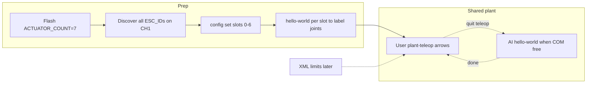

# One-arm Damiao bring-up: 7 slots + shared plant teleop

## Decisions (locked)

- **Expand plant to 7 actuators** — reflash required. The 562 B image already carries `HOST_EXCHANGE_ACTUATOR_SLOTS=25`; only the plant loop limit `ACTUATOR_COUNT` must rise from 6→7 (not a layout-version bump).
- **Shared plant teleop first** — you run `--plant-teleop`; AI uses `--hello-world` / scripts. **One process on COM5 at a time** (hand off by quitting teleop before AI jogs).
- **XML max limits** — deferred until you paste/send the file; plan leaves a host-side clamp hook.
- **Joint labeling** — discover all ESC_IDs first; assign slots 0–6 by ascending ESC_ID; identify physical joints with single-slot `--hello-world` jogs; record map in [docs/bringup.md](docs/bringup.md).




## Phase 0 — Firmware + host: `ACTUATOR_COUNT = 7`

**Wire image unchanged** (`IMAGE_BYTES=562`, `HOST_EXCHANGE_ACTUATOR_SLOTS=25`). Plant only mounts/applies the first `ACTUATOR_COUNT` command slots today ([App/Src/plant/plant_command.c](App/Src/plant/plant_command.c)).


| Area                                                                                         | Change                                                                                                                                                                                                                                                        |
| -------------------------------------------------------------------------------------------- | ------------------------------------------------------------------------------------------------------------------------------------------------------------------------------------------------------------------------------------------------------------- |
| [App/Inc/plant/actuator.h](App/Inc/plant/actuator.h)                                         | `#define ACTUATOR_COUNT 7u`                                                                                                                                                                                                                                   |
| [scripts/controls_pcb_host/protocol/schema.py](scripts/controls_pcb_host/protocol/schema.py) | `ACTUATOR_COUNT = 7`                                                                                                                                                                                                                                          |
| [App/Src/plant/plant_config_nvm.c](App/Src/plant/plant_config_nvm.c) + host CFG parser       | **Must fix packing** — today GET packs 4 B/slot from offset 6 → 6+7×4=34 > 32 B PDU, so slot 6 would be dropped. Compact to **3 B/slot**: `bus`, `protocol                                                                                                    |
| Factory defaults                                                                             | [plant_config_nvm.c](App/Src/plant/plant_config_nvm.c) + [actuator_config.py](scripts/controls_pcb_host/actuator_config.py) `_DEFAULT_TABLE`: add slot 6 (Damiao CH1 placeholder); slots 0–6 all Damiao CH1 for arm session (or disable unused until mapped). |
| Teleop defaults                                                                              | [scripts/control_hub/teleop/defaults.py](scripts/control_hub/teleop/defaults.py) `SLOT_KP` length 7.                                                                                                                                                          |
| NVM                                                                                          | Old flash images fail `slot_count != 7` → factory reload (expected). Retry `--persist` after reflash (prior `flash_err` may clear with correct linker/NVM page).                                                                                              |


**You reflash** Debug build after these edits. Smoke: `config show` lists **7** slots; `config set --slot 6 …` round-trips.

## Phase 1 — Discover seven motors on CH1

Fresh daisy, all powered, 120 Ω ends, 1 Mbps.

```powershell
python scripts/damiao_scan.py --port COM5 --discover --host-only --bus 1 --start 0 --end 32 --listen-ms 60
```

Host-only already collects multiple `FOUND` lines into `hits` but only prints one summary motor — **print every unique ESC_ID + Master** at end (small edit in [damiao_expert.py](scripts/controls_pcb_host/plugins/damiao_expert.py)). Expect 7 IDs; widen to `--end 127` if short.

If TX dies mid-scan (`tx→0`): FDCAN bus-off — power-cycle PCB, re-`config set`, retry (same as after CANH/CANL short).

## Phase 2 — Map slots + identify joints

```powershell
# Example after discover — replace IDs
foreach ($s in 0..6) { ... config set --slot $s --protocol damiao --bus 1 --motor-id 0xNN }
# disable nothing if all 7 are arm joints
python scripts/control_hub.py config show --port COM5
```

For each slot, exclusive COM:

```powershell
python scripts/control_hub.py --hello-world --port COM5 --slot N --delta 0.15
```

You watch which physical joint moves → fill joint table in bringup (slot ↔ ESC_ID ↔ joint name ↔ 4310/4340). Mid-chain rule: **all seven stay enabled** in the plant table whenever multi-slot teleop runs (unmapped mid-chain motors previously faulted neighbors).

## Phase 3 — Shared plant teleop (no XML yet)

**User session:**

```powershell
python scripts/control_hub.py --port COM5 --plant-teleop --plant-slots 0,1,2,3,4,5,6
```

Keys: `1` = CH1 group, arrows jog active selection, `q` quit. Soft host clamps stay at current Damiao teleop defaults until XML arrives.

**AI session (after you quit, or before you start):**

```powershell
python scripts/control_hub.py --hello-world --port COM5 --slot N --delta 0.2
# or multi-cycle wave scripts using hello_world helpers
```

Handoff rule: never two writers on COM5. Status line / `PASS`/`FAIL` from hello-world is the AI signal.

## Phase 4 — XML limits (when you send the file)

- Parse engineer XML → per-joint `q_min`/`q_max` (and optional velocity).
- Host clamp in [plant.py](scripts/control_hub/teleop/plant.py) teleop + [hello_world.py](scripts/control_hub/hello_world.py) before send (do not rely on motor PMAX alone).
- Document path next to bringup joint map. No IK.

## Out of scope / do not touch

- CubeMars scratchpad / workstream
- FreeRTOS, IK/Cartesian
- New `PROTO_DAMIAO_4340` (same MIT plugin)
- Changing FDCAN filters/fan-out unless bus-off recovery is explicitly requested later

## Verification checklist

- [ ] Reflash; `config show` → 7 slots; slot 6 SET/GET works
- [ ] Discover lists 7 ESC_IDs on CH1
- [ ] Each slot hello-world moves one joint; map recorded
- [ ] `--plant-teleop --plant-slots 0,1,2,3,4,5,6` homes/jogs without mid-chain faults
- [ ] AI hello-world works when teleop is not holding the port
- [ ] (Later) XML clamps respected in teleop + hello-world