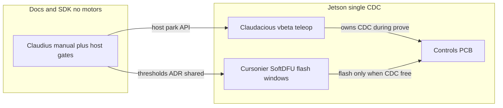

# Three-agent plan: PDU V/I soft-kill, deft_vbeta stack, human manual

## Bench (do not change)

| Asset                                                                | Notes                                                                                                                                                                         |
| -------------------------------------------------------------------- | ----------------------------------------------------------------------------------------------------------------------------------------------------------------------------- |
| One Controls PCB on Jetson `192.168.50.48` + ST-Link for convenience | Soft-DFU is the flash path; ST-Link recovery only                                                                                                                             |
| Identify serial first                                                | `python scripts/soft_dfu_flash.py scan` — last prove: Soft-DFU board `3167375E3435`, live sibling was `3167376F3435`. With one board plugged, pin that serial for every flash |
| Repo on Jetson                                                       | `~/controls_pcb` — pull/rebase, resolve conflicts, Soft-DFU reflash after FW changes                                                                                          |
| Scope plant                                                          | Dual YAM Damiao arms (slots 0–13), holonomic base 6× RobStride (slots 14–19). Lift CANopen off. Bench Damiao spare is ignore-unless-needed                                    |

## Hard ownership (do not cross)

| Agent           | OWNS                                                                                                                                                                                                                                                                                                                                               | MUST NOT                                                                                       |
| --------------- | -------------------------------------------------------------------------------------------------------------------------------------------------------------------------------------------------------------------------------------------------------------------------------------------------------------------------------------------------- | ---------------------------------------------------------------------------------------------- |
| **Claudius**    | `[docs/manual/](docs/manual/)` instruction book + TOC; host V/I soft-kill in SDK (`[controls_pcb_hub.py](scripts/deft_controls_sdk/controls_pcb_hub.py)`, `[pdb/status.py](scripts/deft_controls_sdk/pdb/status.py)`); sim tests via `[pdb_uart_sim.py](scripts/pdb_uart_sim.py)`; PDU policy note under `docs/`                                   | Soft-DFU; exclusive Jetson CDC teleop; rewrite `deft_vbeta/` Claudacious creates; gut Soft-DFU |
| **Claudacious** | Working copy `[deft_vbeta/](deft_vbeta/)` at repo root (fresh clone/copy, not editing the read-only submodule `[docs/deft_vbeta_ref/deft_vbeta](docs/deft_vbeta_ref/deft_vbeta)`); wire `YAMAIMobile` to existing `[scripts/deft_controls_sdk/vbeta/](scripts/deft_controls_sdk/vbeta/)` adapters; Jetson live prove dual-arm + 6-base product CFG | Soft-DFU flash; rewrite Claudius manual chapters; change FW kill math Cursonier owns           |
| **Cursonier**   | FW PDB V/I acceptability → soft-kill overlay in `[pdb_link.c](App/Src/host/pdb_link.c)`; Soft-DFU flash + Jetson pull/conflict resolve; keep `[docs/soft-dfu.md](docs/soft-dfu.md)` accurate                                                                                                                                                       | Edit `deft_vbeta/` teleop; rewrite manual TOC; Connect CDC while Claudacious streaming         |

**Flash windows:** Claudacious stops continuous/vbeta (or Ctrl-C / stop helper) → Cursonier Soft-DFUs with `--serial <board> --require-usb-dfu` → Claudacious resumes.

---

## Shared defaults (locked for this pass)

**PDU V/I policy (provisional scales = existing 10 mV / 10 mA placeholders in `[status.py](scripts/deft_controls_sdk/pdb/status.py)`):**

- Evaluate fresh `PDBF` only (stale still → `COMMS_LOSS` / HARD report as today).
- If any enabled rail/pack is outside limits while peer reports `NORMAL`, Controls overlays USB `kill_state=SOFT_KILL_REQ` + `kill_reason` UV or OC so existing `soft_kill_park_if_requested` parks.
- Draft limits (document as tunable constants): pack_v 40–55 V; 48 V rail 42–52 V; pack/rail current abs max 30 A (tune after first real PDB capture). Sim can inject violations.
- Host SDK applies the **same** numeric checks as a belt-and-suspenders park (works even before FW flash).

**vbeta layout:** Product CFG from `[vbeta/slots.py](scripts/deft_controls_sdk/vbeta/slots.py)` — arms 0–13, base 14–19 @ CH4–6 IDs `0x01`/`0x02`. Do not drive continuous spare map 22–25 for the vbeta stack. Lift stays stub.

**deft_vbeta placement:** Fresh tree at repo-root `[deft_vbeta/](deft_vbeta/)` (sibling to `scripts/`, `App/`). Add to `.gitignore` if the tree is large; keep `[docs/deft_vbeta_ref/deft_vbeta](docs/deft_vbeta_ref/deft_vbeta)` as the read-only submodule reference. Integration uses Controls SDK adapters per `[docs/vbeta-pcb-adapter.md](docs/vbeta-pcb-adapter.md)`.

---

## Claudius — human manual + host PDU gates

### Goal

Readable instruction book with TOC; host-side V/I soft-kill that Claudacious/vbeta already honor.

### Work

1. Create `[docs/manual/README.md](docs/manual/README.md)` as TOC (chapters only, no markdown soup dump).
2. Chapters (short, link out to deep docs — do not rewrite peripherals from scratch):
  - Setup / Jetson / serial ownership
  - Soft-DFU flash (`[docs/soft-dfu.md](docs/soft-dfu.md)`)
  - Plant map (26 slots, arms, base, lift off)
  - PDU / soft-kill (link + new V/I thresholds section)
  - Arms / base / neck pointers into `[docs/peripherals/](docs/peripherals/)`
  - Continuous vs vbeta stack
  - Recovery / E-STOP / COMMS_LOSS
3. Host: extend park path so out-of-range `PdbStatus` V/I triggers `soft_kill_park` (same limits constants, shared module e.g. `pdb/limits.py`).
4. Prove with `pdb_uart_sim.py` injecting bad pack_v / overcurrent → park without needing motors.
5. Fix stale README wire pointer (v2 → v3) as part of manual start-here.

### Success

- [ ] `docs/manual/` TOC navigable by a human in <2 minutes
- [ ] Host parks on simulated bad V/I
- [ ] No Soft-DFU; no `deft_vbeta/` teleop edits

---

## Claudacious — deft_vbeta on Controls PCB (Jetson CDC owner)

### Goal

Run a fresh deft_vbeta checkout against the Controls PCB for **two YAM arms + 6 holonomic RobStrides**, replacing Feather/I2RT CAN transceiver path in software.

### Work

1. Clone/copy gitlab `deft_vbeta` into `[deft_vbeta/](deft_vbeta/)` (ignore large artifacts; do not commit 36 MB blobs).
2. Point `YAMAIMobile` (or thin wrapper) at `PcbArmDriver` / `PcbPlatformClient` / `PcbRobotSession` from `[scripts/deft_controls_sdk/vbeta/](scripts/deft_controls_sdk/vbeta/)` — follow `[docs/vbeta-pcb-adapter.md](docs/vbeta-pcb-adapter.md)`.
3. Apply `yam_product_rows()` CFG before motion; exclusive CDC; service soft-kill each tick (picks up Claudius/Cursonier gates).
4. Jetson prove (hardware as available):
  - Left arm CH1 progressive enable + clear track (required)
  - Right arm CH2 same path if powered; if unpowered, CFG+discover only and document
  - Base slots 14–19 holonomic `base_cmd` smoke (product IDs); if physical wheels still on bench spare IDs, document remap gap — **do not** silently use 22–25 inside vbeta product path
5. Leave lift stubbed; neck optional if DXL present.
6. Yield CDC for Cursonier flash windows.

### Success

- [ ] `deft_vbeta/` runs against PCB USB without Feather/I2RT for arms+base command path
- [ ] ≥30 s session with left arm + base tracking (or explicit HW blockers logged)
- [ ] Never Soft-DFUs; never edits FW kill logic

---

## Cursonier — FW V/I soft-kill + Soft-DFU flash

### Goal

Board-side: unacceptable PDU V/I becomes soft-kill so the park handshake works even if host forgets; keep Soft-DFU reliable on the Jetson board.

### Work

1. Jetson prelude: `git pull` in `~/controls_pcb`, resolve conflicts with host work, sync ELFs/scripts as needed.
2. FW in `[pdb_link.c](App/Src/host/pdb_link.c)` (and small header for limits): on fresh valid `PDBF`, if V/I outside shared limits, present `SOFT_KILL_REQ` + UV/OC reason on USB kill mirror (do not break COMMS_LOSS stale path).
3. Build Debug (+ Release if used); Soft-DFU with `--require-usb-dfu --serial <scan>` alternating once to prove flash still USB-only after FW change.
4. Coordinate with Claudacious: flash only when CDC free; re-scan after Leave.
5. Unit-testable where possible; bench prove with sim or real PDB injecting violation → host sees SOFT_KILL_REQ → park.
6. Touch Soft-DFU docs only if flash SOP changes.

### Success

- [ ] FW overlays soft-kill on bad V/I; stale still COMMS_LOSS
- [ ] Soft-DFU USB-only flash of that FW on Jetson board
- [ ] No `deft_vbeta/` edits; no manual TOC ownership

---

## Brainstormed extras (assign lightly or backlog)

| Extra                                                                       | Why                             | Owner if pulled in                             |
| --------------------------------------------------------------------------- | ------------------------------- | ---------------------------------------------- |
| Auto-park on `HARD_ESTOP` / `COMMS_LOSS` (today only `SOFT_KILL_REQ` parks) | Safer link loss                 | Claudius host + Cursonier confirm              |
| Base product `0x01`/`0x02` vs bench `0x70`/`0x74` ADR                       | Unblocks real holonomic vbeta   | Claudacious documents; CFG change only with HW |
| Dashboard shows V/I limits + “would park”                                   | Operator visibility             | Claudius                                       |
| FW version / Soft-DFU serial table in manual                                | Human ops                       | Claudius links Cursonier prove                 |
| Right-arm powered dual-arm 60 s cruise                                      | Full product prove              | Claudacious when HW up                         |
| PDB scale lock ADR with real PDB capture                                    | Retire 10 mV/10 mA placeholders | Cursonier + Claudius                           |

Out of scope this pass: lift CANopen, CubeMars product swap, retiring all `scripts/legacy/`, second PCB Soft-DFU matrix.

---

## Parallel schedule

| Time | Claudius                                         | Claudacious                                                 | Cursonier                                        |
| ---- | ------------------------------------------------ | ----------------------------------------------------------- | ------------------------------------------------ |
| T0   | Manual TOC skeleton; `pdb/limits.py` + host park | Clone `deft_vbeta/`; wire adapters offline                  | Pull Jetson repo; scan serial; baseline Soft-DFU |
| T1   | Sim bad-V/I park prove; fill manual chapters     | Yield CDC → wait flash                                      | Implement FW V/I overlay; Soft-DFU new FW        |
| T2   | COMMS_LOSS auto-park if time; README v3 fix      | Live vbeta arms+base on Jetson; soft-kill from real/sim PDU | Support flash; no teleop                         |
| T3   | Manual polish from Claudacious “Verified” notes  | Stop or hand notes to Claudius                              | Stop unless reflash requested                    |

**Conflict avoidance:** One CDC owner at a time. Claudius never flashes. Cursonier never runs vbeta motion. Claudacious never edits `pdb_link.c`. Manual links peripherals; does not fork them.