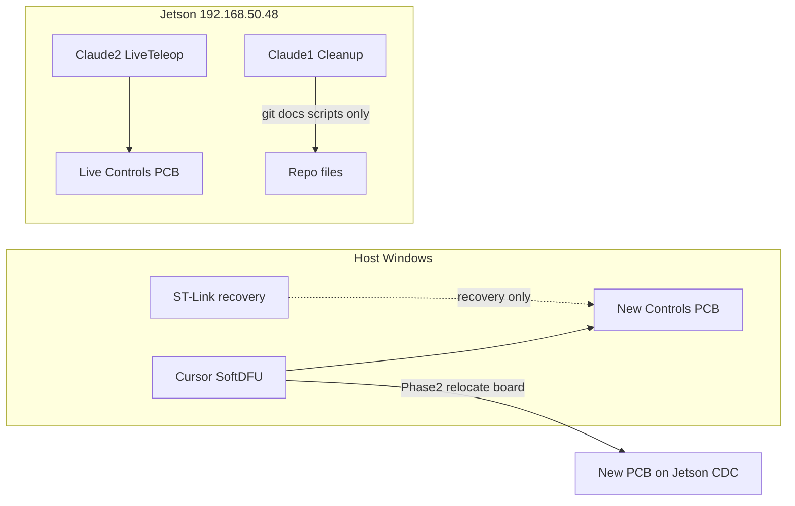

# Three-agent plan: Soft-DFU, cleanup, live peripheral docs

## Hardware / network (current bench)

| Asset | Owner | Notes |
|-------|--------|------|
| **New Controls PCB + ST-Link on host Windows** | **Cursor** | Soft-DFU development only. ST-Link is recovery until Soft-DFU is proven; success forbids relying on it. |
| **Live Controls PCB on Jetson** (`192.168.50.48`, user `deft-robotics`, pass via `JETSON_PASS` / known bench `4565`) | **Claude 2** | Continuous / teleop / peripheral truth. Do not Soft-DFU this board. |
| Host laptop CDC + ST-Link USB | Cursor | Phase 1 |
| Jetson CDC(s) after Cursor board is relocated | Cursor uses **new** board only; Claude 2 keeps **live** board — distinguish by USB serial (`soft_dfu_flash.py scan`) |

---

## Hard ownership rules (do not cross)

| Agent | OWNS | MUST NOT |
|-------|------|----------|
| **Cursor** | Soft-DFU path: [`scripts/soft_dfu_flash.py`](scripts/soft_dfu_flash.py), [`scripts/soft_dfu_flash.sh`](scripts/soft_dfu_flash.sh), [`scripts/deft_controls_sdk/bench/soft_dfu.py`](scripts/deft_controls_sdk/bench/soft_dfu.py), [`scripts/udev/99-stm32-dfu.rules`](scripts/udev/99-stm32-dfu.rules), flash docs under `docs/` that are flashing-specific (e.g. a new `docs/soft-dfu.md` or section in api), Debug/Release ELF build+flash loops on the **new** board | Edit continuous/teleop logic; delete `_tmp_*` Claude 1 owns; Connect COM to Claude 2’s live board; Soft-DFU the live Jetson product board |
| **Claude 1** | Repo hygiene: delete/archive `_tmp_*`, move outdated markdown into [`docs/legacy/`](docs/) or [`scripts/legacy/`](scripts/legacy/), refresh [`docs/scripts-hygiene.md`](docs/scripts-hygiene.md), strip stale “25 slot / 562 B” pointers in bringup/architecture **without inventing new peripheral truth** | Run Soft-DFU; SSH teleop that moves motors; rewrite Claude 2’s new `docs/peripherals/*` once created; flash any board |
| **Claude 2** | Live Jetson teleop + **new** peripheral operating manuals under `docs/peripherals/`; update “what works” from continuous runs; use SSH + `JETSON_PASS` | Soft-DFU; mass-delete scripts; archive load-matrix benches Claude 1 owns; Connect dashboard COM while continuous owns CDC |

**File handoff:** Claude 1 creates `docs/legacy/` and moves stale benches **first**. Claude 2 only **adds** `docs/peripherals/*.md` and may patch [`docs/bringup.md`](docs/bringup.md) with accurate “current plant” pointers. Cursor only adds/updates Soft-DFU flashing docs.

---

## Cursor agent — Soft-DFU without ST-Link

### Goal
Five consecutive Soft-DFU flashes that complete with **USB DFU only** (no SWD fallback), alternating slightly different builds, first on Windows (new board), then on Jetson after the user relocates that board.

### Phase 1 — Host Windows (new PCB + ST-Link present)

1. **Inventory:** `python scripts/soft_dfu_flash.py scan` — record CDC serial (`0483:5740`), whether `0483:DF11` is visible to libusb, ST-Link SWD yes/no.
2. **Unstick path:** Ensure Windows can see DF11 (Zadig WinUSB on `0483:DF11` if needed). ST-Link is allowed **only** to recover a stuck board; each “success” flash must print `flash ok — CDC at …` **without** `(SWD)`.
3. **Build toggles:** Alternate two ELFs so flashes are distinct, e.g.:
   - `Debug/DeftRoboticsControlsPCB.elf` vs `Release/DeftRoboticsControlsPCB.elf`, or
   - Rebuild Debug with a trivial unique `#define` / version string between flashes.
4. **Loop (5×):** stop any CDC owner → `python scripts/soft_dfu_flash.py --image <A|B>` → confirm CDC re-enum → `scan` shows app CDC again. Log each cycle (serial, image, wall time, SWD used? must be no).
5. **CLI polish if stuck:** Harden [`soft_dfu.py`](scripts/deft_controls_sdk/bench/soft_dfu.py) timeouts / clear error when DF11 missing; keep [`soft_dfu_flash.py`](scripts/soft_dfu_flash.py) as the one entrypoint. Add `--require-usb-dfu` (fail if SWD fallback would run) for the prove loop.
6. **Deliverable doc:** `docs/soft-dfu.md` — Windows steps, WinUSB note, recovery-with-ST-Link, “success = USB only”.

### Phase 2 — Same board on Jetson (parallel to Claude 2’s live board)

1. User moves **new** PCB USB to Jetson (ST-Link can stay on host or disconnect).
2. Cursor: install/verify udev [`99-stm32-dfu.rules`](scripts/udev/99-stm32-dfu.rules); use [`soft_dfu_flash.sh`](scripts/soft_dfu_flash.sh) / `sudo -E` as needed.
3. **Pin by serial:** always `--serial <new-board-serial>` so Claude 2’s live ACM is never entered into DFU.
4. Sync ELFs to Jetson (SFTP or git pull) and repeat **5× USB-only** Soft-DFU alternating A/B images.
5. Jetson has **no SWD safety net** — if DFU sticks, document power-cycle recovery; do not Soft-DFU the live board.

### Cursor success criteria
- [x] `soft_dfu_flash.py scan` documents both boards’ serials once both are on Jetson (`3167375E3435` Soft-DFU / `3167376F3435` live)
- [x] **5/5** Soft-DFU cycles on Windows with **no SWD** and alternating images (sn=`3167375E3435`, Debug/Release, `--require-usb-dfu`, 2026-07-24)
- [x] **5/5** Soft-DFU cycles on Jetson with **no ST-Link**, pinned serial, alternating images (2026-07-24)
- [x] `docs/soft-dfu.md` written; ST-Link labeled recovery-only

---

## Claude agent 1 — Repo cleanup (no hardware teleop)

### Goal
Thin the tree so AI/humans see current ops scripts and durable docs; push outdated material into legacy.

### Scope (ordered)

1. **Create** [`docs/legacy/`](docs/legacy/) (and optionally `docs/legacy/load-matrix-2026-07/`).
2. **Move (not delete blindly) outdated benches:**
   - All `docs/bench-load-matrix-*.md`, `docs/act-lap-bloat-deepdive-2026-07-23.md`, `docs/handoff-*.md` → `docs/legacy/…`
   - Keep in place (current): `bench-pdb-sdk-contract-2026-07-24.md`, plant-integ Jul 23/24, `pdb-uart-v1.md`, `host-exchange-v3.md`, `ch4-mcp2518-bringup-postmortem.md`, `lessons.md`, `decisions.md`, `api.md`
3. **Scripts:**
   - **Keep / promote later:** `yam_continuous_all.py`, `pdb_uart_sim.py`, `_tmp_stop_can.py`, `_tmp_launch_continuous.py`, `_tmp_base_bus56_lab.py`, PDB prove trio (`_tmp_pdb_*`), `soft_dfu_flash.py` (Cursor’s — do not gut)
   - **Delete or fold:** redundant Jetson wrappers (`_tmp_run_prove360.py`, `_tmp_poll_prove360.py`, `_tmp_run_tx_smoke.py`, `_tmp_run_fix74.py`, `_tmp_check_recording.py`) after folding useful bits into one remote helper **or** move to `scripts/legacy/tmp_runners/`
   - Delete obvious one-offs: `_tmp_dxl_one.py`, `_tmp_bus6_real_hw.py` → legacy
   - Do **not** `git rm` entire [`scripts/legacy/`](scripts/legacy/) in this pass (frozen pending prove checklist) — only add to it
4. **Hygiene rewrite:** [`docs/scripts-hygiene.md`](docs/scripts-hygiene.md) to match remaining `_tmp_*` and Soft-DFU entrypoint.
5. **Stale fact fixes only** in [`docs/bringup.md`](docs/bringup.md) / [`docs/architecture.md`](docs/architecture.md): layout v3 / 26 actuators / 694 B — no new “how Damiao enable works” essays (that is Claude 2).

### Claude 1 success criteria
- [ ] Load-matrix / handoff benches under `docs/legacy/`
- [ ] `_tmp_*` count sharply reduced; keepers listed in hygiene
- [ ] No Soft-DFU or continuous behavior changes
- [ ] Does not create `docs/peripherals/` content (reserved for Claude 2)

---

## Claude agent 2 — Live teleop → peripheral truth docs

### Goal
By running real scripts on the **live Jetson board**, produce AI-operable + human-deep docs that replace misconception-heavy notes.

### SSH / ops
- Host: `192.168.50.48`, user `deft-robotics`, password from env `JETSON_PASS` (bench default `4565`)
- Prefer Paramiko if key auth fails (established pattern)
- Dashboard: **follow** `.deft_session/state.json` — do **not** Connect COM while continuous owns CDC
- Cleanup: Ctrl-C continuous or `_tmp_stop_can.py`

### Evidence to collect (minimum)

| Peripheral | Script / path | Pass signals |
|------------|---------------|--------------|
| Arm Damiao CH1 slots 0–6 | `yam_continuous_all.py` | Discover J2; progressive latch all `fault=1`; J2 CLEAR tracks |
| DXL neck | continuous | Present + clear bounce both IDs |
| Base RS bus5 `0x70`/`0x74` | continuous + optional `_tmp_base_bus56_lab.py --prove-360` | Spin + rail reverse; sibling reset |
| Base RS bus6 `0x75` | continuous | Tracks with CH6 |
| Damiao bus6 `0x06` | continuous | Plant-seeded bounce, not fake pose |
| PDU UART | `pdb_uart_sim.py` + continuous | `pdb=normal`; Soft-kill Park / `soft_kill_request` parks ESTOP |

### Docs to write (new, authoritative)

Under **`docs/peripherals/`** (Claude 1 must not delete):

1. `arm-damiao-ch1.md` — CFG, enable latch, fault=1 meaning, CLEAR, soft-engage, common snaps
2. `dxl-neck.md` — IDs/slots, torque session, clear range, dual-owner warning
3. `base-robstride-mcp.md` — bus5/6 map, MIT rails, sibling reset, rail reverse policy
4. `base-damiao-ch6.md` — plant FB seed, min-kp latch, soft window
5. `pdu-uart-soft-kill.md` — freshness, COMMS_LOSS, dashboard follow-mode soft-kill flag
6. `continuous-ops.md` — launch/stop, stream health, recording, what “good” looks like for 30–50 s

Each file structure (required):
- **AI quickstart** (commands, serial/port, don’ts)
- **Human deep dive** (why firmware gates exist: HOST_STALE, BENCH_SESSION, blank MCP skip, Damiao latch)
- **Verified** date + log excerpt pointers
- **Known falsehoods** retired from old benches

Seed truth from continuous + [`docs/bench-pdb-sdk-contract-2026-07-24.md`](docs/bench-pdb-sdk-contract-2026-07-24.md); **re-run** rather than trust stale “arm unpowered” morning notes.

### Claude 2 success criteria
- [ ] One ≥30 s continuous cruise with all peripherals tracking, then soft-kill park
- [ ] Six peripheral docs under `docs/peripherals/` with verified sections
- [ ] No Soft-DFU; no mass script deletion

---

## Parallel schedule

| Time | Cursor | Claude 1 | Claude 2 |
|------|--------|----------|----------|
| T0 | Windows Soft-DFU unstick + scan | Create `docs/legacy/`, move load-matrix/handoffs | Read continuous logs; draft doc outlines |
| T1 | 5× Windows USB-only flash prove | Cull `_tmp_*`, rewrite hygiene | Live continuous + soft-kill on **live** board; fill peripherals docs |
| T2 | User moves **new** board → Jetson | Stale bringup/architecture number fixes | Finish docs; link from bringup |
| T3 | 5× Jetson USB-only Soft-DFU by serial | Stop (cleanup done) | Stop (docs done) unless Cursor asks for dual-CDC serial table |

**Conflict avoidance:** Claude 1 finishes legacy moves before Claude 2 lands `docs/peripherals/`. Cursor never opens Claude 2’s CDC serial. Claude 2 never flashes.

---

## Out of scope for all three
- Merging Soft-DFU into continuous motion logic
- Flashing the live product board Claude 2 uses
- Retiring all of `scripts/legacy/` control_hub in this pass
- CubeMars / ZeroErr / lift (document as “not on this bench” only if Claude 2 touches them)
