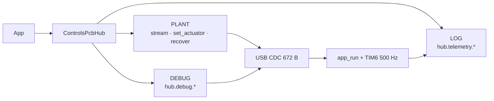

# Host API — Controls PCB

How host software talks to a flashed board. Package:
[`scripts/deft_controls_sdk/`](../scripts/deft_controls_sdk/).

| Doc | Role |
|-----|------|
| **This page** | What to import and call |
| [host-exchange-v2.md](host-exchange-v2.md) | 672 B plant image (`CMDH` ↔ `HBHF`) |
| [host-debug-v1.md](host-debug-v1.md) | DEBUG frames (`DBGC` ↔ `DBGF`) |
| [architecture.md](architecture.md) | Modes, plant tick, staging |
| [bringup.md](bringup.md) | Flash, buses, teleop how-to |

`scripts/legacy/` is frozen pending SDK-only prove-out (see its README).

---

## Quick start

```powershell
cd scripts
pip install -r requirements.txt
```

```python
from deft_controls_sdk import ControlsPcbHub, ActuatorDesire

with ControlsPcbHub.connect("COM5") as hub:   # Linux: /dev/ttyACM0
    hub.recover()
    hub.start_streaming(hz=40.0)
    hub.set_actuator(0, ActuatorDesire(position=0.2, kp=8.0, kd=0.5), send=False)
    print(hub.telemetry.snapshot())
    hub.set_actuator(0, ActuatorDesire(), send=False)  # blank / idle
```

**Rules of thumb**

- One process owns the COM port (don’t run dashboard + script together).
- Host stream ~40 Hz; MCU applies desires at **500 Hz** (hold-last).
- Prefer `send=False` while streaming — the stream thread resends held desires.
- Flash host **and** firmware together after a layout bump (v2 = 672 B).

---

## Mental model



| Mode | Surface | Job |
|------|---------|-----|
| **PLANT** | top-level `hub.*` | Cyclic desires / feedback |
| **DEBUG** | `hub.debug.*` | Discover, CFG, soft-DFU (same COM; may gate plant) |
| **LOG** | `hub.telemetry.*` | Snapshot, grades, optional NDJSON record |

---

## Plant — `ControlsPcbHub`

There is no `hub.plant` namespace; plant calls are on the hub itself.

| Call | Role |
|------|------|
| `ControlsPcbHub.connect(port, *, baud=…, persist_telemetry=False)` | Open CDC. Scripts default **off** for `state.json` rewrite. |
| `hub.start_streaming(hz=40.0, *, telemetry_hz=10.0)` | Background plant TX + side telemetry thread. Does **not** auto-recover. |
| `hub.stop_streaming()` / `hub.is_streaming` | Stop / query. |
| `hub.set_actuator(slot, desire, *, send=True)` | Held MIT desire for `slot` in `0..24`. With streaming, use `send=False`. |
| `hub.held_desire(slot)` / `hub.held_desires()` | What the stream is commanding. |
| `hub.send_once()` | One write of the held image + one FB poll. |
| `hub.refresh_feedback(*, slots=None, seconds=0.5, hz=40.0)` | Pump held desires until the 672 B `HBHF` actuator payload is fresh (see below). |
| `hub.set_mcu_state(state, *, send=True)` | `McuState.NORMAL` / `RECOVERY` / `DIAG_ONLY` / `ESTOP`. |
| `hub.recover()` | `RECOVERY` → `NORMAL` (MCU `plant_recovery_all`). |
| `hub.port` / `hub.close()` | COM name / teardown (`with` supported). |

### Desires and blank MCP

```python
ActuatorDesire()  # all zeros — idle / blank
```

A slot is **blank** when idle (`kp/kd/vel/τ≈0`) **and** `position == 0`. Blank MCP slots (CH4–6) skip SPI. Holds accumulate per slot — leaving many CH4–6 slots non-blank at once is expensive on the MCU.

### Stale plant feedback after CFG / DEBUG

Plant `HBHF` actuator fields are **not** filled by DEBUG probe/CFG alone. Until the MCU exchanges CAN under a held plant desire, slot pose/vel in the 672 B image can stay at zero (especially MCP CH4–6, where blank idle skips SPI).

**Do not** pick between probe pose and plant FB ad hoc. After assigning CFG:

1. Seed an **idle-anchored** desire at a known pose (`kp=0`, `position=pose` — not blank `p=0` if the shaft is elsewhere).
2. Call `hub.refresh_feedback(...)` so firmware parareads and the host pumps until actuator state lands in `HBHF`.
3. Then read `FeedbackImage.actuator(slot)` / metrics / teleop.

```python
hub.set_actuator(slot, ActuatorDesire(position=pose, kp=0.0, kd=0.0))
fb = hub.refresh_feedback(slots=[slot], seconds=0.5)
pos = fb.actuator(slot).position if fb and fb.actuator(slot) else None
```

### `McuState` / `plant_block`

| `McuState` | Meaning |
|------------|---------|
| `NORMAL` (0) | Plant apply allowed (other gates may still block). |
| `RECOVERY` (1) | Recovery / clear path. |
| `DIAG_ONLY` (2) | Plant CAN gated for bench. |
| `ESTOP` (3) | E-stop semantics. |

| `plant_block` | Meaning |
|---------------|---------|
| 0 none | Plant applying |
| 1 bench_session | DEBUG lease / RS2–DM session |
| 2 probe_busy | Blocking probe |
| 3 quiet_period | After session end |
| 4 diag_only | `mcu_state=DIAG_ONLY` |
| 5 host_stale | No fresh CMD >500 ms — start/keep streaming |
| 6 servo_session | Servo host session |

---

## DEBUG — `hub.debug`

Same COM; dedicated **`DBGC` / `DBGF`** frames with a 32 B mailbox at offset 608
([host-debug-v1.md](host-debug-v1.md)). Plant `HBHF.pdb` stays clear. Prefer these
methods over crafting tags. A lease may set `plant_block=bench_session`.

| Call | Role |
|------|------|
| `with hub.debug.lease(bus=…):` | RS2 session bracket. Discover usually manages its own lease. |
| `discover_robstride(bus=…, start=…, end=…)` | RS02 ID sweep (own lease). |
| `probe_robstride(bus=…, motor_id=…)` | One-motor probe dict or `None`. |
| `discover_damiao(bus=…, start=…, end=…, known_ids=…)` | Damiao discover; pass configured IDs first. |
| `cfg_get_table()` | Full actuator table (**25** rows). |
| `cfg_set_slot(…, persist=False)` | RAM SET; `persist=True` also flash SAVE (survives power cycle). |
| `enter_bootloader(confirm=True)` | Soft-DFU enter (CDC drops → `0483:DF11`). |
| `leave_bootloader(serial=…)` | Leave ROM DFU via reset trampoline. |
| `calibrate_robstride(bus=…, motor_id=…)` | RS02 encoder cal (own lease). Shaft free; 24–60 V. |
| `discover_zeroerr(…)` | **Not wired** — CFG `protocol=4` + node ID for now. |

### CFG protocols / buses

| `protocol` | Motor stack |
|------------|-------------|
| 0 | none |
| 1 | RobStride |
| 2 | CubeMars (not motion-ready — see lessons) |
| 3 | Damiao |
| 4 | ZeroErr (CiA 402; `motor_id` = node ID) |

Buses **1..6** = schematic CH1..CH6 (CH1–3 FDCAN, CH4–6 MCP2518).

```python
with ControlsPcbHub.connect("COM5") as hub:
    hit = hub.debug.discover_robstride(bus=4)
    if hit is not None:
        hub.debug.cfg_set_slot(slot=19, bus=4, protocol=1, motor_id=hit, persist=True)
```

---

## deft_vbeta adapters (`deft_controls_sdk.vbeta`)

YAM-shaped drivers that own plant slots via one `PcbRobotSession` (exclusive COM):

- `PcbArmDriver` — I2RT-compatible Damiao arms (slots 0–6 / 7–13)
- `PcbPlatformClient` — Feather-compatible base/neck; **lift cmds are stubs**
- `PcbNeckDriver` / `set_led` — DXL neck + SK9822

Contract + slot map: [vbeta-pcb-adapter.md](vbeta-pcb-adapter.md) (includes YAMAIMobile patch sketch).
Script hygiene: [scripts-hygiene.md](scripts-hygiene.md). Smokes: `scripts/vbeta_arm_smoke.py`, `vbeta_base_smoke.py`, `vbeta_neck_led_smoke.py`.

```python
from deft_controls_sdk.vbeta import PcbRobotSession, PcbArmDriver, PcbPlatformClient

with PcbRobotSession.connect(apply_yam_cfg=False) as session:
    arm = PcbArmDriver(session, side="left")
    arm.connect()
    print(arm.read("Position_Rad"))
```

---

## Soft-DFU — USB flash (no ST-Link)

**Preferred (one-liner):**

```powershell
python scripts/soft_dfu_flash.py
# optional: --image Debug/DeftRoboticsControlsPCB.elf
```

Auto-finds STM32 CDC, enters ROM DFU, programs, leaves via reset trampoline.
You do **not** need to know PDU tags or enter/leave APIs for routine flash.

Linux / Jetson: same Python entry, or `./scripts/soft_dfu_flash.sh` (dfu-util).

Advanced module API (also on `hub.debug`) — enter/leave only for custom flows:

```python
from deft_controls_sdk.bench import (
    find_cdc_port,
    enter_bootloader,
    leave_bootloader,
    flash_firmware,
)

print(find_cdc_port())
flash_firmware(confirm=True)  # default: repo Debug/*.elf
```

Leave targets the app reset trampoline (`0x0803F800`), not a bare jump to `0x08000000` (that can leave USB CDC dead). Details: `bench/soft_dfu.py`.

---

## Telemetry — `hub.telemetry`

| Call | Role |
|------|------|
| `snapshot()` / `snapshot_dict()` | Grade, `fb_hz`, ack lag, actuators, `plant_block`, … |
| `start_recording()` / `stop_recording()` | Opt-in NDJSON under `.deft_session/recordings/` |
| `log_feedback(…)` | Also `hub.log_feedback` — append one FB to an open recording |
| `flush()` / `close()` | Drain disk writer |

Useful fields: `fb_hz` (raw USB FB rate), `stream_ack_lag`, `stream_tx_gap_p95_ms`, `lap_ms` / `lap_max_ms` (from **system** block in layout v2).

---

## Dashboard

```powershell
cd scripts
python -m deft_controls_sdk.debug_dashboard
# optional: --port COM5
```

→ http://127.0.0.1:8765 — one COM owner. Plant holds match the SDK. Discover/CFG/soft-DFU are script-side for now (disconnect the UI first).

| Route | Role |
|-------|------|
| `GET /api/state` | Snapshot |
| `GET /api/ports` | COM list |
| `POST /api/connect` · `/disconnect` | Own / release port |
| `POST /api/actuator/<slot>` | Hold `{position,kp,kd}` |
| `POST /api/actuator/<slot>/idle` | Blank slot |
| `POST /api/mcu_state` · `/recover` | MCU state / recover |
| `POST /api/record/start` · `/stop` | Manual black box |

---

## Slot map

Firmware `ACTUATOR_COUNT` = **25** (matches the wire image). Factory-style layout used by the timing probe:

| Buses | Slots | Backend |
|-------|------:|---------|
| CH1 | 8 | FDCAN |
| CH2 | 8 | FDCAN |
| CH3 | 3 | FDCAN |
| CH4–6 | 2 each | MCP2518 |

Always `cfg_get_table()` before assuming IDs — CFG/NVM overrides factory. Dual-arm teleop recipes in legacy often use slots **0–13** only; the table still has 25 wire slots.

---

## Wire image (v2, brief)

672 B both ways — see [host-exchange-v2.md](host-exchange-v2.md).

| Offset | Size | Contents |
|-------:|-----:|----------|
| 0 | 12 | Header (magic, layout **2**, size **672**, seq) |
| 12 | 32 | System (tick, mcu_state, plant_block, lap timing, …) |
| 44 | 550 | Actuators 25×22 (MIT + 2 B meta on feedback) |
| 594 | 12 | Servos |
| 606 | 2 | LEDs |
| 608 | 64 | `pdb[]` — power mirror only on plant path |

DEBUG tags: [host-debug-v1.md](host-debug-v1.md) (`DBGC`/`DBGF`). v1 (562 B) rejected.

---

## Not in this API

| Concern | Where |
|---------|--------|
| Arrow teleop, brace, YAM soft limits | Prefer hub plant stream; legacy teleop frozen |
| Raw tag / frame crafting | Don’t — use hub; [host-exchange-v2.md](host-exchange-v2.md) / [host-debug-v1.md](host-debug-v1.md) |
| Multi-client COM mux | Not yet — one process owns the port |

## Single RS02 channel bringup

Move one motor between CH1–CH6 and re-run with `--bus` only:

```powershell
cd scripts
python rs02_channel_bringup.py --bus 4
python rs02_channel_bringup.py --bus 1 --motor-id 0x70 --skip-cali
```

## SDK-only actuator prove-out

Migration checklist (what's ported to the SDK vs. still frozen in `scripts/legacy`) tracked in [`scripts/legacy/README.md`](../scripts/legacy/README.md).

---

## Recipes

**Recover + stream**

```python
with ControlsPcbHub.connect("COM5") as hub:
    hub.recover()
    hub.start_streaming(hz=40.0)
```

**Persist a CFG slot**

```python
with ControlsPcbHub.connect("COM5") as hub:
    hub.debug.cfg_set_slot(slot=3, bus=1, protocol=1, motor_id=5, persist=True)
# power-cycle; cfg_get_table()[3] should still show motor_id=5
```

**USB reflash**

```powershell
python scripts/soft_dfu_flash.py
```

**Bandwidth matrix (after flash)**

```powershell
python _tmp_mcp_timing_probe.py --port COM5 --seconds 3.0 --hz 40
```

**Black-box a run**

```python
with ControlsPcbHub.connect("COM5") as hub:
    hub.start_streaming()
    hub.telemetry.start_recording()
    # … exercise …
    hub.telemetry.stop_recording()
    print(hub.telemetry.snapshot().recording_path)
```
