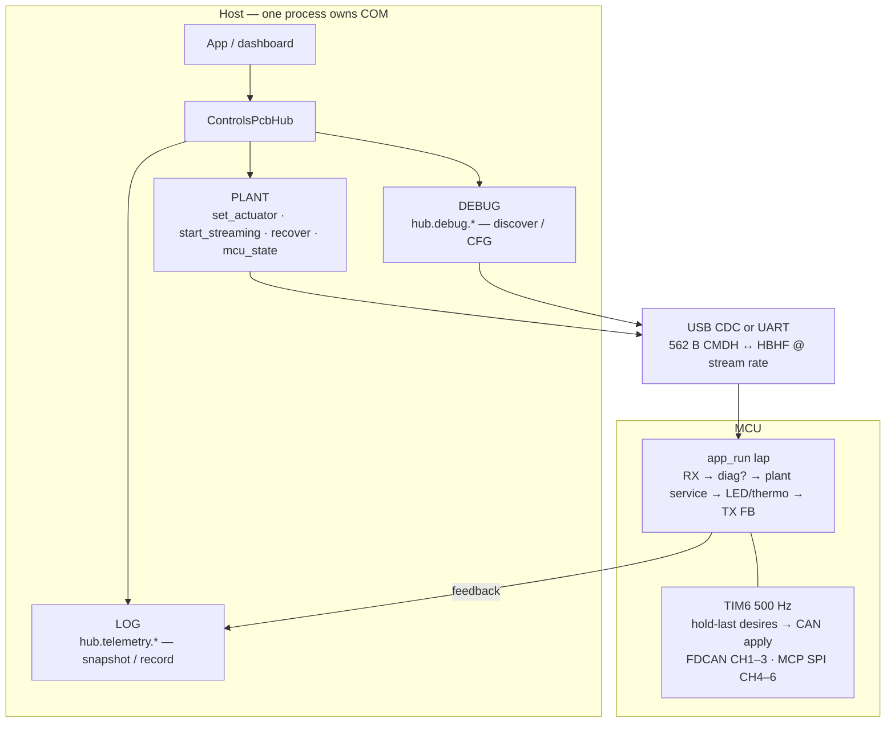

# Host API — Controls PCB

How software talks to the flashed board today. Canonical package:
[`scripts/deft_controls_sdk/`](../scripts/deft_controls_sdk/). Byte layout:
[host-exchange-v1.md](host-exchange-v1.md). Architecture / modes:
[architecture.md](architecture.md). Bench how-to: [bringup.md](bringup.md).

This page is the **call surface** — what to import, what each call does, and
how rates / hold-last / blank MCP interact. It is not a teleop policy guide
(arrow keys, homing, YAM limits stay in `scripts/legacy/`).

---

## 1. Mental model



| Layer | Rate | Who owns it |
|-------|------|-------------|
| Host plant stream | typically **~40 Hz** | `hub.start_streaming(hz=…)` |
| MCU plant apply | **500 Hz** (TIM6) | firmware — repeats last mounted desires |
| USB feedback | as often as `app_run` completes a lap | firmware `host_link_poll_tx` |

**Hold-last:** you do not need to match 500 Hz on the wire. Mount desires (via
stream or `send_once`); the plant keeps applying them until you change them,
blank them, hit `HOST_STALE` (>500 ms without a fresh CMD), or gate with
`mcu_state` / a DEBUG lease.

**One COM owner:** do not open the dashboard and a script (or two scripts)
against the same port at once.

---

## 2. Entry points

```powershell
cd scripts
pip install -r requirements.txt
```

| Use | How |
|-----|-----|
| Python plant / bench | `from deft_controls_sdk import ControlsPcbHub, ActuatorDesire, McuState` |
| Localhost UI | `python -m deft_controls_sdk.debug_dashboard` → http://127.0.0.1:8765 |
| Legacy teleop / cal | `scripts/legacy/` — frozen; not part of this API |

```python
from deft_controls_sdk import ControlsPcbHub, ActuatorDesire, McuState

with ControlsPcbHub.connect("COM5") as hub:
    hub.recover()
    hub.start_streaming(hz=40.0)          # plant TX thread + telemetry side thread
    hub.set_actuator(
        0,
        ActuatorDesire(position=0.0, kp=8.0, kd=0.5),
        send=False,                       # stream will resend held desires
    )
    print(hub.telemetry.snapshot())
```

---

## 3. `ControlsPcbHub` — plant calls

These are the top-level methods. There is **no** `hub.plant` namespace.

| Call | What it does |
|------|----------------|
| `ControlsPcbHub.connect(port, *, baud=…, persist_telemetry=False, telemetry=None)` | Opens serial, attaches a `TelemetryCache`. Scripts default to **not** rewriting `state.json`; pass `persist_telemetry=True` or a shared cache if you want disk mirror / reconnect history. |
| `hub.close()` / `with hub:` | Stops stream, closes COM. |
| `hub.start_streaming(hz=40.0, *, telemetry_hz=10.0)` | Background **plant TX** at `hz` (send → sleep only). Telemetry publish runs on a **separate** thread at `telemetry_hz`. Does **not** auto-`recover()`. |
| `hub.stop_streaming()` | Stops both background threads. |
| `hub.is_streaming` | Whether the plant stream thread is alive. |
| `hub.send_once()` | Build current held-desire image, write+flush one frame, poll/publish latest FB once. |
| `hub.set_actuator(slot, desire, *, send=True)` | Update held MIT desire for `slot` (`0 .. ACTUATOR_COUNT-1`, today **0..13**). `send=True` also writes immediately; with streaming, prefer `send=False` and let the stream resend (dashboard does this). |
| `hub.held_desire(slot)` / `hub.held_desires()` | What the stream is actually commanding (not “last UI box value”). |
| `hub.set_mcu_state(state, *, send=True)` | `McuState.NORMAL`, `RECOVERY`, `DIAG_ONLY`, `ESTOP`. |
| `hub.recover()` | `RECOVERY` then `NORMAL` — MCU runs `plant_recovery_all()` (resets/disables mounted actuators). Use explicitly; not implied by `start_streaming`. |
| `hub.port` | Open COM name. |
| `hub.state_path` | Path to `state.json` under the session dir (only written if persist is on). |
| `hub.log_feedback(raw=None, *, include_raw=True)` | Append one compact FB record to an **open** manual recording (no-op otherwise). |

### Desires and blank MCP

```python
ActuatorDesire(position=0.0, velocity=0.0, kp=0.0, kd=0.0, torque=0.0)  # idle / blank
```

Firmware treats a slot as **blank** when it is idle (`kp/kd/vel/τ≈0`) **and**
`position == 0`. Blank MCP slots (CH4–6) **skip SPI entirely**. A hold at true
zero with `kp>0` is fine; a “soft idle” that must keep MCP RX alive often uses
a tiny position epsilon (legacy teleop / dashboard: `1e-6`) with gains as needed.

**Apply accumulates.** Each `set_actuator` only changes that slot’s held desire.
Other slots keep prior holds until you idle them. Leaving CH4–6 all non-blank
at once is much heavier on the MCU than single-slot teleop.

### `McuState`

| Value | Meaning |
|-------|---------|
| `NORMAL` (0) | Plant apply allowed (subject to other gates). |
| `RECOVERY` (1) | Recovery path / clear desires on MCU. |
| `DIAG_ONLY` (2) | Plant CAN apply gated — bench/diag. |
| `ESTOP` (3) | Emergency stop semantics on MCU. |

### Plant block (read from feedback / telemetry)

Why the 500 Hz apply path may be gated (`plant_block` in FB / snapshot):

| Code | Name | Typical cause |
|------|------|----------------|
| 0 | none | Plant running |
| 1 | bench_session | `hub.debug.lease()` / RS2–DM session |
| 2 | probe_busy | Blocking probe in progress |
| 3 | quiet_period | Shortly after session end |
| 4 | diag_only | `mcu_state=DIAG_ONLY` |
| 5 | host_stale | No fresh host CMD for >500 ms — start/keep streaming |
| 6 | servo_session | Servo host session holding the path |

---

## 4. `hub.debug` — bench / CFG (DEBUG mode)

Same COM, tagged PDU under the hood. App code should call these methods, not
craft PDU tags. While a lease/session is active, plant apply may show
`plant_block=bench_session`.

| Call | What it does |
|------|----------------|
| `with hub.debug.lease(bus=…):` | RS2 session begin/end bracket. Prefer letting discover manage its own lease unless you need a multi-step session. |
| `hub.debug.discover_robstride(bus=…, start=0x40, end=0x80)` | Sweep for an RS02 ID. Manages its own lease. |
| `hub.debug.probe_robstride(bus=…, motor_id=…, timeout_s=…)` | Single-motor probe reply dict (or `None`). |
| `hub.debug.discover_damiao(bus=…, start=…, end=…, known_ids=…)` | Damiao discover; pass `known_ids` for configured slots first (avoids bus flood). |
| `hub.debug.cfg_get_table()` | List of actuator table rows (dual-arm: **14** slots). |
| `hub.debug.cfg_set_slot(slot=…, bus=…, protocol=…, motor_id=…, master_id=0, enabled=True, persist=False)` | RAM apply always; `persist=True` attempts NVM SAVE (flash save is unreliable in practice — RAM may stick while reboot reverts). |
| `hub.debug.calibrate_robstride(…)` | **Not ported** — raises `NotImplementedError`. Use legacy: `python scripts/legacy/control_hub.py calibrate --port COM5 --bus N --id 0xXX`. |

Protocol enum for CFG (firmware `actuator_protocol_t`):

| `protocol` | Meaning |
|------------|---------|
| 0 | `PROTO_NONE` |
| 1 | `PROTO_ROBSTRIDE` |
| 2 | `PROTO_CUBEMARS` |
| 3 | `PROTO_DAMIAO` |

Bus numbers are schematic branches **1..6** (CH1..CH6). CH1–3 = FDCAN; CH4–6 = MCP2518 SPI-CAN.

```python
with ControlsPcbHub.connect("COM5") as hub:
    table = hub.debug.cfg_get_table()
    hit = hub.debug.discover_robstride(bus=4)
    if hit is not None:
        hub.debug.cfg_set_slot(
            slot=3, bus=4, protocol=1, motor_id=hit, persist=False
        )
```

---

## 5. `hub.telemetry` — health / black box (LOG)

| Call | What it does |
|------|----------------|
| `hub.telemetry.snapshot()` | Frozen `SessionState` (grade, `fb_hz`, `ack_seq`, `stream_ack_lag`, actuators, plant_block, …). |
| `hub.telemetry.snapshot_dict()` | Same as JSON-friendly dict. |
| `hub.telemetry.start_recording()` | Opt-in NDJSON under `.deft_session/recordings/`. |
| `hub.telemetry.stop_recording()` | Stop manual record. |
| `hub.telemetry.log_feedback(…)` | Also available as `hub.log_feedback`. |
| `hub.telemetry.flush()` / `close()` | Drain background disk writer. |

Fault-triggered dumps can fire automatically on ugly `plant_block` / fault /
`ESTOP` transitions (with a short connect grace so cold `HOST_STALE` does not
spam). Manual record is unbounded until stopped — watch size in the snapshot.

**Reading metrics:**

- `fb_hz` — raw USB feedback rate when driven from `FrameReader.total_frames` (idle/blank MCP can be hundreds–~1000 Hz; sparse FB under heavy MCP is a superloop symptom, not “Python forgot to TX”).
- `stream_ack_lag` — host plant seq minus MCU `last_cmd_seq` at last FB sample. High lag with healthy `stream_send_ms` means FB samples are sparse.
- `stream_tx_gap_p95_ms` — host plant write spacing (prefer p95 over sticky max).

---

## 6. Localhost dashboard (human API)

```powershell
cd scripts
python -m deft_controls_sdk.debug_dashboard
# optional: python -m deft_controls_sdk.debug_dashboard --port COM5
```

One page, one process, one COM owner on Connect. Plant controls are the same
MIT holds as the SDK (`Apply` → `set_actuator(..., send=False)` into the stream).
DEBUG discover/CFG are **not** in the UI yet — use `hub.debug.*` in a script
(and disconnect the dashboard first).

Useful HTTP routes (same process):

| Route | Method | Role |
|-------|--------|------|
| `/api/state` | GET | Full snapshot |
| `/api/ports` | GET | COM list |
| `/api/connect` / `/api/disconnect` | POST | Own / release COM |
| `/api/actuator/<slot>` | POST | `{position, kp, kd}` hold |
| `/api/actuator/<slot>/idle` | POST | Blank that slot |
| `/api/mcu_state` | POST | `{state}` 0–3 |
| `/api/recover` | POST | Recover |
| `/api/record/start` · `/stop` | POST | Manual black box |

---

## 7. Slot map (dual-arm defaults)

Firmware `ACTUATOR_COUNT = 14`. Wire image still has 25 actuator slots; only
0..13 are mounted.

| Arm | Slots | Typical bus |
|-----|-------|-------------|
| Arm1 J1–J7 | 0–6 | CH1 (FDCAN) |
| Arm2 J8–J14 | 7–13 | CH2 (FDCAN) |

Live CFG can place RobStride (or others) on CH3–CH6; always `cfg_get_table()`
before assuming motor IDs. MCP CH4–6 share SPI — many simultaneous non-blank
MCP holds are expensive on the MCU hot path (see
[handoff-mcp-fb-bringup-2026-07-20.md](handoff-mcp-fb-bringup-2026-07-20.md)).

---

## 8. What this API deliberately does not include

| Concern | Where it lives |
|---------|----------------|
| Arrow teleop, homing, brace, YAM soft limits | `scripts/legacy/control_hub/teleop/` |
| RS02 encoder calibrate | Legacy CLI (`calibrate`) until ported |
| Crafting raw PDU tags / 562 B layouts in apps | Don’t — use hub methods; bytes in [host-exchange-v1.md](host-exchange-v1.md) |
| Second COM session / mux daemon | Not yet — one process owns the port |

---

## 9. Next step — DFU / bootloader (not the API yet)

**Field firmware update over USB without ST-Link (soft-DFU / ROM bootloader)
is a planned next step**, not part of the supported app API in this document.

Until that path is verified and documented as a first-class call:

- Flash / debug with **STM32CubeIDE + ST-Link** (see [bringup.md](bringup.md) §1).
- Do not build product workflows on an unverified bootloader entry hook.

When soft-DFU lands, this section should gain a single explicit hub (or tool)
entry point, success/failure semantics, and a bringup checklist — not a second
competing flash story.

---

## 10. Minimal recipes

**Stream + hold one joint**

```python
with ControlsPcbHub.connect("COM5") as hub:
    hub.start_streaming(hz=40.0)
    hub.set_actuator(0, ActuatorDesire(position=0.2, kp=8.0, kd=0.5), send=False)
    # ... time.sleep / your loop ...
    hub.set_actuator(0, ActuatorDesire(), send=False)  # idle / blank
```

**Recover then stream**

```python
with ControlsPcbHub.connect("COM5") as hub:
    hub.recover()
    hub.start_streaming()
```

**Discover + bind a CFG slot (bench)**

```python
with ControlsPcbHub.connect("COM5") as hub:
    mid = hub.debug.discover_robstride(bus=4)
    hub.debug.cfg_set_slot(slot=3, bus=4, protocol=1, motor_id=mid or 0, persist=False)
```

**Black-box a run**

```python
with ControlsPcbHub.connect("COM5") as hub:
    hub.start_streaming()
    hub.telemetry.start_recording()
    # ... exercise plant ...
    hub.telemetry.stop_recording()
    print(hub.telemetry.snapshot().recording_path)
```
