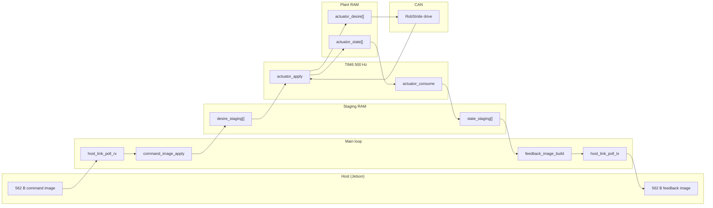

# Architecture

## Overview

Two execution contexts share data through **staging buffers** — no malloc, no RTOS.

| Context | Rate | Entry | Job |
|---------|------|-------|-----|
| **Main loop** | As fast as `app_run()` spins | `app_run()` | Host RX/TX only |
| **Plant loop** | 500 Hz (TIM6) | `control_loop_tick()` | CAN apply/consume |

The host publishes **desire** commands at its own rate (hold-last-command). The plant runs at 500 Hz independently.

## Data flow



## Buffer handoffs

| Buffer | Size / type | Writer | Reader | Notes |
|--------|-------------|--------|--------|-------|
| Wire command image | 562 B | Host | `host_link` | Magic + layout v1 |
| `desire_staging[]` | `ACTUATOR_COUNT` × command | Main | TIM6 `actuator_apply` | `desire_pending` flag |
| `actuator_desire[]` | Plant RAM | TIM6 | Plugins / CAN pack | Committed each tick if pending |
| `actuator_state[]` | Plant RAM | Plugins / CAN parse | TIM6 `actuator_consume` | Per-motor feedback |
| `state_staging[]` | `ACTUATOR_COUNT` × feedback | TIM6 | `feedback_image_build` | Snapshot for host |
| Wire feedback image | 562 B | `host_link` | Host | Magic + tick + ack seq |
| Transport RX rings | 2048 B | ISR / CDC callback | Main `read()` | Drop-on-full |

**Wire vs plant:** Exchange structs define **25 actuator slots** on the wire. Firmware uses `ACTUATOR_COUNT` (currently **1**) ≤ `HOST_EXCHANGE_ACTUATOR_SLOTS`.

## Module map

| Module | Role | Key files |
|--------|------|-----------|
| `app` | Init order, main loop | `App/Src/app.c` |
| `host_link` | RX reassembly, validate, apply; TX feedback | `App/Src/host_link.c` |
| `host_transport` | USB vs UART vtable | `host_transport.c`, `_usb.c`, `_uart.c` |
| `host_exchange` | Wire struct layout + static asserts | `App/Inc/host_exchange.h`, `host_exchange.c` |
| `feedback_image` | Build 562 B feedback from staging | `App/Src/feedback_image.c` |
| `actuator` | Staging, apply, consume | `App/Src/actuator.c` |
| `control_loop` | TIM6 tick, heartbeat, motor enable on boot | `App/Src/control_loop.c` |
| `can_router` | Per-bus TX queue, RX ring, FDCAN1 backend | `App/Src/can_router.c` |
| `plugin_table` | Dispatch pack/parse by protocol | `App/Src/plugins/plugin_table.c` |
| `robstride` | RS-02 private extended-frame protocol | `App/Src/plugins/robstride.c` |
| `config_loader` | Actuator table (RAM stub today) | `App/Src/config_loader.c` |

## Host transport selection

Compile-time toggle in `App/Inc/host_transport.h`:

- `HOST_TRANSPORT_UART 1` → UART4, `host_transport_uart_ops`
- `HOST_TRANSPORT_UART 0` → USB CDC, `host_transport_usb_ops`

USB hooks live in **Cube USER CODE** only: `USB_Device/App/usbd_cdc_if.c` → `host_transport_usb_rx_push` / `host_transport_usb_tx_complete`.

UART path: `UART4_IRQHandler` → HAL → `HAL_UART_RxCpltCallback` in `host_transport_uart.c`.

## Control loop (500 Hz)

On each TIM6 period:

1. `g_control_tick_count++` (12-bit field in feedback)
2. Heartbeat toggle PC3 every 250 ticks (~2 Hz)
3. `actuator_apply()` — commit desires, pack TX, `can_router_poll`, parse RX
4. `actuator_consume()` — copy `actuator_state[]` → `state_staging[]`

Boot: `control_loop_init()` sends RobStride enable (type 3) once, then starts TIM6.

## Main loop

```c
void app_run(void) {
    for (;;) {
        host_link_poll_rx();
        host_link_poll_tx();
    }
}
```

No CAN or actuator logic here — transport only.

## Invariants

- Plant rate is **500 Hz** regardless of host command/feedback rate.
- Host command images use **layout v1**, **562 bytes**, little-endian.
- RobStride drives use the **private extended-frame protocol** (not MIT/CANopen unless changed on the motor via type 25).
- `command_image_apply()` only stages **actuator** desires today; system/servo/LED/PDU fields are defined on the wire but not consumed yet.

## Related docs

- [host-exchange-v1.md](host-exchange-v1.md) — byte layout
- [bringup.md](bringup.md) — flash and bench
- [known-issues.md](known-issues.md) — races, resync, upgrade targets
