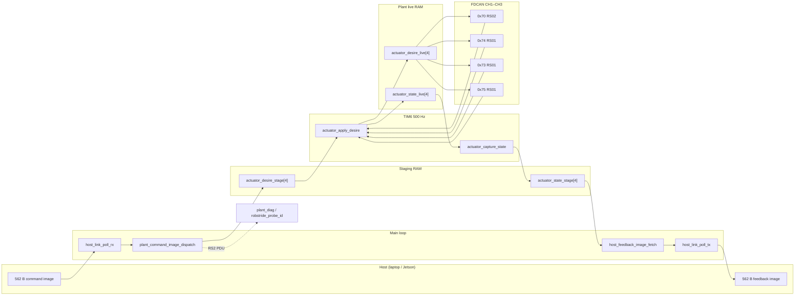

# Architecture

## Overview

Two execution contexts share data through **staging buffers** — no malloc, no RTOS.

| Context | Rate | Entry | Job |
|---------|------|-------|-----|
| **Main loop** | As fast as `app_run()` spins | `app_run()` | Host RX/TX, command dispatch |
| **Plant loop** | 500 Hz (TIM6) | `control_loop_tick()` | CAN apply/capture for all enabled actuators |

The host publishes **desire** commands at its own rate (hold-last-command). The plant runs at 500 Hz independently.

## Dual host paths

| Path | Trigger | MCU behavior | Host scripts |
|------|---------|--------------|--------------|
| **Plant teleop** | `pdu` all zero (no RS2 tag) | `actuator_command_mount` → 500 Hz `actuator_apply_desire` on **all** `ACTUATOR_COUNT` slots | `host_teleop_laptop_usb.py --plant-teleop` |
| **RS2 PDU bench** | `pdu.data[0..2] = 'R','S','2'` | `plant_diag_on_command` — blocking probes, cal, session; **skips** 500 Hz CAN while session active | `rs02_can_scan.py`, `--calibrate`, RS2 arrow teleop |

RS2 ctrl probes (`PROBE_CTRL_FAST`, etc.) may also mount `actuator_commands[0]` desires. Cal / pararead / session kinds do **not** mount desires (avoids kp fights during cal).

**Bus routing:** `pdu.data[11]` = schematic FDCAN branch `1` (CH1) … `3` (CH3). Firmware maps CH2 → `hfdcan3`, CH3 → `hfdcan2`.

## Naming (command / feedback)

| Tier | Command (ingress) | Feedback (egress) |
|------|-------------------|-------------------|
| Host | `host_command_image_dispatch` | `host_feedback_image_fetch` |
| Plant | `plant_command_image_dispatch` | `plant_feedback_image_fetch` |
| Actuator | `actuator_command_mount` | `actuator_feedback_snapshot` |
| TIM6 | `actuator_apply_desire` | `actuator_capture_state` |

## Data flow



## Buffer handoffs

| Buffer | Size / type | Writer | Reader | Notes |
|--------|-------------|--------|--------|-------|
| Wire command image | 562 B | Host | `host_link` | Magic + layout v1 |
| `actuator_desire_stage[]` | 4 × command | Main | TIM6 `actuator_apply_desire` | `actuator_desire_pending` |
| `actuator_desire_live[]` | Plant RAM | TIM6 | `robstride_apply_cycle` | Hold-last between host updates |
| `actuator_state_live[]` | Plant RAM | Plugins / CAN parse | TIM6 `actuator_capture_state` | Per-motor feedback |
| `actuator_state_stage[]` | 4 × feedback | TIM6 | `host_feedback_image_fetch` | Snapshot for host |
| Wire feedback image | 562 B | `host_link` | Host | Magic + tick + ack seq |
| CAN RX rings | 128 frames / bus | ISR | `can_router_poll` | Drop-oldest on overflow |

**Wire vs plant:** Exchange structs define **25 actuator slots** on the wire. Firmware uses `ACTUATOR_COUNT` (**4**) ≤ `HOST_EXCHANGE_ACTUATOR_SLOTS`. Slots 0–3 map to `plant_config.c` table.

## Module map

```
App/
  Inc/app.h
  Src/app.c
  host/          wire schema, link, transport
  plant/         config, actuator, control_loop, plant_diag, can/, plugin_schema/, plugins/
```

| Module | Role | Key files |
|--------|------|-----------|
| `app` | Init order, main loop | `App/Src/app.c` |
| `host_link` | RX reassembly, dispatch; TX fetch | `App/Src/host/host_link.c` |
| `host_transport` | USB vs UART vtable | `App/Src/host/host_transport*.c` |
| `host_exchange_schema` | Wire struct layout + static asserts | `App/Inc/host/host_exchange_schema.h` |
| `plant_command` | Dispatch wire command; RS2 vs plant path | `App/Src/plant/plant_command.c` |
| `plant_diag` | RS2 session, probe dispatch, bus from PDU | `App/Src/plant/plant_diag.c` |
| `plant_feedback` | Aggregate feedback payload | `App/Src/plant/plant_feedback.c` |
| `actuator` | Mount, apply_desire, capture, snapshot | `App/Src/plant/actuator.c` |
| `control_loop` | TIM6 tick, heartbeat | `App/Src/plant/control_loop.c` |
| `can_router` | Per-bus TX queue, RX ring, FDCAN1/2/3 | `App/Src/plant/can/can_router.c` |
| `plugin_table` | Dispatch pack/parse by protocol | `App/Src/plant/plugin_schema/plugin_table.c` |
| `robstride` | RobStride extended-frame protocol | `App/Src/plant/plugins/robstride.c` |
| `plant_config` | Four-actuator table (bus, ID, enable) | `App/Src/plant/plant_config.c` |

## CAN topology (schematic)

| `can_bus_id_t` | MCU peripheral | Pins | Actuators |
|----------------|----------------|------|-----------|
| `CAN_BUS_CH1` | FDCAN1 | PB8 / PB9 | `0x70`, `0x74` (daisy) |
| `CAN_BUS_CH2` | FDCAN3 | PA8 / PA15 | `0x73` |
| `CAN_BUS_CH3` | FDCAN2 | PB12 / PB13 | `0x75` |

## Host transport selection

Compile-time toggle in `App/Inc/host/host_transport.h`:

- `HOST_TRANSPORT_UART 0` → USB CDC (controls PCB laptop bench)
- `HOST_TRANSPORT_UART 1` → UART4

## Control loop (500 Hz)

On each TIM6 period:

1. `g_control_tick_count++` (12-bit field in feedback)
2. Heartbeat toggle PC3 every 250 ticks (~2 Hz)
3. `actuator_apply_desire()` — unless `plant_diag_skip_actuator_can()`:
   - promote `actuator_desire_stage` → `actuator_desire_live`
   - per enabled slot: `robstride_apply_cycle` (3× MOTOR_CTRL + periodic pararead)
4. `actuator_capture_state()` — copy live → stage

## Main loop

```c
void app_run(void) {
    for (;;) {
        control_loop_service();  /* TIM6 flag */
        host_link_poll_rx();
        host_link_poll_tx();
    }
}
```

CAN and actuator work run on TIM6; main loop handles transport and command dispatch.

## Invariants

- Plant rate is **500 Hz** regardless of host command rate (~40 Hz typical for plant teleop).
- Host command images use **layout v1**, **562 bytes**, little-endian.
- RobStride drives use the **private extended-frame protocol** (MIT-style p/v/kp/kd pack in comm `0x01`).
- Normal plant teleop leaves `pdu` zero; RS2 bench tools set the `'RS2'` PDU tag.
- Plant teleop host uses **kp gating** (0 at rest) and low gains — materially lower bench current than RS2 teleop at kp=50.

## Related docs

- [host-exchange-v1.md](host-exchange-v1.md) — byte layout, PDU RS2 fields
- [bringup.md](bringup.md) — flash, motor map, scripts
- [known-issues.md](known-issues.md) — cal NOISE, backlog
