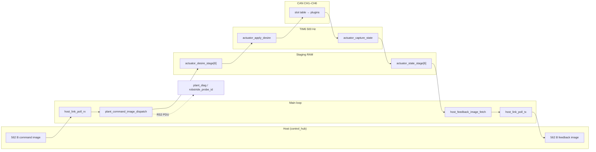

# Architecture

## Overview

Two execution contexts share data through **staging buffers** — no malloc on the hot path.

| Context | Rate | Entry | Job |
|---------|------|-------|-----|
| **Main loop** | As fast as `app_run()` spins | `app_run()` | Host RX/TX, command dispatch |
| **Plant loop** | 500 Hz (TIM6) | `control_loop_tick()` | CAN apply/capture for all enabled actuators |

`USE_FREERTOS_SCHEDULER` in `App/Inc/app.h` selects bare-metal superloop (`0`, default) vs FreeRTOS (`1`). Both paths keep the same staging handoffs; RTOS only moves *where* `app_run` and the plant tick run.

The host publishes **desire** commands at its own rate (hold-last-command). The plant runs at 500 Hz independently.

## Plant runtime gates (firmware)

`plant_runtime.c` is the single gate for the 500 Hz actuator path:

```
mount → stage → apply_desire (plant_runtime_actuator_can_apply?) → capture → snapshot → feedback
```

When apply is blocked, `host_system_feedback.reserved` (7 bits) carries `plant_block_reason_t`:

| Value | Meaning |
|-------|---------|
| 0 | none — plant loop running |
| 1 | bench_session (RS2/DM) |
| 2 | probe_busy |
| 3 | quiet_period after session end |
| 4 | DIAG_ONLY mcu_state |
| 5 | host_stale (>500 ms) |
| 6 | servo_host_session |

Host: `controls_pcb_host status` shows `plant_block=…`. Plugins call `bench_yield_usb()` during long probes (not `plant_diag` directly).

## Host stack (Python)

Canonical package: **`scripts/control_hub/`** (entry: `python scripts/control_hub.py`).

| Layer | Role |
|-------|------|
| `control_hub/protocol/rs02.py` | RS02 datasheet comm types, params, ext_id decode |
| `control_hub/rs02/calibrate.py` | Encoder cal sequence (comm 0x04→0x702D→0x05→0x06→0x16) |
| `control_hub/teleop/plant.py` | 500 Hz plant teleop (`actuator_commands[]`, no RS2 PDU) |
| `control_hub/link.py` | USB heal / release between bench and plant modes |
| `controls_pcb_host/` | Wire image builders, `PcbSession`, CLI, Damiao/DXL plugins |

`controls_pcb_host.py` and `control_hub.py` are equivalent entrypoints. Legacy scripts (`host_teleop_laptop_usb.py`, `rs02_can_scan.py`) remain for expert `--bench-cmds` / MCP smoke; new work goes through `control_hub`.

## Dual host paths (firmware)

| Path | Trigger | MCU behavior | Host |
|------|---------|--------------|------|
| **Plant teleop** | `pdu` all zero (no RS2/DM tag) | `actuator_command_mount` → 500 Hz `actuator_apply_desire` on **all** `ACTUATOR_COUNT` slots | `control_hub teleop` |
| **RS2 PDU bench** | `pdu.data[0..2] = 'R','S','2'` | `plant_diag_on_command` — blocking probes, cal, session; **skips** 500 Hz CAN while session active | `control_hub calibrate`, `controls_pcb_host probe` |
| **DM0 PDU bench** | `pdu.data[0..2] = 'D','M','0'` + `DIAG_ONLY` | `plant_diag_on_dm_command` — Damiao probe on selected bus | `controls_pcb_host` Damiao plugins |

RS2 ctrl probes (`PROBE_CTRL_FAST`, etc.) may mount `actuator_commands[0]` desires. Cal / pararead / session kinds do **not** mount desires.

**Bus routing:** `pdu.data[11]` = schematic branch `1` (CH1) … `6` (CH6). FDCAN: CH1→`hfdcan1`, CH2→`hfdcan3`, CH3→`hfdcan2`. CH4–6: MCP2518 SPI-CAN (unchanged bringup — see `docs/ch4-mcp2518-bringup-postmortem.md`).

## Naming (command / feedback)

| Tier | Command (ingress) | Feedback (egress) |
|------|-------------------|-------------------|
| Host | `host_command_image_dispatch` | `host_feedback_image_fetch` |
| Plant | `plant_command_image_dispatch` | `plant_feedback_image_fetch` |
| Actuator | `actuator_command_mount` | `actuator_feedback_snapshot` |
| TIM6 | `actuator_apply_desire` | `actuator_capture_state` |

## Data flow


```mermaid
flowchart LR
  subgraph host["Host (control_hub)"]
    CMD["562 B command image"]
    FB["562 B feedback image"]
  end

  subgraph main["Main loop"]
    HL_RX["host_link_poll_rx"]
    HL_TX["host_link_poll_tx"]
    DISPATCH["plant_command_image_dispatch"]
    FETCH["host_feedback_image_fetch"]
  end

  subgraph staging["Staging RAM"]
    DS["actuator_desire_stage[6]"]
    SS["actuator_state_stage[6]"]
  end

  subgraph tim6["TIM6 500 Hz"]
    APPLY["actuator_apply_desire"]
    CAP["actuator_capture_state"]
  end

  subgraph can["CAN CH1–CH6"]
    M0["slot table → plugins"]
  end

  CMD --> HL_RX --> DISPATCH --> DS
  DISPATCH -.->|RS2 PDU| DIAG["plant_diag / robstride_probe_id"]
  DS --> APPLY --> M0
  M0 --> CAP --> SS
  SS --> FETCH --> HL_TX --> FB
```

## Buffer handoffs

| Buffer | Size / type | Writer | Reader | Notes |
|--------|-------------|--------|--------|-------|
| Wire command image | 562 B | Host | `host_link` | Magic + layout v1 |
| `actuator_desire_stage[]` | 6 × command | Main | TIM6 `actuator_apply_desire` | `actuator_desire_pending` |
| `actuator_desire_live[]` | Plant RAM | TIM6 | plugin `apply_cycle` | Hold-last between host updates |
| `actuator_state_live[]` | Plant RAM | Plugins / CAN parse | TIM6 `actuator_capture_state` | Per-motor feedback |
| `actuator_state_stage[]` | 6 × feedback | TIM6 | `host_feedback_image_fetch` | Snapshot for host |
| Wire feedback image | 562 B | `host_link` | Host | Magic + tick + ack seq |
| CAN RX rings | 128 frames / bus | ISR | `can_router_poll` | Drop-oldest on overflow |

**Wire vs plant:** Exchange structs define **25 actuator slots** on the wire. Firmware uses `ACTUATOR_COUNT` (**6**) ≤ `HOST_EXCHANGE_ACTUATOR_SLOTS`. Slots 0–5 map to `plant_config.c` (host mirror: `controls_pcb_host/actuator_config.py`).

## Module map

```
App/
  Inc/app.h                    USE_FREERTOS_SCHEDULER
  Src/app.c
  host/                        wire schema, link, transport
  plant/                       config, actuator, control_loop, plant_diag, can/, plugins/

scripts/
  control_hub/                 RS02 cal, plant teleop, protocol
  controls_pcb_host/           session, CLI, wire builders, plugins
  control_hub.py                 unified CLI entry
```

| Module | Role | Key files |
|--------|------|-----------|
| `plant_diag` | RS2/DM/DXL bench dispatch, MCP smoke/wake (CH4–6 only) | `App/Src/plant/plant_diag.c` |
| `robstride` | RS02 extended-frame protocol + `robstride_probe_id` | `App/Src/plant/plugins/robstride.c` |
| `mcp2518fd` / `spi_can_router` | SPI-CAN rails — **do not reorder init priority** | `App/Src/plant/can/` |
| `plant_config` | Six-actuator table | `App/Src/plant/plant_config.c` |

`plant_diag.h` probe kinds `0–19` alias `robstride.h` (`RS02_PROBE_*`). MCP-only kinds `20–22` stay in `plant_diag.h`.

## CAN topology (schematic)

| `can_bus_id_t` | MCU peripheral | Pins | Typical slot (see `plant_config.c`) |
|----------------|----------------|------|-------------------------------------|
| `CAN_BUS_CH1` | FDCAN1 | PB8 / PB9 | RS02 `0x76` |
| `CAN_BUS_CH2` | FDCAN3 | PA8 / PA15 | RS02 `0x70` |
| `CAN_BUS_CH3` | FDCAN2 | PB12 / PB13 | Damiao |
| `CAN_BUS_CH4`–`CH6` | MCP2518 | PB11 / PB1 / PA4 | RS02 bench |

## RS02 encoder cal (datasheet)

Per `External_Documentation/RobStride/RS02/RS02_Firmware_Documentation.pdf`:

1. **comm 0x04** reset (`data[0]=1` clears faults) — motor at **rest** (mms=0)
2. **parawrite 0x702D=1** (`iq_test`, §4.2.7) — optional extended init
3. **comm 0x05** motor_cali — one listen window on MCU; shaft spins freely
4. Success: mms **cali → rest or running**
5. **comm 0x06** zero, **comm 0x16** data_save, pararead verify (`0x7019` mechPos)

Supply **24–60 V** (datasheet range). Host skips zero/save if step 4 fails.

## Host transport

`App/Inc/host/host_transport.h`: `HOST_TRANSPORT_UART 0` → USB CDC (bench laptop).

## Control loop (500 Hz)

On each TIM6 period:

1. `g_control_tick_count++`
2. Heartbeat toggle PC3 every 250 ticks (~2 Hz)
3. `actuator_apply_desire()` — unless `plant_diag_skip_actuator_can()`
4. `actuator_capture_state()`

## Invariants

- Plant rate is **500 Hz** regardless of host command rate (~40 Hz teleop).
- Host images: **layout v1**, **562 bytes**, little-endian.
- RobStride: **29-bit extended CAN 2.0 @ 1 Mbps**.
- Plant teleop: idle **kp=0 kd=0** (backdrivable); RS2 teleop via PDU uses separate path.
- RS2 teleop exit does **not** call `RECOVERY` (avoids all-bus reset / LED flood). Damiao teleop may use `RECOVERY` on exit.

## Related docs

- [host-exchange-v1.md](host-exchange-v1.md) — byte layout, PDU RS2 fields
- [bringup.md](bringup.md) — flash, motor map, scripts
- [ch4-mcp2518-bringup-postmortem.md](ch4-mcp2518-bringup-postmortem.md) — SPI-CAN constraints
- [known-issues.md](known-issues.md) — bench backlog
