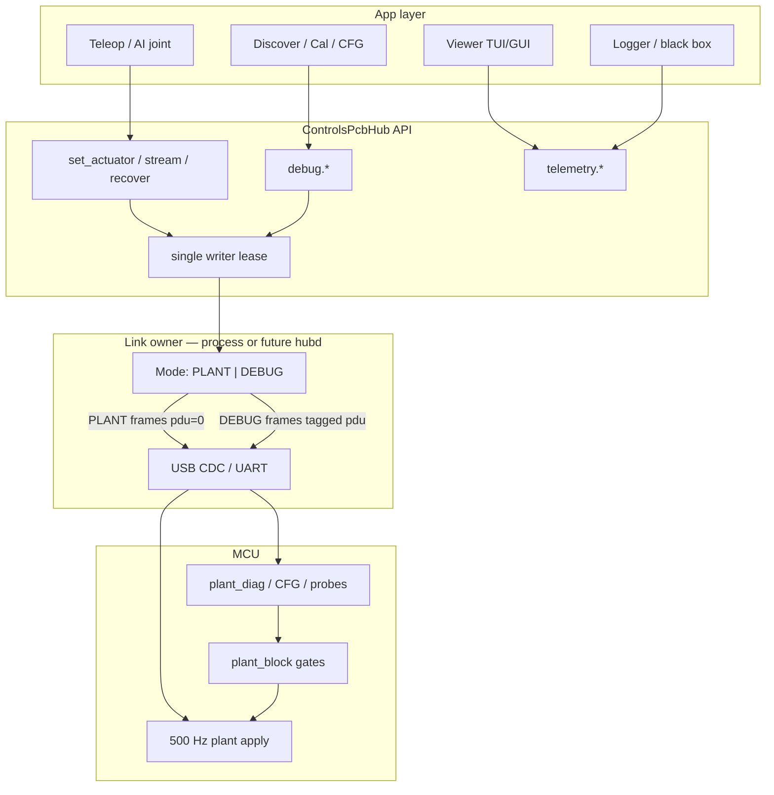
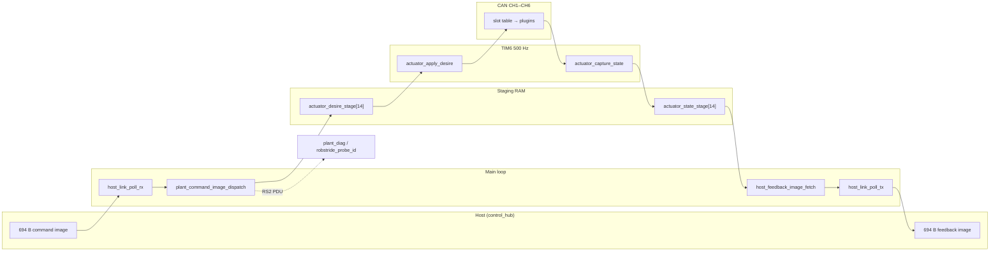

# Architecture

## Overview

Two execution contexts share data through **staging buffers** under bare-metal; under RTOS there are three tasks. No malloc on the hot path.

| Context | Rate | Entry | Job |
|---------|------|-------|-----|
| **Host** | As fast as HostTask / `app_run` spins | `app_host_service()` | USB RX, diag, pdb, light heartbeat |
| **Plant** | 500 Hz (TIM6 notify) | `app_plant_service()` | Actuator apply/capture + FB TX |
| **Peripheral** | Best-effort (below plant) | `app_peripheral_service()` | Servo/LED mount, DXL bus, SPI3, CAN router poll |

`USE_FREERTOS_SCHEDULER` in `App/Inc/app.h` selects bare-metal superloop (`0`) vs FreeRTOS CMSIS-RTOS **v2** (`1`, default; `osThreadNew`, heap 48 KB). Bare-metal `app_run` calls host → plant → peripheral sequentially. Under RTOS: **Host**, **Plant**, and **Peripheral** share `osPriorityAboveNormal` (time-slice keeps USB ack + DXL/LED alive under plant load); Plant waits on TIM6 `vTaskNotifyGiveFromISR` (TIM6 NVIC=6; USB NVIC 0); DXL polled UART is wrapped in `vTaskSuspendAll`. Metrics: `act_lap_ms` / `act_lap_peak_ms` = PlantTask; `periph_lap_ms` / `periph_lap_peak_ms` = PeripheralTask; `cmd_rx_seq` = USB RX stage; `cmd_applied_seq` = plant mount.

The host publishes **desire** commands at its own rate (hold-last-command). The plant runs at 500 Hz independently.

## Host API modes

One physical link (USB CDC or UART), one 694 B cyclic frame in each direction — but two jobs share it: soft-realtime plant control and bench diagnostics. App code should choose a **mode**, never a `pdu` tag directly. See Host API modes below and [bringup.md](bringup.md).

| Mode | Wire behavior (today, under the hood) | Host API surface |
|------|----------------------------------------|------------------|
| **PLANT** | Cyclic 694 B, `pdu=0`, stream ~30–100 Hz | Top-level hub: `set_actuator`, `start_streaming`, `recover`, … |
| **DEBUG** | Same link, tagged PDU / diag sessions; plant apply gated | `hub.debug.*` (exclusive lease) |
| **HEALTH** | Derived from feedback system word + link metrics | Feedback / status fields (no separate `hub.health` yet) |
| **LOG** | Host-side events / snapshots — `state.json` + NDJSON fault/manual recording (`telemetry/recorder.py`) | `hub.telemetry.start_recording()` / `stop_recording()`, auto on fault |


```mermaid
flowchart TB
  subgraph apps["App layer"]
    Teleop["Teleop / AI joint"]
    Bench["Discover / Cal / CFG"]
    UI["Viewer TUI/GUI"]
    Log["Logger / black box"]
  end

  subgraph api["ControlsPcbHub API"]
    Plant["set_actuator / stream / recover"]
    Debug["debug.*"]
    Telemetry["telemetry.*"]
    Lease["single writer lease"]
  end

  subgraph link["Link owner — process or future hubd"]
    Mux["Mode: PLANT | DEBUG"]
    Ser["USB CDC / UART"]
  end

  subgraph mcu["MCU"]
    PlantPath["500 Hz plant apply"]
    DiagPath["plant_diag / CFG / probes"]
    Gates["plant_block gates"]
  end

  Teleop --> Plant
  Bench --> Debug
  UI --> Telemetry
  Log --> Telemetry
  Plant --> Lease
  Debug --> Lease
  Lease --> Mux
  Mux -->|PLANT frames pdu=0| Ser
  Mux -->|DEBUG frames tagged pdu| Ser
  Ser --> PlantPath
  Ser --> DiagPath
  DiagPath --> Gates
  Gates --> PlantPath
```

`scripts/deft_controls_sdk/ControlsPcbHub` is the live host API — plant control is **top-level** (`set_actuator`, `start_streaming`, `recover`, …); there is no `hub.plant` namespace. `hub.debug` is a bench lease (`deft_controls_sdk/bench/`) for discover/CFG. `hub.telemetry` reads the shared feedback cache (`TelemetryCache` → `state.json`). RobStride/Damiao discover are ported (fabricated-frame tests); RS02 calibrate is not ported yet (`scripts/deft_controls_sdk/README.md`). `python -m deft_controls_sdk.debug_dashboard` opens a `ControlsPcbHub` from the browser and becomes the sole COM owner on Connect. Until a future `hubd` mux exists, **one process owns COM** — do not open a second dashboard or legacy CLI against the same port. Frozen predecessors live under `scripts/legacy/`.

**Legacy tangle** (what this replaces as the primary story): *teleop / dashboard / CLI / plugins → all open COM → same 694 B → pdu tag?* — every app had to know wire/pdu details to pick a mode. The mode table + diagram above is the target story; `docs/host-exchange-v3.md` remains the byte-level source of truth underneath it.

## Plant runtime gates (firmware)

`plant_runtime.c` is the single gate for the 500 Hz actuator path:

```
mount → stage → apply_desire (plant_runtime_actuator_can_apply?) → capture → snapshot → feedback
```

When apply is blocked, `host_system_feedback.reserved` (7 bits) carries `plant_block_reason_t`:

| Value | Meaning |
|-------|---------|
| 0 | none — plant loop running |
| 1 | bench_session (RS2/DM) |
| 2 | probe_busy |
| 3 | quiet_period after session end |
| 4 | DIAG_ONLY mcu_state |
| 5 | host_stale (>500 ms) |
| 6 | servo_host_session |

Host: `controls_pcb_host status` shows `plant_block=…`. Plugins call `bench_yield_usb()` during long probes (not `plant_diag` directly).

## Host stack (Python)

Canonical package: **`scripts/deft_controls_sdk/`** (`from deft_controls_sdk import ControlsPcbHub`).

| Layer | Role |
|-------|------|
| `ControlsPcbHub` | Sole COM owner; plant methods + `debug` + `telemetry` |
| `link/` | USB/UART exchange, image encode/decode |
| `bench/` | Discover / CFG / probe lease (`hub.debug`) |
| `telemetry/` | Feedback cache, `state.json`, fault/manual NDJSON |
| `debug_dashboard` | Browser UI that owns a hub session |

Legacy teleop/joint CLI: `scripts/legacy/` (`PYTHONPATH=legacy;.`). See [bringup.md](bringup.md).

## PLANT vs DEBUG modes (firmware detail)

How the two [Host API modes](#host-api-modes) above are actually realized on the wire today — `pdu` tags are the DEBUG transport's implementation detail, not something app code should key off directly.

| Path | Trigger | MCU behavior | Host |
|------|---------|--------------|------|
| **PLANT** | `pdu` all zero (no RS2/DM tag) | `actuator_command_mount` → 500 Hz `actuator_apply_desire` on **all** `ACTUATOR_COUNT` slots | Hub plant methods, legacy `control_hub teleop` |
| **DEBUG — RS2 PDU bench** | `pdu.data[0..2] = 'R','S','2'` | `plant_diag_on_command` — blocking probes, cal, session; **skips** 500 Hz CAN while session active | `hub.debug.*`, legacy calibrate/probe |
| **DEBUG — DM0 PDU bench** | `pdu.data[0..2] = 'D','M','0'` + `DIAG_ONLY` | `plant_diag_on_dm_command` — Damiao probe on selected bus | `hub.debug.discover_damiao`, legacy Damiao plugins |

RS2 ctrl probes (`PROBE_CTRL_FAST`, etc.) may mount `actuator_commands[0]` desires. Cal / pararead / session kinds do **not** mount desires.

**Bus routing:** `pdu.data[11]` = schematic branch `1` (CH1) … `6` (CH6). FDCAN: CH1→`hfdcan1`, CH2→`hfdcan3`, CH3→`hfdcan2`. CH4–6: MCP2518 SPI-CAN — see [lessons.md](lessons.md).

## Naming (command / feedback)

| Tier | Command (ingress) | Feedback (egress) |
|------|-------------------|-------------------|
| Host | `host_command_image_dispatch` | `host_feedback_image_fetch` |
| Plant | `plant_command_image_dispatch` | `plant_feedback_image_fetch` |
| Actuator | `actuator_command_mount` | `actuator_feedback_snapshot` |
| TIM6 | `actuator_apply_desire` | `actuator_capture_state` |

## Data flow (MCU staging detail)

Lower-level realization of the `Mux`/`Ser`/`PlantPath`/`DiagPath`/`Gates` boxes in the [Host API modes](#host-api-modes) diagram above — same story, buffer-level detail.


```mermaid
flowchart LR
  subgraph host["Host (control_hub)"]
    CMD["694 B command image"]
    FB["694 B feedback image"]
  end

  subgraph main["Main loop"]
    HL_RX["host_link_poll_rx"]
    HL_TX["host_link_poll_tx"]
    DISPATCH["plant_command_image_dispatch"]
    FETCH["host_feedback_image_fetch"]
  end

  subgraph staging["Staging RAM"]
    DS["actuator_desire_stage[14]"]
    SS["actuator_state_stage[14]"]
  end

  subgraph tim6["TIM6 500 Hz"]
    APPLY["actuator_apply_desire"]
    CAP["actuator_capture_state"]
  end

  subgraph can["CAN CH1–CH6"]
    M0["slot table → plugins"]
  end

  CMD --> HL_RX --> DISPATCH --> DS
  DISPATCH -.->|RS2 PDU| DIAG["plant_diag / robstride_probe_id"]
  DS --> APPLY --> M0
  M0 --> CAP --> SS
  SS --> FETCH --> HL_TX --> FB
```

## Buffer handoffs

| Buffer | Size / type | Writer | Reader | Notes |
|--------|-------------|--------|--------|-------|
| Wire command image | 694 B | Host | `host_link` | Magic + layout v3 |
| `actuator_desire_stage[]` | 14 × command | Main | TIM6 `actuator_apply_desire` | `actuator_desire_pending` |
| `actuator_desire_live[]` | Plant RAM | TIM6 | plugin `apply_cycle` | Hold-last between host updates |
| `actuator_state_live[]` | Plant RAM | Plugins / CAN parse | TIM6 `actuator_capture_state` | Per-motor feedback |
| `actuator_state_stage[]` | 14 × feedback | TIM6 | `host_feedback_image_fetch` | Snapshot for host |
| Wire feedback image | 694 B | `host_link` | Host | Magic + tick + ack seq |
| CAN RX rings | 128 frames / bus | ISR | `can_router_poll` | Drop-oldest on overflow |

**Wire vs plant:** Exchange structs define **26 actuator slots** on the wire (`HOST_EXCHANGE_ACTUATOR_SLOTS`, `App/Inc/host/host_exchange_schema.h`). Firmware `ACTUATOR_COUNT` == `HOST_EXCHANGE_ACTUATOR_SLOTS` — plant table is the wire table, no separate compiled-in split. Per-slot bus/protocol assignment is CFG-driven at runtime; see [bringup.md](bringup.md) for current plant config.

## Module map

```
App/
  Inc/app.h                    USE_FREERTOS_SCHEDULER
  Src/app.c
  host/                        wire schema, link, transport
  plant/                       config, actuator, control_loop, plant_diag, can/, plugins/

scripts/
  deft_controls_sdk/           Preferred host API (ControlsPcbHub)
  legacy/                      Frozen teleop / CLI / old packages
```

| Module | Role | Key files |
|--------|------|-----------|
| `plant_diag` | RS2/DM/DXL bench dispatch, MCP smoke/wake (CH4–6 only) | `App/Src/plant/plant_diag.c` |
| `robstride` | RS02 extended-frame protocol + `robstride_probe_id` | `App/Src/plant/plugins/robstride.c` |
| `mcp2518fd` / `spi_can_router` | SPI-CAN rails — **do not reorder init priority** | `App/Src/plant/can/` |
| `plant_config` | Actuator table (`ACTUATOR_COUNT=14`, dual YAM) | `App/Src/plant/plant_config.c` |

`plant_diag.h` probe kinds `0–19` alias `robstride.h` (`RS02_PROBE_*`). MCP-only kinds `20–22` stay in `plant_diag.h`.

## CAN topology (schematic)

| `can_bus_id_t` | MCU peripheral | Pins | Typical slot (see `plant_config.c`) |
|----------------|----------------|------|-------------------------------------|
| `CAN_BUS_CH1` | FDCAN1 | PB8 / PB9 | Dual-arm Damiao slots 0–6; RS02 also OK |
| `CAN_BUS_CH2` | FDCAN3 | PA8 / PA15 | Dual-arm Damiao slots 7–13; RS02 also OK |
| `CAN_BUS_CH3` | FDCAN2 | PB12 / PB13 | Mixed / spare (historical Damiao bench) |
| `CAN_BUS_CH4`–`CH6` | MCP2518 | PB11 / PB1 / PA4 | SPI-CAN bench |

## RS02 encoder cal (datasheet)

Per `External_Documentation/RobStride/RS02/RS02_Firmware_Documentation.pdf`:

1. **comm 0x04** reset (`data[0]=1` clears faults) — motor at **rest** (mms=0)
2. **parawrite 0x702D=1** (`iq_test`, §4.2.7) — optional extended init
3. **comm 0x05** motor_cali — one listen window on MCU; shaft spins freely
4. Success: mms **cali → rest or running** (no separate cal-done ACK). Firmware
   also polls **enable (0x03)** after mms=cali — motor ignores enable while
   calibrating, so the first enable/fb reply ends the listen early.
5. **comm 0x06** zero, **comm 0x16** data_save, pararead verify (`0x7019` mechPos)

Supply **24–60 V** (datasheet range). Host skips zero/save if step 4 fails.

## Host transport

`App/Inc/host/host_transport.h`: `HOST_TRANSPORT_UART 0` → USB CDC (bench laptop).

## Control loop (500 Hz)

On each TIM6 period:

1. `g_control_tick_count++`
2. Heartbeat toggle PC3 every 250 ticks (~2 Hz)
3. `actuator_apply_desire()` — unless `plant_diag_skip_actuator_can()`
4. `actuator_capture_state()`

## Invariants

- Plant rate is **500 Hz** regardless of host command rate (~40 Hz teleop).
- Host images: **layout v3**, **694 bytes**, little-endian.
- RobStride: **29-bit extended CAN 2.0 @ 1 Mbps**.
- Plant teleop: idle **kp=0 kd=0** (backdrivable); RS2 teleop via PDU uses separate path.
- RS2 teleop exit does **not** call `RECOVERY` (avoids all-bus reset / LED flood). Damiao teleop may use `RECOVERY` on exit.

## Wire contracts (layout v3 — shipped)

| | Current |
|--|---------|
| USB host image | **694 B**, [host-exchange-v3.md](host-exchange-v3.md) |
| System block | **32 B** health + lap timing |
| Actuator slot | **22 B** × 26 (20 MIT + 2 B meta identity on fb) |
| USB `pdb[]` | **64 B**; DEBUG mailbox = `pdb[0..31]` until dedicated DEBUG messages |
| Controls ↔ PDB UART | **LIVE** (`UART4_MODE_PDB`): UART4 PC10/PC11, IT RX-to-idle + IT TX, `pdb_link` on HostTask; soft-kill park / rail-enable APIs still unfinished; hard ESTOP GPIO placeholder PA0 |
| Host stream rate | ~30–50 Hz typical; USB FS has headroom at 694 B |

```text
header       12
system       32
actuators   550   (25 × 22)
servos       12
leds          2
pdb          64
───────────────
total       672
```

Three-layer power path: **host ↔ controls (USB) ↔ PDB (UART + ESTOP wire)**. Soft-kill is staged on UART/status so actuators can reach a safe pose under power before the controls board asserts hard ESTOP.

Full decision text: **[decisions.md](decisions.md)** ADR-001.

## Deferred (other host API — document only)

1. **`hubd`**: sole COM owner as a standalone process; WebSocket/`/state` for UI; writer lease in code; JSON/NDJSON as log sink, not control plane.
2. **DEBUG** as a distinct message type/magic (vs tagged USB `pdu` forever).
3. Telemetry log *selectors* (filter fields/rate); fault/recording ring already exists under `.deft_session/`.

## Related docs

- [decisions.md](decisions.md) — ADR-001 host 672 B + PDB UART 64 B
- [bringup.md](bringup.md) — current how-to (SDK + dual-arm)
- [lessons.md](lessons.md) — open bugs + durable bring-up lessons
- [host-exchange-v3.md](host-exchange-v3.md) — **current** 694 B layout (v1/v2 superseded, see `docs/legacy/`)
- [fdcan-dual-id-mixed-bus.md](fdcan-dual-id-mixed-bus.md) — mixed std/ext FDCAN detail
