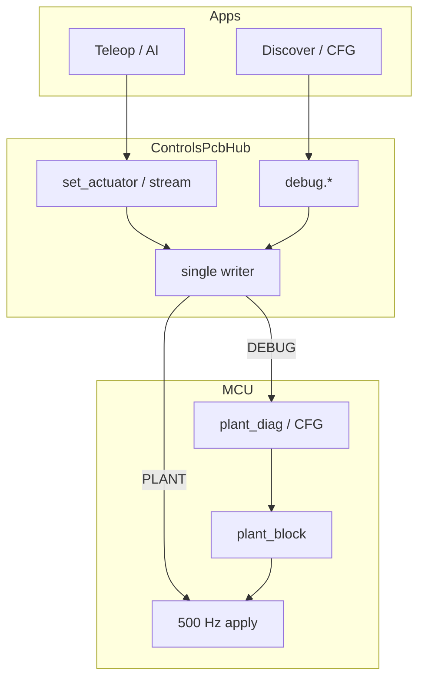

# Architecture

STM32G474 Controls PCB: **500 Hz** plant loop, **694 B** host exchange (layout v3), plugins over FDCAN CH1–3 + MCP2518 SPI-CAN CH4–6, Dynamixel neck UART, SK9822 LEDs, PDB UART kill.

Wire bytes: [host-contract.md](host-contract.md). Buses / protocols: [plant.md](plant.md). Host stacks: [integration.md](integration.md). ADRs: [decisions.md](decisions.md). Vendor cheat-sheet: [vendor.md](vendor.md).

## Runtime contexts

| Context | Rate | Entry | Job |
|---------|------|-------|-----|
| **Host** | As fast as HostTask spins | `app_host_service()` | USB RX, diag, PDB, light heartbeat |
| **Plant** | 500 Hz (TIM6 notify) | `app_plant_service()` | Actuator apply/capture + FB TX |
| **Peripheral** | Best-effort | `app_peripheral_service()` | DXL, LED, SPI3, CAN router poll |

`USE_FREERTOS_SCHEDULER` in `App/Inc/app.h` selects bare-metal superloop (`0`) vs FreeRTOS CMSIS-RTOS v2 (`1`, default). Host publishes **desire** at its own rate (hold-last); plant runs independently.

## Naming: “PDU” is overloaded

| Name | What | Where |
|------|------|-------|
| USB DEBUG **pdu** mailbox | 32 B tags (`DFU!`, `CFG`, `RS2`, …) inside DEBUG frames | `host_exchange_schema.h` |
| **PDB / PDU kill** | Soft/hard kill over **UART4** | `pdb_link.c` — [plant.md](plant.md)#pdb-kill |

Same word; different protocols. FB `pdb[64]` mirrors power-board telemetry on PLANT; DEBUG uses the first 32 B of that region as a mailbox on `DBGC`/`DBGF` only.

## Host API modes

One physical link (USB CDC or UART), one 694 B cyclic frame — two jobs share it. Apps choose a **mode**, not a raw `pdu` tag.

| Mode | Wire | Host surface |
|------|------|--------------|
| **PLANT** | `CMDH`/`HBHF`, mailbox ignored | `ControlsPcbHub`: `set_actuator`, `start_streaming`, `recover`, … |
| **DEBUG** | `DBGC`/`DBGF` tagged mailbox | `hub.debug.*` (exclusive lease) |
| **HEALTH** | Derived from FB system word | Feedback fields |
| **LOG** | Host-side NDJSON / `state.json` | `hub.telemetry.*` |

Until a mux/`hubd` exists: **one process owns COM**.


```mermaid
flowchart TB
  subgraph apps["Apps"]
    Teleop["Teleop / AI"]
    Bench["Discover / CFG"]
  end
  subgraph api["ControlsPcbHub"]
    Plant["set_actuator / stream"]
    Debug["debug.*"]
    Lease["single writer"]
  end
  subgraph mcu["MCU"]
    PlantPath["500 Hz apply"]
    DiagPath["plant_diag / CFG"]
    Gates["plant_block"]
  end
  Teleop --> Plant --> Lease
  Bench --> Debug --> Lease
  Lease -->|PLANT| PlantPath
  Lease -->|DEBUG| DiagPath --> Gates --> PlantPath
```

## Plant hot path (post-optimization)

```
TIM6 ISR → PlantTask
  → host_link_apply_pending_plant
  → actuator_apply_desire → plugin → can_tx_enqueue
  → can_router_poll (commanded buses) → state_live
  → host_link_poll_tx (≤1 plant FB / tick)
PeripheralTask: DXL / LED
```

Wins that got FB from ~2 Hz → ~600–750 Hz: INT-gated MCP RX, blank-MCP skip, poll budget, host coalesce (latest command image), ≤1 FB/tick. Coalesce intentionally causes `cmd_seq_lag` at high host TX — not a bug.

Measure: `act_lap_ms` / `act_lap_peak_ms` / `periph_lap_*` in FB; `scripts/bench_load_matrix.py`.

## Plant gates

`plant_runtime.c` gates 500 Hz apply. When blocked, `host_system_feedback.reserved` carries `plant_block_reason_t` (bench session, probe, quiet, DIAG_ONLY, host_stale, servo session).

## Mixed protocol (CFG, not sniff)

Each of 26 slots: `{bus, protocol, motor_id, master_id, enabled}`. RX fans out to every enabled slot on that bus; plugins reject mismatches. No runtime protocol sniff.

| Enum | Value | Shape |
|------|------:|-------|
| `PROTO_ROBSTRIDE` | 1 | EXT 29-bit |
| `PROTO_CUBEMARS` | 2 | STD MIT (not HW-proven) |
| `PROTO_DAMIAO` | 3 | STD MIT |
| `PROTO_ZEROERR` | 4 | STD CANopen |

Blank policy: skip SPI on uncommanded MCP; Damiao/CubeMars on FDCAN keep enable latch / MIT; ZeroErr blank (`kp≈0`) must shut down PDO, not spam boot.

## Product CFG (YAM)

| Slots | Bus | Protocol |
|------:|-----|----------|
| 0–6 left | CH1 | Damiao |
| 7–13 right | CH2 | Damiao |
| 14–19 base | CH4–6 | RobStride |
| 20 lift | CH3 | disabled |
| 21–25 spare | — | disabled |

## Platform north star

Controls PCB = thin **plant platform** (one COM, many peripherals). Host-side demux: **HostProxy** in the SDK; lab via `pcb_lab`; YAM via `vbeta`. ROS peripheral drivers later. Do not edit YAMAIMobile for plant glue. See [integration.md](integration.md).

## Module map

```
App/host/     wire schema, link, PDB UART
App/plant/    actuator, control_loop, plant_diag, can/, plugins/
scripts/deft_controls_sdk/   ControlsPcbHub (preferred)
scripts/pcb_lab/             lab + tests + legacy/ (retire)
```
