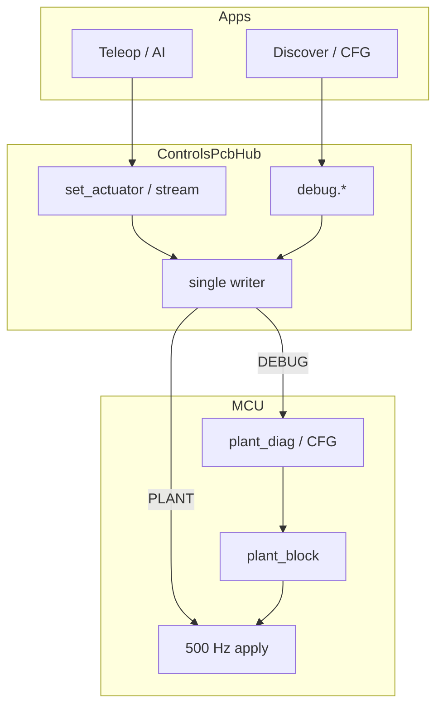

# Architecture

STM32G474 Controls PCB: **500 Hz** plant loop, **694 B** host exchange (layout v3), plugins over FDCAN CH1–3 + MCP2518 SPI-CAN CH4–6, Dynamixel neck UART, SK9822 LEDs, PDB UART kill.

Wire bytes: [host-contract.md](host-contract.md). Buses / protocols: [plant.md](plant.md). Host stacks: [integration.md](integration.md). ADRs: [decisions.md](decisions.md). Vendor cheat-sheet: [vendor.md](vendor.md).

## Runtime contexts

| Context | Rate | Entry | Job |
|---------|------|-------|-----|
| **Host** | As fast as HostTask spins | `app_host_service()` | USB RX, diag, PDB, light heartbeat |
| **Plant** | 500 Hz (TIM6 notify) | `app_plant_service()` | Actuator apply/capture + FB TX |
| **Peripheral** | Best-effort | `app_peripheral_service()` | DXL, LED, SPI3, CAN router poll |

`USE_FREERTOS_SCHEDULER` in `App/Inc/app.h` selects bare-metal superloop (`0`) vs FreeRTOS CMSIS-RTOS v2 (`1`, default). Host publishes **desire** at its own rate (hold-last); plant runs independently.

## Naming: “PDU” is overloaded

| Name | What | Where |
|------|------|-------|
| USB DEBUG **pdu** mailbox | Legacy 32 B tags inside `DBGC`/`DBGF` (deprecated) | offset 630 — see [debug-mailbox-deprecation.md](debug-mailbox-deprecation.md) |
| **Debug lanes** | `DL\x01` + 10×32 B lanes on `DBGC`/`DBGF` | ADR-004 / [host-contract.md](host-contract.md) |
| **PDB / PDU kill** | Soft/hard kill over **UART4** | `pdb_link.c` — [plant.md](plant.md)#pdb-kill |

Same word historically; plant `HBHF.pdb[64]` is the power-board mirror only. Debug RPC uses debug lanes (preferred) or the legacy mailbox on DEBUG frames.

## Host API modes

One physical link (USB CDC or UART). **`stm32_mode`** is chosen at `ControlsPcbHub.connect(mode=...)` and changes only via disconnect/reconnect (ADR-004). Distinct from `mcu_state` (apply/safety).

| `mode=` / `stm32_mode` | Wire | Host surface |
|------------------------|------|--------------|
| **plant** / **bandwidth** (0) | `CMDH`/`HBHF` only; PDU mirror at 630+ | streaming, timing metrics; `hub.debug.*` refuses |
| **debug** (1) | plant frames + debug lanes `DBGC`/`DBGF` | `hub.debug.*` (lease / discover / CFG) |
| Soft-DFU (2) | leave app CDC → ROM DFU | `enter_bootloader` / flash scripts |

Until a mux/`hubd` exists: **one process owns COM**.


```mermaid
flowchart TB
  subgraph apps["Apps"]
    Teleop["Teleop / AI"]
    Bench["Discover / CFG"]
  end
  subgraph api["ControlsPcbHub"]
    Plant["set_actuator / stream"]
    Debug["debug.*"]
    Lease["single writer"]
  end
  subgraph mcu["MCU"]
    PlantPath["500 Hz apply"]
    DiagPath["plant_diag / CFG"]
    Gates["plant_block"]
  end
  Teleop --> Plant --> Lease
  Bench --> Debug --> Lease
  Lease -->|PLANT| PlantPath
  Lease -->|DEBUG| DiagPath --> Gates --> PlantPath
```

## Plant hot path (post-optimization)

```
TIM6 ISR → PlantTask
  → host_link_apply_pending_plant
  → actuator_apply_desire → plugin → can_tx_enqueue
  → can_router_poll (commanded buses) → state_live
  → host_link_poll_tx (≤1 plant FB / tick)
PeripheralTask: DXL / LED
```

Wins that got FB from ~2 Hz → ~600–750 Hz: INT-gated MCP RX, poll budget, host coalesce (latest command image), ≤1 FB/tick. Coalesce intentionally causes `cmd_seq_lag` at high host TX — not a bug. (Historical blank-MCP-only skip is gone; CH4–6 share the same blank-bus policy as CH1–3.)

Measure: `act_lap_ms` / `act_lap_peak_ms` / `periph_lap_*` in FB; suite bandwidth TUI / matrix (`python -m pcb_lab.debug test --bandwidth`).

## Plant gates

`plant/diag/diag_gates.h` (`plant_runtime_actuator_can_apply`) gates 500 Hz apply. When blocked, feedback carries `plant_block_reason_t`: bench session, probe busy, quiet, **apply_off** (`plant_apply=0`), host_stale. Wire code `SERVO_SESSION=6` is reserved/unused — servo uses `plant_diag_skip_servo_bus`, not this gate.

Bench discover/probe (`plant/diag/diag.h`) is a separate DEBUG path; `mode=bandwidth` never sends those tags. Cleaning diag lease/probe code does **not** move bandwidth metrics (ack_lag / fb_hz) — those are USB + CAN apply work when apply is armed.

## Mixed protocol (CFG, not sniff)

Each of 26 slots: `{bus, protocol, motor_id, master_id, enabled}`. RX fans out to every enabled slot on that bus; plugins reject mismatches. No runtime protocol sniff.

| Enum | Value | Shape |
|------|------:|-------|
| `PROTO_ROBSTRIDE` | 1 | EXT 29-bit |
| `PROTO_CUBEMARS` | 2 | STD MIT (not HW-proven) |
| `PROTO_DAMIAO` | 3 | STD MIT |
| `PROTO_ZEROERR` | 4 | STD CANopen |

Blank policy: shared for CH1–6 — skip blank slots on a bus with no commanded hold unless all-idle sync; Damiao/CubeMars keep enable latch / MIT; ZeroErr blank (`kp≈0`) must shut down PDO, not spam boot. Host idle-anchor uses `p=1e-6` so MCP stays in path when other buses are active.

## Product CFG (YAM)

| Slots | Bus | Protocol |
|------:|-----|----------|
| 0–6 left_arm | CH1 | Damiao |
| 7–13 right_arm | CH2 | Damiao |
| 14+17 / 15+18 / 16+19 base_wheel_1..3 | CH4–6 | RobStride (steer+drive) |
| 20 torso | CH3 | disabled |
| 21–25 spare | — | disabled |

HostProxy demuxes named sections into the held 694B CMDH image. Product
(deft_vbeta) authors `ActuatorDesire` fields; lab `actions/` is separate.
See [integration.md](integration.md).

## Platform north star

Controls PCB = thin **plant platform** (one COM, many peripherals). Host-side
demux: **HostProxy.set_section**; lab via `pcb_lab` + `actions/`; product via
**deft_vbeta** (this repo is a submodule; product drivers live in the parent).
ROS: `ControlsPcbHostNode`. Do not edit YAMAIMobile for plant glue.

## Module map

```
App/host/     wire schema, link, PDB UART
App/plant/    actuator, control_loop, plant_diag, can/, plugins/
scripts/deft_controls_sdk/   HostProxy + Hub + ros/ (preferred)
scripts/pcb_lab/             lab CLI + tests
```
