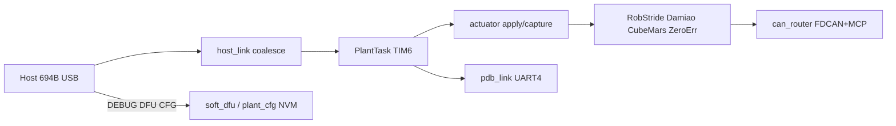
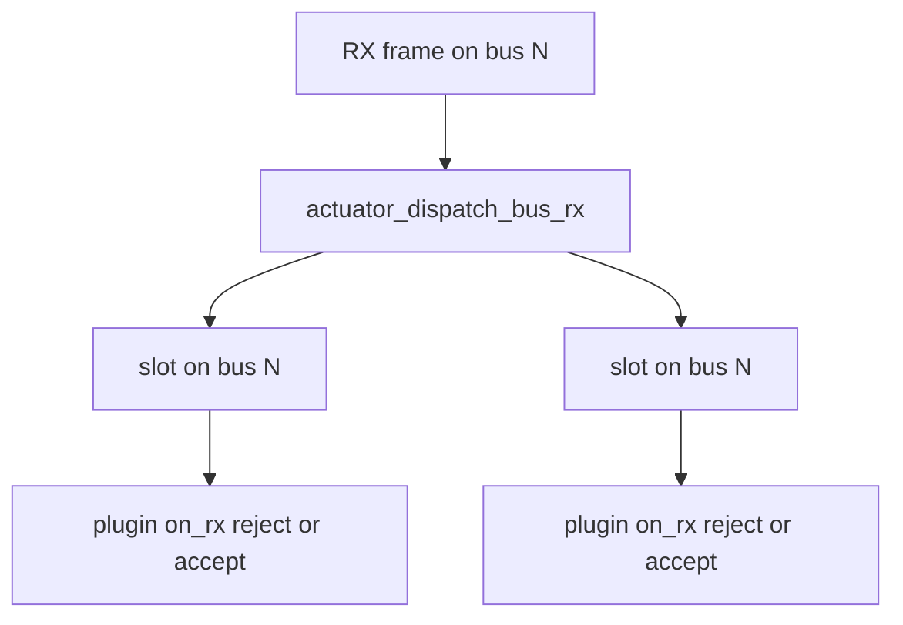
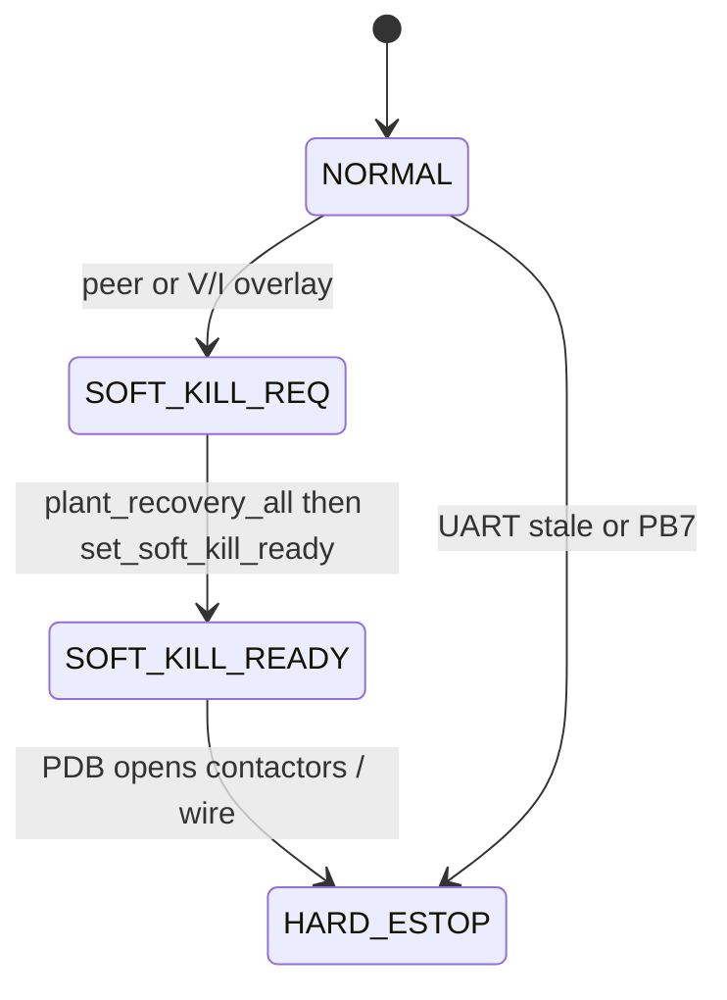
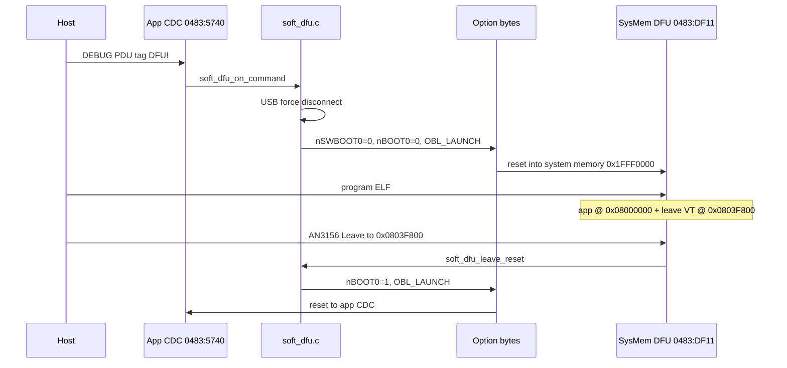

# Mental model — post-`2a35cfe` gaps

**Baseline you already own:** CAN router, polling TX/RX, Host/Plant + **694 B** contract (layout v3, 26 slots).

**Pivot commit:** `2a35cfe` — *dual YAM arm teleop successful*. Everything below is the work layered *around* that core (~38 commits). Use this as the stitch map; deep docs are linked, not duplicated.

**Naming gotcha:** “PDU” means two different things:

| Name | What it is | Where |
|------|------------|-------|
| USB DEBUG **pdu** mailbox | 32 B tag channel (`DFU!`, `CFG`, `RS2`, …) inside the 694 B image | `host_exchange_schema.h` / DEBUG path |
| **PDB / PDU kill** | Power soft/hard kill state machine over **UART4** | `pdb_link.c`, `docs/pdb-uart-v1.md` |

They share a name and the FB `pdb[64]` region overlaps the DEBUG mailbox in the first 32 B — different protocols and authorities.



---

## 1. Optimizations (FB ~2 Hz → ~600–750 Hz)

**Mental model:** every win is one of:

1. **Remove work when idle** (INT-gated MCP RX, blank MCP skip)
2. **Bound work per plant tick** (poll TX max, maintain budget, burst=1)
3. **Stop HostTask from remounting 26 slots on every USB frame** (coalesce + deferred mount + ≤1 FB/tick)

| Layer | What changed | Read first |
|-------|----------------|------------|
| MCP TX | Non-blocking TXQ reclaim (no `HAL_Delay` on plant path); batched **16 B** RAM load; global FRESET budget | [`App/Src/plant/can/mcp2518fd.c`](../App/Src/plant/can/mcp2518fd.c) |
| SPI poll | INT-gated RX (idle MCP = **0 SPI**); `SPI_POLL_TX_MAX = 2`; per-bus poll | [`App/Src/plant/can/spi_can_router.c`](../App/Src/plant/can/spi_can_router.c) |
| Actuator | Blank MCP skip; per-bus RX index; poll only commanded buses | [`App/Src/plant/actuator.c`](../App/Src/plant/actuator.c) — `actuator_rebuild_bus_index`, `actuator_dispatch_bus_rx` |
| RobStride | Coalesce MCP flush per rail; `ROBSTRIDE_MAINTAIN_MAX_PER_TICK = 2` | [`App/Src/plant/plugins/robstride.c`](../App/Src/plant/plugins/robstride.c) |
| Host | Drain USB ring → keep **latest** plant image; stage for TIM6; plant FB **at most once per TIM6 tick** | [`App/Src/host/host_link.c`](../App/Src/host/host_link.c) — `host_link_poll_rx` / `host_link_apply_pending_plant` / `host_link_poll_tx` |
| Schedule | Plant vs Peripheral split; TIM6 ISR only notifies | [`App/Src/plant/control_loop.c`](../App/Src/plant/control_loop.c), [`App/Src/app.c`](../App/Src/app.c) |

**Hot path (one TIM6 lap):**

```
TIM6 ISR → vTaskNotifyGiveFromISR(PlantTask)
  → host_link_apply_pending_plant
  → actuator_apply_desire → plugin *_apply_cycle → can_tx_enqueue
  → robstride_mcp_flush_pending / can_router_poll_bus (commanded buses)
  → actuator_dispatch_bus_rx → state_live
  → host_link_poll_tx (≤1 plant FB)
PeripheralTask: DXL / LED (blocking work off plant path)
```

**Trust:** [bench-optimize-and-load-matrix-plan.md](legacy/bench/bench-optimize-and-load-matrix-plan.md), bringup “What raised FB”.  
**Measure:** `act_lap_ms` / `act_lap_peak_ms` / `periph_lap_*` in FB ([`plant_timing.c`](../App/Src/plant/plant_timing.c)); [`scripts/bench_load_matrix.py`](../scripts/bench_load_matrix.py).

**Known tradeoff:** host coalesce intentionally causes `cmd_seq_lag` at 200–500 Hz host TX — not a bug. Fixing lag without coalesce needs its own RFC.

**Ignore:** old “raise Plant priority” experiments (cut `act_lap`, blew `cmd_seq_lag` / `periph_lap`) — see dated benches under `docs/legacy/`.

---

## 2. Mixed protocol (not auto-detect)

**Mental model:** CFG assigns each of 26 slots `{bus, protocol, motor_id, master_id, enabled}`. Hardware accepts **std + ext** on FDCAN CH1–3 and MCP CH4–6 (`FDCAN_RX_STD_AND_EXT` on all three FDCAN channels — older “CH2 ext-only” notes are obsolete). Software **fans out** each RX frame to every enabled slot on that bus; each plugin rejects ID/payload mismatches.

There is **no** runtime protocol sniff.



| Enum | Value | Wire shape |
|------|------:|------------|
| `PROTO_NONE` | 0 | — |
| `PROTO_ROBSTRIDE` | 1 | EXT 29-bit |
| `PROTO_CUBEMARS` | 2 | STD MIT (`CUBEMARS_ENABLE_SERVO_MODE` default **0**) |
| `PROTO_DAMIAO` | 3 | STD MIT |
| `PROTO_ZEROERR` | 4 | STD CANopen COB-IDs |

**Blank / idle policy (easy to miss)** — in `actuator_apply_desire`:

- **MCP blank:** skip SPI (uncommanded CH4–6).
- **Damiao / CubeMars on FDCAN:** **exempt** from blank-skip — enable latch + continuous MIT must keep running.
- **ZeroErr blank (`kp≈0`):** must **not** keep streaming — if operational, shutdown PDO; skip boot spam.

**ID planning:** CubeMars/Damiao use low std IDs (often `0x01..0x07`). ZeroErr uses CiA COB-IDs (`0x180+N`, `0x200+N`, SDO `0x580/0x600+N`, NMT `0x000`). Same-bus mix is filter-safe only if IDs do not alias (two ESCs both `1` on one bus will cross-feed).

**Read:** [fdcan-dual-id-mixed-bus.md](fdcan-dual-id-mixed-bus.md), [`actuator.c`](../App/Src/plant/actuator.c), [`plugin_table.c`](../App/Src/plant/plugin_schema/plugin_table.c).

---

## 3. CubeMars / ZeroErr bringup

### CubeMars — MIT, Damiao-shaped, **not HW-proven**

Lifecycle (TX-driven latch, **not** RX-gated like Damiao):

```
RESET  → cubemars_reset_enable_latch / plant_recovery_all
ENTER  → first apply_cycle: TX {FF×7, 0xFC} on std ID=motor_id, latch=true
STREAM → every tick: one MIT DLC=8 (including blank kp=kd=0)
EXIT   → recovery: latch clear + TX {FF×7, 0xFD}
```

Constants: `CUBEMARS_MIT_CMD_{ENABLE,DISABLE,SET_ZERO} = 0xFC/FD/FE`. Pack = Damiao nibble interleave — **do not copy the vendor PDF sample** (known bugs). Default model `CUBEMARS_AK80_9`; `cubemars_set_model()` exists but **no CFG model field** yet.

Product YAM CFG still uses **Damiao** arms. `cubemars_yam_rows()` in [`vbeta/slots.py`](../scripts/deft_controls_sdk/vbeta/slots.py) is scaffold only.

**Trust:** [`cubemars.c`](../App/Src/plant/plugins/cubemars.c) / [`cubemars.h`](../App/Inc/plant/plugins/cubemars.h), [rfc-cubemars-mit-plant.md](legacy/rfc/rfc-cubemars-mit-plant.md).  
**Ignore:** Servo-mode notes in older `lessons.md` / parts of `bringup.md` — Servo is behind `#if CUBEMARS_ENABLE_SERVO_MODE` (off).

### ZeroErr — CANopen PP boot FSM, **not bench-proven**

| Layer | Role |
|-------|------|
| [`App/Src/plant/can/canopen.c`](../App/Src/plant/can/canopen.c) | NMT / expedited SDO / PDO1 pack-parse |
| [`App/Src/plant/plugins/zeroerr.c`](../App/Src/plant/plugins/zeroerr.c) | CiA 402 PP policy + boot FSM |
| `App/Src/plant/plugins/canopen.c` | empty parking stub — ignore |

`motor_id` = CANopen **node ID** (1..127). Prefer **FDCAN @ 1 Mbps** (EDS). Encoder: `ZEROERR_ENCODER_RES = 524288` (provisional).

Boot advances **one** NMT/SDO action per tick until operational (abbreviated):

```
IDLE → NMT_STOP → RESET_COMM → WAIT → PREOP → MODE_PP(0x6060=1)
  → remap TxPDO1/RxPDO1 → NMT_START → cw 0x06 → 0x07 → 0x0F → OPERATIONAL
```

PDO1 (matches ZeroErr Python): RxPDO1 `0x200+N` DLC6 (`cw u16` + `target_pos i32`); TxPDO1 `0x180+N` DLC6 (`statusword` + `actual_pos`).

**Caveat:** SDO wait (~30 ms) inside boot can **pop RX** and steal frames from cohabitants on that bus — do not spam multi-node boot at 500 Hz.

Host `hub.debug.discover_zeroerr()` / `lift_canopen_discover.py` still unwired / `NotImplementedError`.

**Read:** [zeroerr-firmware-bringup.md](zeroerr-firmware-bringup.md).

### vbeta product map (what actually runs)

From `yam_product_rows()`:

| Slots | Bus | Protocol |
|------:|-----|----------|
| 0–6 left arm | CH1 | Damiao |
| 7–13 right arm | CH2 | Damiao |
| 14–19 base | CH4–6 | RobStride |
| 20 lift | CH3 | disabled (`PROTO_NONE`) |
| 21–25 spare | — | disabled |

Assign CubeMars/ZeroErr today via `hub.debug.cfg_set_slot(..., protocol=2|4, ...)` — there is **no** channel-bringup CLI yet (unlike `rs02_channel_bringup.py` / `damiao_channel_bringup.py`).

---

## 4. PDB / PDU kill state machine

**Not CAN.** Peer protocol on **UART4** (PC10/PC11), 115200 8N1, magics `PDBC` / `PDBF`, version 1, CRC16-CCITT.

| Constant | Value | Meaning |
|----------|------:|---------|
| `PDB_TX_PERIOD_MS` | 20 | 50 Hz PDBC TX |
| `PDB_STALE_MS` | 200 | ~4 missed frames → HARD + COMMS_LOSS |
| Hard ESTOP | **PB7** | pull-up; PDU drives; **HIGH=ok, LOW=asserted** |

| State | Value |
|-------|------:|
| `PDB_KILL_NORMAL` | 0 |
| `PDB_KILL_SOFT_REQ` | 1 |
| `PDB_KILL_SOFT_READY` | 2 |
| `PDB_KILL_HARD_ESTOP` | 3 |

Reasons: `NONE=0`, `HOST=1`, `UNDERVOLTAGE=2`, `OVERCURRENT=3`, `OVERTEMP=4`, `COMMS_LOSS=5`, `BUTTON=6`, `OTHER=7`.



**Controls eval** (`pdb_link_eval_kill`):

1. Fresh PDBF within 200 ms? → else `HARD_ESTOP` + `COMMS_LOSS`
2. Peer kill ≠ NORMAL? → pass through peer state/reason
3. Else V/I overlay (`pdb_vi_reject_reason`) → `SOFT_KILL_REQ` + UV/OC, or NORMAL

**Bridge to plant:** host `mcu_state` ESTOP/RECOVERY → `plant_recovery_all()` → `pdb_link_set_soft_kill_ready(true)` **only if** peer is still `SOFT_KILL_REQ`. USB FB mirrors kill into `system` + `pdb[64]`. Hub helpers: `soft_kill_park`, `soft_kill_park_if_requested`, `soft_kill_park_if_bad_vi`.

**Read:** [pdb-uart-v1.md](pdb-uart-v1.md), [`pdb_link.c`](../App/Src/host/pdb_link.c), [`plant_command.c`](../App/Src/plant/plant_command.c).  
**Prove:** `pdb_uart_sim.py`, `pdb_softkill_handshake_prove.py`, `pdb_plant_integ_test.py`.

---

## 5. Soft-DFU + NVM (three different memories)

Boot mode is **not** a flash “status struct.” Keep these buckets separate:

```text
0x08000000  app flash (.isr_vector, .text, …)
0x0803F800  .soft_dfu_leave_vt (8 B mini VT) — host Leave jumps here after DFU
0x0807F800  NVM_CFG plant CFG page (2 KiB) — actuator table, NOT boot status
RAM .dfu_sig (NOLOAD)     warm-reset DFU arm only (legacy fallback)
Option bytes nBOOT0       real boot-mode persistence (survives power)
```

Linker: [`STM32G474RETX_FLASH.ld`](../STM32G474RETX_FLASH.ld) — `NVM_CFG` @ `0x807F800`, `.soft_dfu_leave_vt` @ `0x0803F800`, `.dfu_sig`.

### Soft-DFU flow



Legacy fallback if OB launch fails: RAM `soft_dfu_sig_t` `{magic=0x5A5AC0DE, guard=~magic}` → `NVIC_SystemReset` → `soft_dfu_check_and_jump` in `main` **before** `HAL_Init`.

**Read:** [soft-dfu.md](soft-dfu.md), [`soft_dfu.c`](../App/Src/host/soft_dfu.c). Host: [`scripts/soft_dfu_flash.py`](../scripts/soft_dfu_flash.py).

### Plant CFG NVM (not DFU)

`plant_cfg_nvm_image_t` @ `0x0807F800`:

- `magic = 0x50434647` (`'PCFG'`), `version = 1`, CRC32 over body
- slots: `{schematic_bus, protocol, motor_id, flags.bit0=enabled}`

Ops over USB PDU `'C','F','G'`: GET/SET/SAVE/LOAD/DEFAULTS. Save erases flash page **255** with **BKER** (G4 bank quirk), programs, verifies. API: `plant_config_nvm_load/save`, `plant_config_on_command`.

---

## 6. Script / vbeta navigation

Canonical live CLIs ([scripts-hygiene.md](scripts-hygiene.md)):

| File | Role |
|------|------|
| `vbeta_smoke.py` / `vbeta_product_prove.py` | Product CFG / arm\|base\|neck smoke |
| `vbeta/{session,slots,cfg}.py` | Sole hub owner + product rows |
| `yam_continuous_all.py` | Multi-peripheral cruise + soft-kill park |
| `pdb_uart_sim.py` + PDB prove trio | Kill handshake / plant integ |
| `soft_dfu_flash.py` | Soft-DFU enter / flash / leave |
| `bench_load_matrix.py` | Host-rate / scenario load matrix |
| `rs02_channel_bringup.py` / `damiao_channel_bringup.py` | Proven single-channel bringup |

**Ignore until the core loop is clear:** `scripts/_tmp_*`, `scripts/legacy/`, `docs/legacy/`, huge `docs/deft_vbeta_ref/`, deprecated `vbeta_*_smoke.py` shims.

**Rule:** **one CDC owner**. Soft-DFU and live teleop must pin `--serial`.

---

## Suggested self-study order

1. Optimizations hot path (plant tick → MCP) — 30–45 min  
2. Mixed demux + blank exemptions — 20 min  
3. CubeMars latch vs ZeroErr boot FSM — 30 min  
4. PDB soft-kill handshake + hub park — 30 min  
5. Flash map: leave VT vs CFG NVM vs option bytes — 20 min  
6. Run one lean path (`vbeta_smoke.py arm`) with this map open

**SDK / deft_vbeta / i2rt (vertical, not skim):** after step 6, use
[study-sdk-damiao-vertical.md](study-sdk-damiao-vertical.md) — labs that follow
one Damiao hold/jog from `vbeta_smoke` / `install_pcb_backend` down to
`damiao_apply_cycle`, with checkpoints and Ask-me prompts.

## Trust / ignore quick list

| Trust | Ignore / lag |
|-------|----------------|
| This map + linked RFCs / `*-v1.md` / `soft-dfu.md` | CubeMars **Servo** notes in older `lessons.md` / `bringup.md` |
| `cubemars.h` + `rfc-cubemars-mit-plant.md` | “CH2 ext-only” FDCAN filter folklore |
| `plant/can/canopen.c` | Empty `plant/plugins/canopen.c` stub |
| `scripts-hygiene.md` canonical table | `_tmp_*`, `legacy/`, `deft_vbeta_ref/` for day-to-day work |
