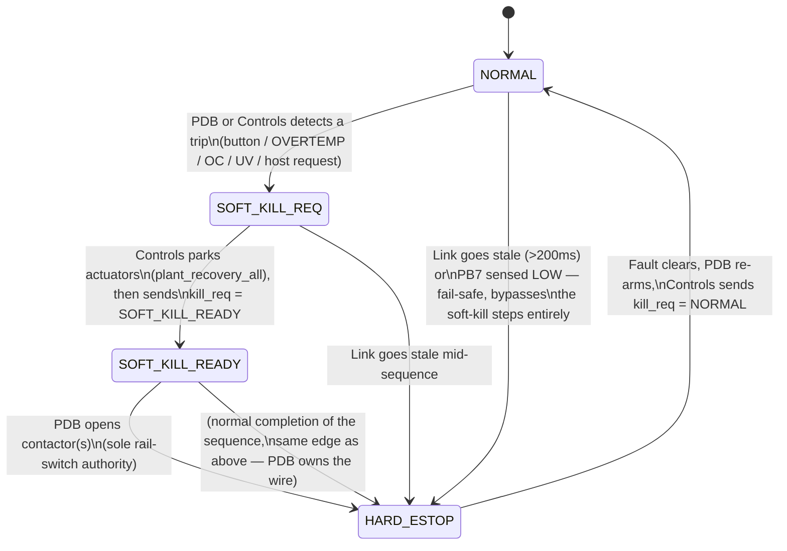

# PDB UART link — wire contract v1

Point-to-point link between **Controls** (this STM32G474 board) and the **PDB**
(Power Distribution Board) MCU. Separate from the USB `host_exchange` link —
see [host-contract.md](host-contract.md). Narrative pointer: [architecture.md](architecture.md)
("PDU" naming), [plant.md](plant.md)#pdb-kill. Decision record: [decisions.md](decisions.md) ADR-001.

This doc is the byte/bit-level spec referenced from `App/Inc/host/pdb_link.h`,
`App/Src/host/pdb_link.c`, `App/Inc/host/uart4_mode.h` and
`App/Inc/host/pdb_vi_limits.h`. If you are implementing the PDB side of this
link, this file plus those four are the full contract — read the "PDU-side
implementer checklist" at the end first.

## Physical layer

| | |
|--|--|
| UART | UART4, pins PC10 (TX), PC11 (RX) |
| Baud / framing | 115200 8N1, no flow control, no invert |
| Direction | Full duplex, both sides free-run their own TX timer (not request/response) |
| Frame size | Fixed **64 bytes**, both directions |
| Hard ESTOP | Separate GPIO, **not on this UART** — see "Hard ESTOP GPIO" below |

Controls-side FW module: `App/Src/host/pdb_link.c`. Active only when
`UART4_MODE == UART4_MODE_PDB` (`App/Inc/host/uart4_mode.h`); the link is
compiled out to inert stubs otherwise (`pdb_link_kill_state()` stub returns
`HARD_ESTOP`/`COMMS_LOSS` so callers fail safe if the link isn't built in).

## Frame layout (common header, both directions)

| Offset | Size | Field | Notes |
|-------:|-----:|-------|-------|
| 0 | 4 | `magic` | ASCII, byte-for-byte on the wire. Controls→PDB: `'P','D','B','C'` (`0x43424450` as a little-endian u32). PDB→Controls: `'P','D','B','F'` (`0x46424450`). |
| 4 | 1 | `version` | `1`. Receiver rejects the frame if this isn't an exact match — no forward-compat parsing in v1. |
| 5 | 1 | `seq` | Sender's free-running frame counter, incremented once per frame **sent** (wraps u8). Independent per direction — Controls' `seq` and the PDB's `seq` are not the same counter. |
| 6 | 1 | `flags` | Bitfield, see below. |
| 7 | 1 | reserved | Always `0`. Padding so payload starts at offset 8. |
| 8..61 | 54 | `payload` | Direction-specific — see "Command payload" / "Feedback payload". |
| 62..63 | 2 | `crc16` | CRC16-CCITT over bytes `[0..61]` (62 bytes), stored **little-endian** (low byte at 62, high byte at 63). |

Total frame = 64 bytes (offsets 0–63 inclusive). `PDB_OFF_CRC = 62` in code.

### `flags` byte (offset 6) — command direction (Controls→PDB)

| Bit | Meaning |
|----:|---------|
| 0 | `estop_requested` — host/local soft-ESTOP request latch (`pdb_link_request_estop()`). This is a **request**, it does not touch the PB7 wire — PDB decides what to do with it. |
| 1–7 | Reserved, must be `0`. |

The feedback frame's `flags` byte (offset 6) is currently unused by Controls FW — reserve it the same way (bit0+ = 0) unless/until a v2 contract defines it, so both sides can add fields later without breaking `version == 1` receivers.

### CRC16-CCITT

Poly `0x1021`, init `0xFFFF`, bit-banged MSB-first, no final XOR, no reflect.
Computed over the 62 header+payload bytes at offsets `0..61` (i.e. everything
before the CRC field itself), result written little-endian at offset 62.

```c
uint16_t crc16_ccitt(const uint8_t *data, uint32_t len /* = 62 */) {
    uint16_t crc = 0xFFFF;
    for (uint32_t i = 0; i < len; i++) {
        crc ^= (uint16_t)data[i] << 8;
        for (uint8_t bit = 0; bit < 8; bit++) {
            crc = (crc & 0x8000) ? (uint16_t)((crc << 1) ^ 0x1021)
                                  : (uint16_t)(crc << 1);
        }
    }
    return crc;
}
/* buf[62] = crc & 0xFF; buf[63] = (crc >> 8) & 0xFF; */
```

Bit-banged deliberately (not table-driven) so a PDB toolchain can reproduce it
exactly without importing a CRC table or trusting a library's poly/init/reflect
defaults to match.

## Command payload (Controls→PDB), payload = offsets 8..61

| Offset | Size | Field | Notes |
|-------:|-----:|-------|-------|
| 8 | 1 | `rail_enable_cmd` | Bitmask, 1 bit per rail. This is a **request** — PDB is the sole authority on actually switching a rail. |
| 9 | 1 | `kill_req` | See "Requested vs. reported state" below. In current FW this field only ever carries `PDB_KILL_NORMAL (0)` or `PDB_KILL_SOFT_READY (2)` — never `1` or `3`. |
| 10 | 1 | `heartbeat` | Free-running u8, incremented once per command frame **sent**. PDB should echo the value it last received back at feedback offset 45 (`hb_echo`). |
| 11..61 | 51 | reserved | Always `0` in v1. |

## Feedback payload (PDB→Controls), payload = offsets 8..61

| Offset | Size | Field | Notes |
|-------:|-----:|-------|-------|
| 8 | 8 | `pack_v[4]` | 4× `u16`, little-endian, one per pack. Units: **10 mV/count** (e.g. `4500` = 45.00 V). `0` = pack slot not populated. |
| 16 | 8 | `rail_v[4]` | 4× `u16`, little-endian. Units: 10 mV/count. `rail_v[0]` is the central 48 V rail. |
| 24 | 8 | `pack_i[4]` | 4× `u16`, little-endian. Units: **10 mA/count** (e.g. `3000` = 30.00 A). |
| 32 | 8 | `rail_i[4]` | 4× `u16`, little-endian. Units: 10 mA/count. |
| 40 | 1 | `contactor` | Bitmask, 1 bit per rail — contactor **closed** status (PDB-reported ground truth, not a request). |
| 41 | 1 | `kill_state` | `pdb_kill_state_t` — PDB's authoritative view of link/system kill state. See state machine below. |
| 42 | 1 | `kill_reason` | `pdb_kill_reason_t` — reason code paired with `kill_state`. |
| 43 | 1 | `estop_sense` | PDB's own read of the hard-ESTOP net it drives: `1` = released/HIGH, `0` = asserted/LOW. Same polarity as Controls' local PB7 read (`pdb_link_estop_sense()`). |
| 44 | 1 | `fault_flags` | Bitmask, PDB-specific fault bits. Not yet enumerated in Controls FW (read-only passthrough today). |
| 45 | 1 | `hb_echo` | Echo of the last `heartbeat` byte (command offset 10) the PDB received. Liveness/round-trip proof; **Controls FW does not currently gate anything on this matching** — no code path reads it back for correctness — but populate it faithfully, since host-side tooling may use it for latency/drop diagnostics later. |
| 46..61 | 16 | reserved | Always `0` in v1. |

`u16` fields are little-endian on the wire (low byte first), consistent with
the magic/CRC encoding above and with how `pdb_rd_u16()` decodes them in
`pdb_link.c`.

## Kill state machine

```
enum pdb_kill_state_t : u8 {
    PDB_KILL_NORMAL      = 0,
    PDB_KILL_SOFT_REQ    = 1,
    PDB_KILL_SOFT_READY  = 2,
    PDB_KILL_HARD_ESTOP  = 3,
};

enum pdb_kill_reason_t : u8 {
    PDB_KILL_REASON_NONE         = 0,
    PDB_KILL_REASON_HOST         = 1,
    PDB_KILL_REASON_UNDERVOLTAGE = 2,
    PDB_KILL_REASON_OVERCURRENT  = 3,
    PDB_KILL_REASON_OVERTEMP     = 4,
    PDB_KILL_REASON_COMMS_LOSS   = 5,
    PDB_KILL_REASON_BUTTON       = 6,
    PDB_KILL_REASON_OTHER        = 7,
};
```



### Requested vs. reported state — read this before implementing the PDB side

There are **two different fields carrying kill-state-shaped values**, and they
are not symmetric:

- **`kill_req`** (command payload, offset 9) — what *Controls is asking for*.
  Current FW (`pdb_link_set_soft_kill_ready()`) only ever sends `NORMAL (0)`
  or `SOFT_KILL_READY (2)` here. Controls never transmits `SOFT_KILL_REQ (1)`
  or `HARD_ESTOP (3)` as a request — those two values only ever appear as
  **reported** state, originating from the PDB's own `kill_state` byte or from
  Controls' own fail-safe mirror logic (see below), never as something
  Controls asks the PDB to enter.
- **`kill_state`** (feedback payload, offset 41) — what *the PDB reports it is
  actually in*. This is the full 4-value enum and is authoritative — Controls
  treats it as ground truth whenever the link is fresh (see resolution
  algorithm below).

A PDB implementation should treat `kill_req == SOFT_KILL_READY` as Controls'
confirmation that it is safe to proceed with opening rails (actuators are
parked), and should not expect Controls to ever ask for `SOFT_KILL_REQ` or
`HARD_ESTOP` directly — those transitions are the PDB's own call (or the
result of Controls losing comms).

### Controls-side resolution algorithm (`pdb_link_eval_kill()` in `pdb_link.c`)

This is what Controls actually computes for its **own** USB-facing
`kill_state`/`kill_reason` mirror (`system.kill_state` in the host exchange,
`hub.pdb_status()`). A PDB implementer doesn't need to reproduce this, but
should understand it to know what Controls will *do* with a given feedback
frame:

1. **Freshness check.** If no CRC-valid `PDBF` has ever been received, or the
   last valid one is older than `PDB_STALE_MS = 200 ms`:
   - If `PDB_STALE_FAILSAFE = 1` (product default): force
     `HARD_ESTOP` + `COMMS_LOSS`, unconditionally, ignoring anything the
     payload might otherwise say.
   - If `PDB_STALE_FAILSAFE = 0` (bench-only build override, no PDU
     connected): report `NORMAL` + `NONE` instead, so bench work doesn't
     permanently red-light the LED/USB mirror just because no PDB is wired up.
   - **Important:** a frame that fails magic/version/CRC is treated
     identically to *no frame at all* — it does **not** refresh the
     last-valid timestamp. A stream of garbage bytes degrades to the same
     200 ms fail-safe timeout as silence; it can never be mistaken for a live
     link.
2. **Peer non-NORMAL wins outright.** If the frame is fresh and
   `kill_state != NORMAL`, Controls mirrors the peer's `kill_state` and
   `kill_reason` verbatim. Controls never demotes or second-guesses a
   PDB-reported `SOFT_KILL_REQ`, `SOFT_KILL_READY`, or `HARD_ESTOP`.
3. **NORMAL peer gets a local V/I overlay.** If the frame is fresh and the
   peer reports `NORMAL`, Controls independently evaluates the same
   feedback payload against the thresholds below
   (`pdb_vi_reject_reason()` / `pdb_vi_limits.h`). If a limit is tripped,
   Controls' *own USB mirror* reports `SOFT_KILL_REQ` + `UNDERVOLTAGE` or
   `OVERCURRENT` even though the PDB itself said `NORMAL`. This does **not**
   change what Controls transmits back to the PDB as `kill_req` by itself —
   it's a host-visible escalation, and the normal soft-kill park sequence
   (steps below) is what actually drives `kill_req` afterward.
   Otherwise: mirrors peer `NORMAL` + `NONE` straight through.

V/I overlay thresholds (`App/Inc/host/pdb_vi_limits.h`, counts using the
10 mV/count, 10 mA/count scale above; not locked — tune after first real PDB
capture):

| Check | Range | Applies when |
|-------|-------|--------------|
| `pack_v[i]` | 4000–5500 counts (40.00–55.00 V) | `pack_v[i] != 0` (pack populated) |
| `rail_v[0]` (central 48 V only) | 4200–5200 counts (42.00–52.00 V) | rail looks active: contactor bit `i==0` set, or `rail_v[0] != 0` |
| `pack_i[i]` / `rail_i[i]` (all 4 channels) | abs max 3000 counts (30.00 A) | pack/rail active (same "on" definition as above) |

Overcurrent is checked first per channel and wins immediately if both an OC
and a UV/OV condition would trip on the same pass. An unpopulated pack
(`pack_v == 0`) is skipped entirely for that index.

## Soft-kill handshake — full sequence

1. **Steady state (NORMAL).** Controls sends `kill_req = NORMAL (0)` every
   command frame; `heartbeat` free-runs. PDB reports `kill_state = NORMAL`,
   `kill_reason = NONE` as long as its own conditions are clear (no button,
   no local fault) and — if evaluating locally — Controls' V/I overlay hasn't
   tripped.
2. **Trip.** A kill condition appears — PDB-local (button press, its own
   over-temp/fault sensing) or Controls-local (V/I overlay above, or a host
   call to `pdb_link_request_estop(true)` setting the `flags` bit0 request
   latch). The PDB reflects this as `kill_state = SOFT_KILL_REQ` with the
   appropriate `kill_reason` in its next feedback frame (or, for the
   Controls-local V/I overlay case, Controls' own USB-facing mirror reports
   `SOFT_KILL_REQ` even before/without the PDB itself changing state).
3. **Park.** Host/Controls observes `kill_state == SOFT_KILL_REQ` (via the USB
   mirror — `hub.pdb_status()` / `system.kill_state`) and runs
   `plant_recovery_all()`, parking every actuator on every CAN bus to a safe
   state. This step happens entirely on the Controls/host side — nothing
   about it is visible on the UART wire itself.
4. **Ready.** Once actuators are confirmed parked, Controls calls
   `pdb_link_set_soft_kill_ready(true)`, which sets the outgoing `kill_req`
   field (command offset 9) to `SOFT_KILL_READY (2)` starting with the next
   TX frame.
5. **PDB acts.** Seeing `kill_req == SOFT_KILL_READY` (and its own conditions
   still warranting a kill), the PDB — sole authority on rail switching —
   opens the relevant contactor(s) and reports `kill_state =
   SOFT_KILL_READY` (transitioning to `HARD_ESTOP` once rails are actually
   open/de-energized, per the state diagram above).
6. **Fail-safe bypass.** At *any* point, independent of the sequence above:
   if the UART link goes stale (no valid `PDBF` for >200 ms) or Controls'
   local PB7 read goes LOW, Controls' own kill mirror forces `HARD_ESTOP` +
   `COMMS_LOSS` immediately — see the caveat under "Hard ESTOP GPIO" below on
   why this is a Controls-local fail-safe and not something the PDB needs to
   coordinate on the wire.
7. **Recovery.** Controls sets `kill_req` back to `NORMAL (0)`. Once the PDB's
   own conditions clear (button released, fault gone, rails safe to
   re-energize), it reports `kill_state = NORMAL` again. There is no separate
   ack byte for this transition — state is read directly from
   `kill_state`/`kill_reason` each frame. `hb_echo` proves the link is alive,
   it is not a transition acknowledgment.

## RX framing / resync (byte-stream recovery)

Controls receives byte-at-a-time on a UART RX interrupt into a 256 B ring
buffer, then in the main service loop accumulates bytes into a 64 B frame
buffer. Once 64 bytes have accumulated:

1. Check `magic` == `'PDBF'` at offset 0, `version == 1` at offset 4, and CRC
   match at offset 62–63.
2. **If invalid:** do *not* update the last-valid-frame timestamp (see
   freshness step 1 above — corrupt frames must degrade the same as
   silence). Then resync: scan offsets `1..63` of the 64-byte accumulator for
   a fresh `'PDBF'` magic. If found at offset `i`, shift the trailing
   `64 - i` bytes to the front of the buffer (this may be the start of the
   next real frame) and keep accumulating from there. If no magic is found
   anywhere in the buffer, discard everything and start empty.
3. **If valid:** copy the 64 bytes verbatim into the "last valid feedback"
   buffer (this is what feeds both the kill state machine and the USB
   `pdb[64]` mirror), stamp the current time, mark "ever synced".

A PDB implementation receiving `PDBC` frames from Controls should apply the
same byte-stream resync logic (scan for `'PDBC'` magic on a bad frame) so a
transient glitch on either side recovers within one frame instead of staying
permanently misaligned.

## TX rate / timing

| Constant | Value | Meaning |
|----------|------:|---------|
| `PDB_TX_PERIOD_MS` | 20 ms | Nominal command TX period — 50 Hz design point. |
| `PDB_STALE_MS` | 200 ms | No valid `PDBF` within this window → fail-safe (see freshness step 1). Comment in code: "~4 missed frames at a 20 Hz nominal rate." |
| `UART4_TX_PACE_BYTES` | `1` (current default) | See below — throttles effective rate well below the 20 ms/50 Hz nominal. |

**Byte-pacing quirk (current default, matters for real hardware):** on
Jetson-hosted builds, bulk 64-byte UART bursts corrupt on the Jetson's
`tegra194-hsuart` (observed as all-`0x00` RX) — full-burst `HAL_UART_Transmit`
is not usable as-is. The workaround (`UART4_TX_PACE_BYTES = 1`) sends exactly
**one byte per ~1 ms HostTask service tick**. A 64-byte frame therefore takes
~64 ms to clock out, so the **effective** command rate is **~10–15 Hz**, not
the nominal 20 ms/50 Hz the period constant implies. `PDB_STALE_MS = 200 ms`
still applies against this slower effective rate — in practice, meaningfully
fewer than "4 missed frames" of margin exists once byte-pacing is active, so
a PDB implementation should not assume a full 4-frame cushion before the
200 ms fail-safe trips.

If `UART4_TX_PACE_BYTES = 0` (e.g. a bench STM32-to-STM32 link with no Jetson
in the path), a full 64 B frame goes out in a single `HAL_UART_Transmit_IT`
call and the true ~50 Hz nominal rate is achievable.

**Feedback direction is not polled.** The PDB is expected to free-run its own
feedback TX timer independently — Controls does not request/poll for
feedback frames. There is no Controls-enforced nominal rate for the PDB→
Controls direction beyond the 200 ms staleness window; running comfortably
inside that window (matching the ~20–50 Hz command-side cadence is a
reasonable target) is recommended so Controls' mirror never sits near the
stale edge under normal operation.

## Hard ESTOP GPIO (out-of-band — not on this UART)

| | |
|--|--|
| Net | PB7 on Controls |
| Polarity | Active-low: HIGH = power allowed / released, LOW = asserted |
| Driver | **PDB only.** Controls configures PB7 as a high-Z input with internal pull-up and never drives it. |
| Read API | `pdb_link_estop_sense()` — local Controls-side GPIO read, exposed on the USB mirror as `system.estop_sense`, independent of `kill_state`. |

**Contract nuance an implementer must not miss:** Controls' kill-state
resolution algorithm (`pdb_link_eval_kill()`, described above) does **not**
independently read PB7 and fold it into `kill_state`/`kill_reason`. It only
reacts to (a) link staleness, and (b) the `kill_state` *byte the PDB reports
in its feedback frame*. That means: **the PDB must set `kill_state =
HARD_ESTOP` (and an appropriate `kill_reason`) in the same feedback frame(s)
where it is driving PB7 LOW.** If the PDB were to drive PB7 low while still
reporting `kill_state = NORMAL` in its `PDBF` payload, Controls' `kill_state`
mirror and gating logic (`plant_command.c`) would *not* see `HARD_ESTOP` —
only the separate `system.estop_sense` diagnostic byte would reflect it. LED
behavior (`led.c`) already treats these as two independent signals (peer
`estop_sense` vs. `kill_state`) for exactly this reason — don't assume they're
automatically synchronized on the Controls side; the PDB is responsible for
keeping its own `kill_state` report consistent with its own PB7 drive.

The 200 ms staleness fail-safe (freshness step 1 above) is the only path by
which Controls forces `HARD_ESTOP` *without* the PDB explicitly reporting it
— and that path only fires on comms loss, not on a live-but-inconsistent
feedback stream.

## PDU-side implementer checklist

- [ ] 64 B frames both directions, UART4-equivalent 115200 8N1, no flow control.
- [ ] Command frames from Controls carry magic `'PDBC'`; your feedback frames must carry magic `'PDBF'` exactly, `version = 1`.
- [ ] CRC16-CCITT (poly `0x1021`, init `0xFFFF`, MSB-first, no reflect, no final XOR) over bytes `0..61`, written little-endian at `62..63`. Verify Controls' command frames the same way before trusting `rail_enable_cmd`/`kill_req`.
- [ ] Populate `hb_echo` (feedback offset 45) with the last `heartbeat` byte (command offset 10) you received, every frame, even though Controls doesn't gate on it today.
- [ ] Your `kill_state`/`kill_reason` (feedback offsets 41/42) are authoritative to Controls whenever they're non-`NORMAL` — Controls will not override or second-guess them.
- [ ] Expect `kill_req` (command offset 9) to only ever be `NORMAL (0)` or `SOFT_KILL_READY (2)` — never wait for Controls to "ask for" `SOFT_KILL_REQ`/`HARD_ESTOP`; those originate from you.
- [ ] Whenever you drive the PB7 hard-ESTOP net LOW, your `kill_state` byte must say `HARD_ESTOP` in the same feedback frame(s) — Controls does not read PB7 itself to infer this.
- [ ] Free-run your own feedback TX independently; don't wait for a command frame to reply to. Stay comfortably inside the 200 ms staleness window Controls enforces (`PDB_STALE_MS`).
- [ ] Implement the same magic-byte resync-on-garbage behavior on your RX side (scan for `'PDBC'` starting at offset 1 on a bad frame) so transient corruption recovers in one frame instead of desyncing permanently.
- [ ] Voltage/current fields are `u16` little-endian, 10 mV/count and 10 mA/count respectively — match `pdb_vi_limits.h`'s scale exactly if you want Controls' overlay thresholds to mean what this doc says they mean.

## Source of truth

Code, not this doc, wins on any discrepancy: `App/Inc/host/pdb_link.h`,
`App/Src/host/pdb_link.c`, `App/Inc/host/uart4_mode.h`,
`App/Inc/host/pdb_vi_limits.h`. Sim/reference client:
`scripts/pcb_lab/legacy/pdb_uart_sim.py`. End-to-end handshake proof:
`scripts/pcb_lab/legacy/pdb_softkill_handshake_prove.py`.
