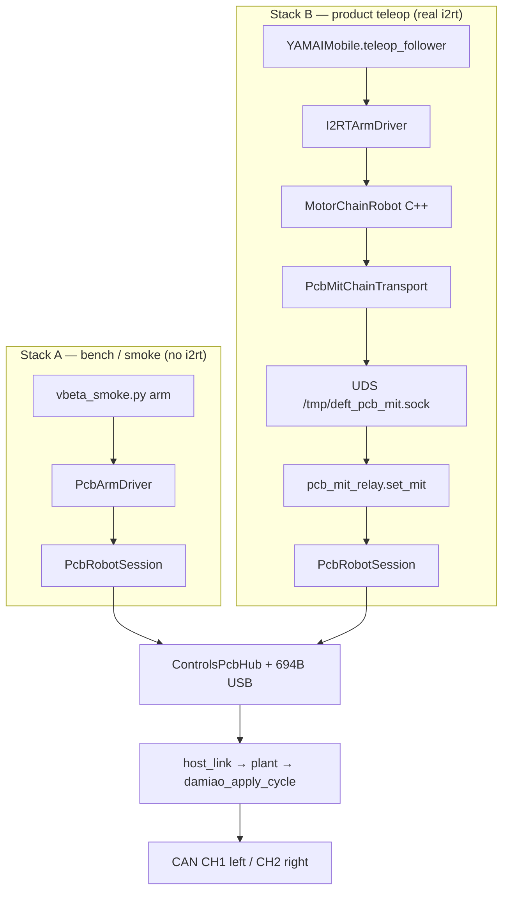

# Study plan — SDK / API stack via Damiao arm testing

This is a **hands-on vertical study**, not a skim list. You already own the
firmware plant contract (CAN router, poll TX/RX, 694 B Host/Plant). The gap is
how **host APIs** sit on top — especially how `deft_vbeta` + rewired **i2rt**
route desires through the Controls PCB instead of SocketCAN.

**Method:** pick one real test action (hold / jog a Damiao arm). For every
method call, walk *down* the stack until CAN leaves CH1/CH2, then walk *up*
feedback. Answer the checkpoint questions **before** peeking at the answer
keys. Bring unanswered “Ask me” items into chat.

Companion maps (read only when a lab points you there):

- [mental-model-post-2a35cfe.md](mental-model-post-2a35cfe.md) — plant / PDB / DFU
- [vbeta-pcb-adapter.md](vbeta-pcb-adapter.md) — adapter contract + method maps
- [i2rt-vs-ours-arm-compare.md](i2rt-vs-ours-arm-compare.md) — control-layer gaps
- [host-exchange-v3.md](host-exchange-v3.md) — 694 B layout
- [api.md](api.md) / [`scripts/deft_controls_sdk/README.md`](../scripts/deft_controls_sdk/README.md)

**Hardware rule:** exactly **one** process owns USB CDC. Close the debug
dashboard before any lab that opens COM. Prefer `--serial` / `--port` pins when
more than one board is reachable.

**Windows note:** the i2rt UDS relay uses `AF_UNIX` (`/tmp/deft_pcb_mit.sock`).
Labs **1–3** (PCB-direct SDK) run on Windows or Jetson. Labs **4–6** (full
`pcb:` / i2rt path) need the Jetson / Linux env under
`C:\Users\jsong\Documents\DeftRoboticsControlsPCB\deft_vbeta` (or the Jetson
checkout). Code reading for Labs 4–6 still works on Windows without hardware.

---

## 0. Big picture — two stacks, one plant



| | Stack A | Stack B |
|-|---------|---------|
| Goal | Prove PCB arms without YAM | Product teleop / record |
| Arm math | Python `PcbArmDriver` (motor-side kp/kd; gravity opt-in) | **i2rt** gravity / gains / gripper (~250 Hz host loop) |
| Entry | `scripts/vbeta_smoke.py arm` | `install_pcb_backend(robot)` + `robot.teleop_follower` |
| Channel | N/A (slots directly) | `"pcb:left"` / `"pcb:right"` (was `can_deft_l` / `can_deft_r`) |
| Framing | Firmware packs MIT | Same — Jetson no longer packs Damiao CAN |

**Critical history:** an earlier Option A *replaced* `follower_arms` with
`PcbArmDriver`, which dropped i2rt’s host loop. That swap is **gone**.
`install_pcb_backend` only starts the relay + platform client; arms stay real
i2rt. See header comment in
[`deft_vbeta/src/deft_amr/amr/amr/pcb_bridge.py`](../deft_vbeta/src/deft_amr/amr/amr/pcb_bridge.py).

### Checkpoint 0 — answer before Lab 1

Write answers in a notebook / scratch file. Do not scroll to §Answer keys yet.

1. If both the debug dashboard and `vbeta_smoke.py` open the same COM port, what breaks and why?
2. Does Stack B still use SocketCAN for Damiao MIT frames on the Jetson?
3. Who packs the 8-byte Damiao MIT frame in Stack B — i2rt C++ or STM32 firmware?
4. Name the session object that must be the sole CDC owner in both stacks.

**Ask me if stuck:** “Why keep i2rt at all if `PcbArmDriver` already talks MIT?”

---

## Lab 1 — Slot map and CFG (no motion yet)

**Goal:** know which plant slots a left-arm desire hits before you command anything.

### Do

1. Open [`scripts/deft_controls_sdk/vbeta/slots.py`](../scripts/deft_controls_sdk/vbeta/slots.py).
2. Find `LEFT_ARM_SLOTS`, `RIGHT_ARM_SLOTS`, `arm_slots()`, `yam_product_rows()`, `DEFAULT_ARM_KP`, `DEFAULT_ARM_KD`.
3. Skim [`docs/vbeta-pcb-adapter.md`](vbeta-pcb-adapter.md) §Slot map only.
4. Optional offline (no COM):

```python
from deft_controls_sdk.vbeta.slots import arm_slots, yam_product_rows, PROTO_DAMIAO
print(arm_slots("left"))
print(arm_slots("right"))
for i, row in enumerate(yam_product_rows()[:14]):
    bus, en, proto, mid, master = row
    print(i, bus, en, proto, hex(mid), master)
```

### Trace (what you should conclude)

| Joint index | Left slot | Right slot | Bus | Protocol |
|------------:|----------:|-----------:|----:|----------|
| 0..6 | 0..6 | 7..13 | CH1 / CH2 | `PROTO_DAMIAO` (3) |

`yam_product_rows()` returns CFG tuples `(bus, enabled, protocol, motor_id, master_id)`
applied by `ensure_yam_product_cfg` when `PcbRobotSession.connect(..., apply_yam_cfg=True)`.

### Checkpoint 1

1. Left J3 (index 2) maps to which plant slot and which Damiao `motor_id`?
2. What does `apply_yam_cfg=True` do that a bare `set_actuator` does not?
3. True/False: product CFG and the firmware factory-default NVM layout are the same.

**Ask me:** “Should I SAVE CFG to NVM during smoke, or only RAM-apply?”

---

## Lab 2 — Vertical call chain of `vbeta_smoke.py arm --hold` (Stack A)

**Goal:** follow one CLI from argv to Damiao CAN. This is the core learning loop.

### Run (when you have the board + exclusive COM)

```bash
# Close dashboard first. From Controls PCB repo root:
python scripts/vbeta_smoke.py arm --side left --hold --hold-s 3 --apply-cfg
# later:
python scripts/vbeta_smoke.py arm --side left --jog --joint 0 --delta 0.05 --apply-cfg
```

If you cannot run HW yet, still **read** the chain below with the files open.

### Vertical walk — do this in order, with the file open at each step

For each step: (a) find the function, (b) note what it calls next, (c) answer
the micro-question.

#### Step 2.1 — CLI entry

File: [`scripts/vbeta_smoke_lib.py`](../scripts/vbeta_smoke_lib.py) → `arm_main`

Micro-Q: What three things does `arm_main` do between `PcbRobotSession.connect` and `arm.write("Goal_Position", …)`?

#### Step 2.2 — Session owns COM

File: [`scripts/deft_controls_sdk/vbeta/session.py`](../scripts/deft_controls_sdk/vbeta/session.py) → `PcbRobotSession.connect`

Trace:

```
PcbRobotSession.connect
  → ControlsPcbHub.connect(port/serial)
  → hub.recover()   # or idle_first DIAG_ONLY path
  → ensure_yam_product_cfg(hub)   # if apply_yam_cfg
  → hub.start_streaming(hz=40)
```

Micro-Q: What does `start_streaming(40)` mean for how often the **host** refreshes the 694 B command image? How is that different from the **plant** 500 Hz TIM6 rate?

#### Step 2.3 — Arm driver API (I2RT-compatible surface)

File: [`scripts/deft_controls_sdk/vbeta/arm.py`](../scripts/deft_controls_sdk/vbeta/arm.py)

```
arm.connect()
  → read FB positions, _command_joint_pos(q) hold-present (skip_home)
arm.write("Goal_Position", target)
  → _command_joint_pos → _desires_for → session.set_actuators(...)
arm.write("Zero_Torque", True)
  → blank ActuatorDesire() per slot (kp=kd=0)
```

Micro-Q: In `_desires_for`, where do `kp`/`kd` come from? Is gravity torque on by default?

#### Step 2.4 — Hub → wire

Files:

- [`controls_pcb_hub.py`](../scripts/deft_controls_sdk/controls_pcb_hub.py) — `set_actuator` / `start_streaming`
- [`link/api_types.py`](../scripts/deft_controls_sdk/link/api_types.py) — `ActuatorDesire`
- [`link/connection.py`](../scripts/deft_controls_sdk/link/connection.py) — hold image + USB TX thread

Micro-Q: What five floats does one `ActuatorDesire` carry into the plant image?

#### Step 2.5 — Firmware plant (you already know this layer — reconnect it)

```
USB RX → host_link_poll_rx (coalesce latest)
  → host_link_apply_pending_plant @ TIM6
  → actuator_apply_desire
  → damiao_apply_cycle  (enable latch 0xFB/0xFC, then MIT pack)
  → can_tx_enqueue(CH1)
  → actuator_dispatch_bus_rx → state_live
  → host_link_poll_tx (FB)
```

File: [`App/Src/plant/plugins/damiao.c`](../App/Src/plant/plugins/damiao.c) — `damiao_apply_cycle`, `damiao_pack_tx`.

Micro-Q: Does Python send the Damiao enable opcode `0xFC` on the Stack A smoke path? If not, who does?

#### Step 2.6 — Soft-kill during hold

`arm_main` calls `_service_loop` → `session.service_soft_kill()` → hub
`soft_kill_park_if_requested`. Tie this to [mental-model §4](mental-model-post-2a35cfe.md)
(PDB UART kill SM).

### Checkpoint 2 — write the full chain from memory

Reproduce this chain with **no notes**, then compare:

```
vbeta_smoke arm --hold
  → arm_main
  → PcbRobotSession.connect → ControlsPcbHub → start_streaming
  → PcbArmDriver.connect / write("Goal_Position")
  → ActuatorDesire ×7 on slots 0–6
  → 694 B USB
  → damiao_apply_cycle → CH1 MIT
```

Fill blanks:

1. `write("Goal_Position", q7)` updates the **______** image; the streaming thread sends it at ~**______** Hz.
2. Firmware plant reapplies the held desire at **______** Hz (TIM6), with Damiao MIT often divided further.
3. After smoke, `Zero_Torque` blanks desires so the enable latch / MIT hold **______** (describe expected motor behavior).

**Ask me:** paste your written chain; I’ll mark gaps.

---

## Lab 3 — Interactive SDK REPL (force method-level muscle memory)

**Goal:** call the same APIs without the smoke CLI wrapper.

### Do (COM exclusive)

```python
from deft_controls_sdk.vbeta import PcbRobotSession, PcbArmDriver
import numpy as np

with PcbRobotSession.connect(apply_yam_cfg=True, stream_hz=40.0) as session:
    arm = PcbArmDriver(session, side="left", skip_home_on_connect=True)
    arm.connect()
    q = arm.read("Position_Rad")
    print("fb", q)
    # Hold present:
    arm.write("Goal_Position", q)
    # Tiny jog on J0 only (edit delta carefully):
    # q2 = q.copy(); q2[0] += 0.03; arm.write("Goal_Position", q2)
    input("Enter to Zero_Torque + exit…")
    arm.write("Zero_Torque", True)
    arm.disconnect()
```

### Exercises (answer in writing)

| # | Exercise | What to observe |
|---|----------|-----------------|
| 3a | `arm.read("Position_Rad")` twice, 1 s apart, with no write | Does FB move? Why / why not? |
| 3b | `Goal_Position` = present `q`, then read `Position_Setpoint` | Setpoint vs FB relationship |
| 3c | `Zero_Torque` then try a small `Goal_Position` without clearing zero mode | Does motion happen? Read `write()` in `arm.py` |
| 3d | Open dashboard **while** this REPL holds COM | What error / behavior? |

### Checkpoint 3

1. List every public method on `PcbArmDriver` that `YAMAIMobile` would need for teleop parity (use [vbeta-pcb-adapter.md](vbeta-pcb-adapter.md) method map — then close it and recite).
2. What does `session.close()` leave the plant in (`mcu_state`, LED, desires)?

**Ask me:** “I want a breakpoint where the 694 B image is built — where in the SDK?”

---

## Lab 4 — How SocketCAN was replaced (code archaeology, Stack B)

**Goal:** understand the rewire without running teleop yet.

### Do — open these side by side

| Layer | File | Look for |
|-------|------|----------|
| Channel config | `deft_vbeta/.../robots/configs.py` | `channel = "pcb:left"` / `"pcb:right"`; comment about reverting to `can_deft_l`/`can_deft_r` |
| Transport seam | `deft_vbeta/src/i2rt_cpp/include/i2rt/motor_drivers/mit_transport.hpp` | `CanMitChainTransport` vs `PcbMitChainTransport` |
| Chain select | `i2rt_cpp` `motor_chain.cpp` (search `"pcb:"`) | which transport is constructed |
| Bridge | `deft_vbeta/.../amr/pcb_bridge.py` | `install_pcb_backend` — what it does **not** replace |
| Relay | `deft_vbeta/.../motors/pcb_mit_relay.py` | `OP_SET_CONTROL`, `set_mit`, `ArmMitRelayServer` |

### Before / after diagram (fill the blanks yourself first)

**Before:**

```
I2RTArmDriver(channel="can_deft_l")
  → MotorChainRobot
  → DMChainCanInterface
  → CanMitChainTransport
  → SocketCAN can_deft_l @ 1 Mbps
  → Damiao ESC (Jetson packed MIT)
```

**After:**

```
I2RTArmDriver(channel="pcb:left")
  → MotorChainRobot   # gravity / kp / kd / gripper STILL HERE
  → DMChainCanInterface
  → PcbMitChainTransport
  → UDS OP_SET_CONTROL (floats only)
  → pcb_mit_relay.set_mit(session, slot, ...)
  → PcbRobotSession / ControlsPcbHub
  → 694 B USB
  → damiao_pack_tx on STM32
  → FDCAN CH1
```

### Checkpoint 4

1. What information crosses the UDS boundary — full CAN frames, or MIT floats + motor id?
2. Why does `install_pcb_backend` start a relay server *and* optionally attach `PcbPlatformClient` to the **same** session?
3. If you reverted channels to `can_deft_l` but left `install_pcb_backend` running, what would go wrong?
4. `OP_MOTOR_ON` on the relay — does it send `0xFC` on USB? Read `pcb_mit_relay.py` handler path and write what it actually does.

**Ask me:** “Show me the exact struct layout of `_REQUEST` vs what i2rt sends.”

---

## Lab 5 — Vertical chain of one teleop desire (Stack B)

**Goal:** same vertical method as Lab 2, but through i2rt.

### Conceptual run (Jetson when ready)

Typical product path (names vary by launcher):

```python
from lerobot.common.robot_devices.robots.configs import YAMAIMobileRobotConfig
from lerobot.common.robot_devices.robots.yam_ai_mobile import YAMAIMobile
from amr.pcb_bridge import install_pcb_backend

robot = YAMAIMobile(config=YAMAIMobileRobotConfig())
session = install_pcb_backend(robot, apply_yam_cfg=True)
robot.connect()
# one teleop sample:
robot.teleop_follower(left_q7, right_q7)
# ...
robot.disconnect()
session.close()
```

Recorders call `install_pcb_backend` similarly — see
`deft_vbeta/src/deft_amr/amr/amr/episode_recorder.py`.

### Vertical walk

| # | Layer | Symbol | What it does |
|---|-------|--------|----------------|
| 1 | YAM | `teleop_follower` / `send_action` | Host joint targets |
| 2 | Python driver | `I2RTArmDriver.write("Goal_Position", q7)` | Into MotorChainRobot |
| 3 | i2rt C++ | `MotorChainRobot::update` | Gravity + gains → `set_commands` |
| 4 | i2rt C++ | `MitChainTransport::set_control` | Per-motor MIT fields |
| 5 | i2rt C++ | `PcbMitChainTransport` | UDS client, `OP_SET_CONTROL` |
| 6 | Python relay | `ArmMitRelayServer` → `set_mit` | `motor_id` → `arm_slots(side)[id-1]` |
| 7 | Session | `PcbRobotSession.set_actuator` | Hold 694 B image |
| 8 | Stream | `ControlsPcbHub` TX thread ~40 Hz | USB CDC |
| 9 | FW | `damiao_apply_cycle` | Latch + pack + CH1/CH2 |

### Checkpoint 5 — contrast Stack A vs B

Fill the table from memory:

| Question | Stack A (`PcbArmDriver`) | Stack B (i2rt + relay) |
|----------|--------------------------|-------------------------|
| Who chooses kp/kd? | | |
| Who computes gravity torque? | | |
| Typical host update rate? | | |
| Does Jetson open SocketCAN? | | |
| Sole CDC owner? | | |

Read [i2rt-vs-ours-arm-compare.md](i2rt-vs-ours-arm-compare.md) **after** you fill the table — correct yourself.

**Ask me:** “When I feel a soft arm under Stack A but stiff under Stack B, which layer do I blame first?”

---

## Lab 6 — Feedback path (up the stack)

**Goal:** desires are only half the story; FB closes the loop.

### Do

1. In Stack A REPL, call `arm.read_all()` and map fields → plant FB slots.
2. In relay code, read `read_mit_fb` — which FB fields return over UDS `_RESPONSE`?
3. In firmware, remind yourself: `actuator_capture_state` → `host_link_poll_tx` ≤1 FB / TIM6 tick (mental-model §1).

### Checkpoint 6

1. Host streams commands at ~40 Hz but plant FB can be much faster. What does the SDK expose as “latest” — every plant frame, or coalesced?
2. If `fault` stays 0 forever on a slot, list three possible causes (CFG, bus, enable latch, wrong side, COM coalesce…).
3. Soft-kill mid-teleop: which layer parks actuators first — hub helper or i2rt `motor_off`?

**Ask me:** bring a screenshot of dashboard FB for slots 0–6 while holding.

---

## Lab 7 — SDK surface inventory (API literacy)

**Goal:** know what lives where so you stop grepping randomly.

### Map to complete (fill blanks while browsing the package)

```
scripts/deft_controls_sdk/
  controls_pcb_hub.py     → ControlsPcbHub  (plant + debug lease + telemetry)
  link/
    api_types.py          → ActuatorDesire, FeedbackImage, McuState, …
    connection.py         → USB/UART exchange, streaming thread
    exchange/             → wire layout / encode
  vbeta/
    session.py            → PcbRobotSession (sole COM for product drivers)
    arm.py                → PcbArmDriver
    platform.py           → PcbPlatformClient (base/neck; lift stub)
    slots.py              → YAM product CFG rows + gains
    cfg.py                → ensure_yam_product_cfg
    gravity_comp.py       → opt-in MuJoCo gravity (Stack A)
  bench/                  → hub.debug.* discover/CFG/probe
  debug_dashboard/        → browser COM owner
```

### Exercises

1. From `ControlsPcbHub`, list 8 methods you would use in a custom arm script without `PcbArmDriver`.
2. Find how DEBUG mode differs from PLANT mode ([architecture.md](architecture.md) Host API modes). Can Stack A smoke and `hub.debug.discover_damiao` share one process cleanly?
3. Trace `ensure_yam_product_cfg` — RAM vs NVM save.

### Checkpoint 7

Draw (paper) three boxes: **App / Teleop**, **SDK**, **Firmware**. Place each symbol in a box:

`teleop_follower`, `PcbMitChainTransport`, `set_mit`, `ActuatorDesire`, `damiao_pack_tx`, `yam_product_rows`, `pdb_link_eval_kill`

**Ask me:** “Design a minimal 30-line script that jogs right arm J2 without PcbArmDriver.”

---

## Lab 8 — Failure drills (understanding by breakage)

For each scenario, **predict** before trying (or before reading code):

| Scenario | Prediction (your notes) | Then verify in code / HW |
|----------|-------------------------|---------------------------|
| Smoke without `--apply-cfg` on a board whose NVM is all-RobStride | | |
| Two smokes in two terminals | | |
| `side="right"` with only left arm wired | | |
| `Goal_Position` length 6 instead of 7 | | |
| Soft-DFU flash while smoke holds COM | | |
| Stack B with relay socket deleted mid-run | | |
| `Zero_Torque` but i2rt still sending gravity torque (Stack B) vs Stack A | | compare docs |

### Checkpoint 8

Write a personal “debug order” checklist (≤8 bullets) for “arm doesn’t move.”
Example skeleton: COM owner → CFG protocol/bus/id → mcu_state NORMAL → streaming → non-zero kp → FB fault → CAN traffic → PDB kill.

**Ask me:** review your checklist against how you actually debug today.

---

## Suggested calendar (not just reading)

| Day | Focus | Output you produce |
|-----|-------|--------------------|
| 1 | Labs 0–2 | Written chain Lab 2 + Checkpoint answers |
| 2 | Lab 3 on HW | REPL log + answers 3a–3d |
| 3 | Labs 4–5 code archaeology | Before/after diagram + contrast table |
| 4 | Lab 6–7 | FB notes + SDK inventory map |
| 5 | Lab 8 + one Stack B bring-up if Jetson ready | Failure checklist + one teleop sample |

Budget ~2–3 focused hours per day. If a lab needs HW you don’t have, do the
**code vertical walk** and mark the HW step deferred — still answer checkpoints.

---

## Questions bank — for you to answer

Use these as a self-quiz after Day 3. Prefer short answers.

1. What is `PcbRobotSession` and why does it exist if `ControlsPcbHub` already connects?
2. Why relay over UDS instead of calling `PcbArmDriver` from C++?
3. Where is Damiao enable latched in Stack A vs Stack B?
4. Map `motor_id=3` on `pcb:left` to plant slot index.
5. What changes in the plant when `kp=kd=0` for Damiao (blank policy)?
6. Name two things `install_pcb_backend` does **not** do.
7. How does host command coalesce create `cmd_seq_lag`, and why is that OK for 40 Hz teleop?
8. Lift slot 20: what API exists, what does the plant do?
9. Base product IDs `0x01`/`0x02` vs bench IDs — adapter bug or CFG/hardware mismatch? ([vbeta-pcb-adapter.md](vbeta-pcb-adapter.md))
10. When would you choose Stack A vs Stack B for a new experiment?

---

## Questions bank — bring to chat (“Ask me”)

Copy any of these into chat when ready; better with your attempt attached.

- Walk my Lab 2 chain and mark the first wrong hop.
- I think enable is sent from Python — prove me wrong with the call path.
- Diff Stack A vs B gains on a real hold: what should I measure in FB?
- Where do I put a log to see UDS `OP_SET_CONTROL` rate vs USB stream rate?
- Soft-kill during `teleop_follower`: correct park order?
- I want to temporarily force SocketCAN on one arm only — safe?
- Design the smallest test that proves CFG hit CH2 without moving the right arm.

---

## Answer keys (peek only after you attempt)

<details>
<summary>Checkpoint 0</summary>

1. Two CDC owners → torn frames / open failures / stuck stream. One process rule.
2. No — Stack B uses `pcb:` → UDS → USB; SocketCAN only if channel is `can*`.
3. STM32 firmware (`damiao_pack_tx`).
4. `PcbRobotSession` (wrapping `ControlsPcbHub`).

</details>

<details>
<summary>Checkpoint 1</summary>

1. Slot 2, typically `motor_id=0x03` on CH1 (see `yam_product_rows` / left arm rows).
2. Writes the YAM product actuator table (bus/protocol/ids/enable) into the plant CFG path so slots match the arm map — not just desires.
3. False — product map ≠ factory default NVM layout.

</details>

<details>
<summary>Checkpoint 2</summary>

1. command / hold image; ~40 Hz (smoke default `stream_hz=40`).
2. 500 Hz TIM6 plant (Damiao may further divide MIT apply).
3. Desires blank → firmware stops “commanding” MIT / can exit latch path — motors should go idle/compliant per Damiao disable semantics after recovery/idle policy (smoke uses blank desires + short sleep).

</details>

<details>
<summary>Checkpoint 4 (selected)</summary>

1. MIT floats + motor id/type opcodes — not raw CAN frames.
2. One CDC owner for arms + base/neck.
3. i2rt would talk SocketCAN while relay still holds USB — split brain / wrong bus.
4. Generally FB / session-side handling — enable latch remains firmware-side on MIT commanding; do not assume relay sends `0xFC` as a DEBUG PDU.

</details>

<details>
<summary>Checkpoint 5 (selected)</summary>

| | A | B |
|-|---|---|
| kp/kd | `DEFAULT_ARM_*` in Python | i2rt host loop |
| gravity | opt-in `GravityComp` (default off) | i2rt every cycle |
| host rate | ~40 Hz stream | i2rt ~250 Hz compute → still USB-stream limited at session |
| SocketCAN | no | no (when `pcb:`) |
| CDC owner | `PcbRobotSession` | same, via `install_pcb_backend` |

</details>

---

## How this ties to the mental-model doc

After Labs 2 and 5 you should be able to point to each box:

```
[SDK desire] → [694 B] → [host_link coalesce] → [PlantTask]
  → [damiao plugin] → [can_router] → [CH1/CH2]
```

and separately:

```
[PDB UART kill] ⊄ CAN
[Soft-DFU / NVM CFG] ⊄ MIT path
```

If a concept in [mental-model-post-2a35cfe.md](mental-model-post-2a35cfe.md) still feels abstract, re-run **Lab 2 Step 2.5** with that section open — vertical testing is how the firmware map becomes yours again.

---

## Env quick reference (`deft_vbeta`)

Working tree: `C:\Users\jsong\Documents\DeftRoboticsControlsPCB\deft_vbeta` (gitignored from parent; branch `controls_pcb`).

| Piece | Path / note |
|-------|-------------|
| Bridge | `src/deft_amr/amr/amr/pcb_bridge.py` |
| Relay | `src/deft_amr/lerobot/.../pcb_mit_relay.py` |
| i2rt | `src/i2rt_cpp` submodule, branch `controls_pcb` |
| SDK (nested) | `external/controls_pcb` → `pip install -e …` per bridge docstring |
| UDS | `/tmp/deft_pcb_mit.sock` (Linux) |
| Build i2rt | `colcon build --packages-select i2rt_cpp` + `source install/setup.bash` (see i2rt README) |

Parent-repo smoke (Stack A) does **not** require that full colcon env — only `deft_controls_sdk` on `PYTHONPATH` / editable install from this Controls PCB repo.
