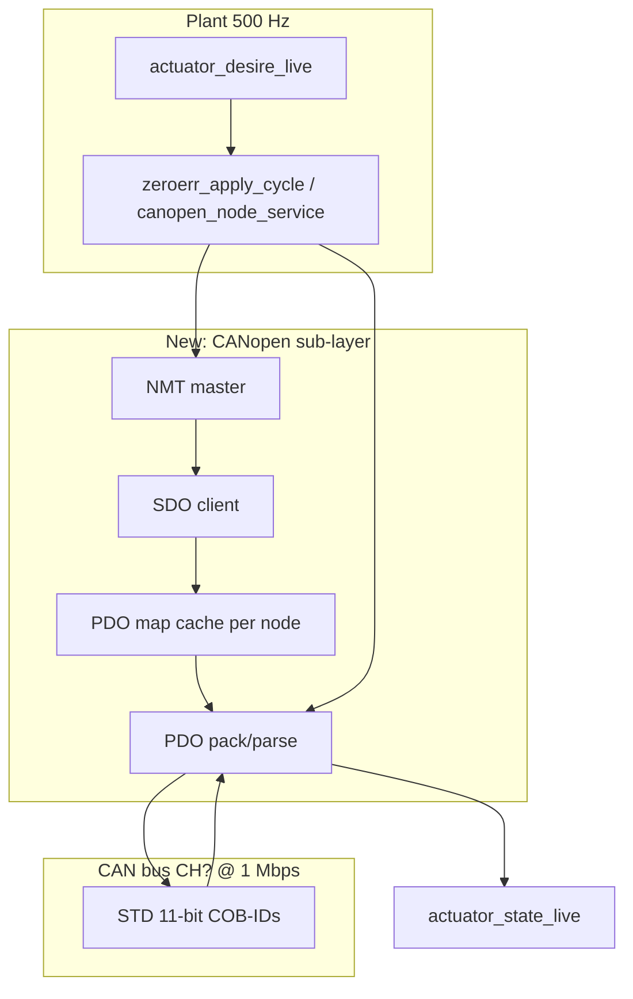

# ZeroErr (eRob / eDriver) — firmware bringup plan

**Status:** Phase 2–3 first code drop on `feat/zeroerr-bringup` — `PROTO_ZEROERR=4`, CANopen helpers + PP plant path. Not yet bench-proven on hardware.  
**Sources used (2026-07-21):**

| Source | Role |
|--------|------|
| [`External_Documentation/zeroerr.md`](../External_Documentation/zeroerr.md) | Prior notes + caveats |
| [`ZeroErr Driver_V1.5.eds`](https://raw.githubusercontent.com/ZeroErrControl/eRob_CANopen_Python/main/ZeroErr%20Driver_V1.5.eds) | **Ground truth** object dictionary / default PDO (byte-exact) |
| [`eRobControl_PP.py`](https://github.com/ZeroErrControl/eRob_CANopen_Python/blob/main/eRobControl_PP.py) | Official-example bringup sequence + remapped PDO1 |
| Official PDF | Still form-gated — obtain V1.9 when possible; do not block Phase 0–1 on it |

**Product naming:** EDS product is **“eDriver”** (CANopen slave). **eRob** is the actuator family. Confirm the unit on the bench is CANopen (not EtherCAT-only).

---

## 0. Decision up front — do not force `plugin_ops_t`

RobStride / Damiao / CubeMars are **one CAN frame in / one frame out** per plant tick.

ZeroErr is **CANopen CiA 402**:

- **NMT** (network state)
- **SDO** (config / identity / mode / profile params)
- **PDO** (cyclic control + feedback after mapping)
- Optional **SYNC** (`COB-ID 0x080`)

Empty placeholders already exist: `App/Inc/plant/plugins/canopen.h`, `App/Src/plant/plugins/canopen.c` (empty). Use them.



**Recommended architecture**

1. **`canopen_*.c`** — bus-agnostic NMT/SDO/PDO helpers on top of `can_router` / FDCAN (or MCP later).
2. **`zeroerr.c`** — CiA 402 policy (enable FSM, PP/CSV/CST mode choice, encoder scale, desire→target mapping).
3. **Do not** implement ZeroErr as “only `pack_tx`/`parse_rx`” until a node is already **OPERATIONAL** with PDO maps cached. Cold start / CFG / recover belong in a service path (diag lease or explicit init), same spirit as Damiao enable-latch / RobStride maintain_enable.

---

## 1. Bus and identity (from EDS — verified)

| Field | Value |
|-------|-------|
| Vendor | `ZEROERR CONTROL` |
| VendorNumber | `0x5A65726F` (“Zero” ASCII-ish) |
| ProductName | `eDriver` |
| ProductNumber | `0x26483052` |
| RevisionNumber | `0x00020111` |
| Device type `0x1000` default | `0x420192` (CiA 402 drive) |
| Baud rates in EDS | **Only `BaudRate_1000=1`** — treat **1 Mbps** as required. Ignore 500 kbps examples in ROS docs for this EDS. |
| Node ID | Example scripts use `0x02`; **factory default unknown** — discover with SDO / LSS later; plan for CFG `motor_id = node_id`. |
| Encoder scale (example code) | **524288 counts/rev** (= 2¹⁹). Confirm on hardware via SDO before trusting rad conversion. |

**PCB bus choice (bringup default):** prefer **FDCAN CH1–3** first (same as Damiao/RobStride FDCAN path — cheap enqueue). MCP CH4–6 only after CANopen master is proven (SPI cost under multi-node PDO is a known pain point on this board).

---

## 2. CAN frame formats (standard CiA 301 + this EDS)

All IDs below are **11-bit standard**. `N` = node ID (`1..127`).

### 2.1 Predefined connection set (EDS defaults)

| Function | COB-ID | Direction | Notes |
|----------|--------|-----------|-------|
| NMT | `0x000` | Master → slaves | 2-byte command |
| SYNC | `0x080` | Master → slaves | 0-byte data typical |
| EMCY | `0x080 + N` | Slave → master | Not used in first bringup |
| TxPDO1 | `0x180 + N` | Slave → master | Enabled by default |
| RxPDO1 | `0x200 + N` | Master → slave | Enabled by default |
| TxPDO2 | `0x280 + N` | Slave → master | **Disabled** in EDS (`COB-ID` has bit31 set) |
| RxPDO2 | `0x300 + N` | Master → slave | **Disabled** in EDS |
| TxPDO3 / RxPDO3 | `0x380+N` / `0x400+N` | | Disabled |
| TxPDO4 / RxPDO4 | `0x480+N` / `0x500+N` | | Disabled |
| SDO tx (server→client) | `0x580 + N` | Slave → master | Response |
| SDO rx (client→server) | `0x600 + N` | Master → slave | Request |
| Heartbeat / NMT error | `0x700 + N` | Slave → master | Optional later |

EDS snippets:

- RxPDO1 COB: `$NodeID+0x200`
- TxPDO1 COB: `$NodeID+0x180`
- SDO: `$NodeID+0x600` / `$NodeID+0x580`
- RxPDO2 default COB: `$NodeID+0x80000300` → **bit 31 = 1 ⇒ PDO invalid/disabled**

### 2.2 NMT frame

```
ID:  0x000
DLC: 2
Data[0]: CS (command specifier)
Data[1]: Node-ID (0 = all nodes)
```

| CS | Meaning | Used in ZeroErr Python example |
|----|---------|--------------------------------|
| `0x01` | Start remote node → **Operational** | Yes (`nmt.send_command(0x01)`) |
| `0x02` | Stop remote node | Yes (before reset) |
| `0x80` | Enter Pre-Operational | Via library / PDO config |
| `0x81` | Reset node | — |
| `0x82` | Reset communication | Yes (`data=[0x82, node_id]`) |

### 2.3 SYNC frame

```
ID:  0x080
DLC: 0
Data: (none)
```

Python example sends SYNC after controlword / target updates when using async PDO + sync helper. For plant 500 Hz, prefer **either**:

- **A)** event-driven / async PDO (`transmission type 0xFF`) and no SYNC, or  
- **B)** sync-driven PDO (`type 0x01`) and one SYNC per plant tick / decimated tick  

Decide in Phase 2; do not mix blindly.

### 2.4 SDO expedited download (master writes a value) — CiA 301

```
ID:  0x600 + N
DLC: 8
Data[0]: command specifier
Data[1]: index low
Data[2]: index high
Data[3]: subindex
Data[4..7]: value (little-endian), unused bytes 0
```

Common expedited CS bytes:

| CS | Meaning |
|----|---------|
| `0x2F` | write 1 byte |
| `0x2B` | write 2 bytes |
| `0x27` | write 3 bytes |
| `0x23` | write 4 bytes |

**SDO upload (master reads)** request:

```
ID:  0x600 + N
DLC: 8
Data: 0x40, index_lo, index_hi, sub, 0,0,0,0
```

Response on `0x580 + N` with CS `0x4F/0x4B/0x47/0x43` + data.

Abort: CS `0x80` + 4-byte abort code.

**Bringup must implement a blocking SDO client with timeout** before any PDO trust.

### 2.5 Factory default PDO payloads (EDS — important!)

**Do not assume factory = controlword+position.** Defaults are:

**RxPDO1** (`0x200+N`) — enabled, mapping count = **1**:

| Offset | Object | Len |
|--------|--------|-----|
| 0 | `0x6040` Controlword | 16-bit |

Payload = **2 bytes**: `cw_lo, cw_hi` (LE).

**TxPDO1** (`0x180+N`) — enabled, mapping count = **1**:

| Offset | Object | Len |
|--------|--------|-----|
| 0 | `0x6041` Statusword | 16-bit |

Payload = **2 bytes**.

**RxPDO2** (`0x300+N`) — **disabled**, but mapping already = controlword + target position:

| Offset | Object | Len |
|--------|--------|-----|
| 0 | `0x6040` Controlword | 16-bit |
| 2 | `0x607A` Target position | 32-bit |

Payload if enabled = **6 bytes**: `cw_lo, cw_hi, p0, p1, p2, p3` (LE).

**TxPDO2** (`0x280+N`) — **disabled**, mapping = statusword + position actual:

| Offset | Object | Len |
|--------|--------|-----|
| 0 | `0x6041` Statusword | 16-bit |
| 2 | `0x6064` Position actual | 32-bit |

Payload if enabled = **6 bytes**.

**RxPDO3** default maps controlword + **target velocity `0x60FF`** (for profile/CSV later).

### 2.6 Target PDO layout for plant (match ZeroErr Python / “official manual” remap)

`eRobControl_PP.configure_pdo()` **rewrites PDO1** (while NMT Pre-Operational) to:

**RxPDO1** (`0x200+N`), DLC **6**:

```
[0] controlword  u16 LE   (0x6040)
[2] target_pos   i32 LE   (0x607A)   // encoder counts
```

**TxPDO1** (`0x180+N`), DLC **6**:

```
[0] statusword   u16 LE   (0x6041)
[2] actual_pos   i32 LE   (0x6064)   // encoder counts
```

PDO mapping entries are encoded as `0xIIIISSLL` in the OD:

| Mapping value | Meaning |
|---------------|---------|
| `0x60400010` | index `0x6040`, sub 0, **16** bits |
| `0x607A0020` | index `0x607A`, sub 0, **32** bits |
| `0x60410010` | statusword 16-bit |
| `0x60640020` | actual position 32-bit |

**SDO sequence to install that map** (from the Python example — firmware should mirror):

1. NMT → Pre-Operational  
2. Disable PDO: write COB-ID `| 0x80000000` to `0x1400:01` / `0x1800:01`  
3. Set transmission type (`0x1400:02` / `0x1800:02`) — example uses `0x01` then `0xFF`  
4. Clear map: `0x1600:00 = 0`, `0x1A00:00 = 0`  
5. Write map entries `0x1600:01/02`, `0x1A00:01/02`  
6. Set map count = 2  
7. Re-enable PDO: write COB-ID **without** bit 31  
8. NMT Start (`0x01`) → Operational  
9. Then cyclic RxPDO1 / parse TxPDO1  

**Alternative (often simpler):** enable **factory RxPDO2 / TxPDO2** (already mapped to cw+pos / sw+pos) by clearing bit 31 on `0x1401:01` / `0x1801:01`, and use COB-IDs `0x300+N` / `0x280+N`. Validate on hardware — Python path remaps PDO1 instead; either is fine if documented in CFG.

---

## 3. Object dictionary — minimum set for firmware

### 3.1 Mandatory / identity

| Index | Name | Use |
|-------|------|-----|
| `0x1000` | Device type | Expect `0x420192`-class |
| `0x1001` | Error register | Fault triage |
| `0x1018:01..03` | Identity | Vendor / product / revision — **first SDO read on discover** |
| `0x1017` | Producer heartbeat time | Optional later |

### 3.2 CiA 402 motion (PP first)

| Index | Name | Type | Role |
|-------|------|------|------|
| `0x6040` | Controlword | u16 | State machine + PP trigger bit4 |
| `0x6041` | Statusword | u16 | Enabled / fault / target reached (bit10) |
| `0x6060` | Modes of operation | i8 | **`1` = Profile Position** (example) |
| `0x6061` | Modes of operation display | i8 | Verify |
| `0x6064` | Position actual value | i32 | Feedback counts |
| `0x607A` | Target position | i32 | Command counts |
| `0x6081` | Profile velocity | u32 | PP slew |
| `0x6083` / `0x6084` | Profile accel / decel | u32 | PP |

### 3.3 Later modes (do not block PP bringup)

| Index | Mode |
|-------|------|
| `0x60FF` | Target velocity (CSV / profile velocity objects) |
| `0x6071` | Target torque |
| `0x6077` | Torque actual |

### 3.4 ZeroErr manufacturer extensions (optional)

| Index | Name |
|-------|------|
| `0x2240` | Motor encoder position |
| `0x2241` | Dual encoder difference |
| `0x22A2` | Drive temperature |
| `0x2380`–`0x2382` | Current / velocity / position loop gains |

### 3.5 Controlword values (CiA 402 — as used by ZeroErr example)

| Value | Meaning |
|-------|---------|
| `0x0006` | Shutdown |
| `0x0007` | Switch on |
| `0x000F` | Enable operation |
| `0x001F` | Enable + **new set-point** (PP bit4 rising edge) |
| `0x0080` | Fault reset |

Enable: `0x06 → 0x07 → 0x0F`, then for moves pulse bit4 via `0x0F → 0x1F`.  
Statusword bit10 (`0x0400`) = target reached (PP).

---

## 4. How this maps to *our* plant desire

Host `ActuatorDesire` is MIT-shaped (`position` rad, `velocity`, `kp`, `kd`, `torque`).

| Phase | Mapping |
|-------|---------|
| **PP bringup (recommended first)** | `position` rad → encoder counts via `counts = pos_rad / (2π) * encoder_res`. Ignore `kp/kd` on wire (inner loops stay in drive). `kp>0` means “enabled + tracking PP target”; `kp≈0` blank → disable / NMT stop or cw shutdown. |
| **Later CSV** | Map `velocity` → `0x60FF` / profile velocity objects; remap PDO. |
| **Later CST / torque** | Map `torque` → `0x6071`. |
| **True MIT impedance** | **Not** what eDriver’s public PP example does — only pursue if the gated manual documents a cyclic torque+pos mode we can PDO-map. Do not invent RobStride-style packed MIT frames. |

Blank policy: mirror MCP — blank ZeroErr slots must not spam RxPDO/SDO every 500 Hz tick.

---

## 5. Phased bringup plan

### Phase 0 — Hardware + docs gate (½–1 day)

- [ ] Confirm unit is **CANopen** eDriver (not EtherCAT-only SKU).
- [ ] Wire to **FDCAN CH1 or CH2**, **1 Mbps**, termination correct.
- [ ] Note DIP/switch **node ID** (or use vendor tool).
- [ ] Copy EDS into `External_Documentation/ZeroErr/` (vendor file, not paraphrased).
- [ ] Optional: obtain official PDF V1.9; attach next to EDS.
- [ ] Scope CH? with analyzer or `candump` via USB-CAN adapter.

**Exit:** bus silent or heartbeat/EMCY visible; bitrate confirmed 1M.

### Phase 1 — Host PC CANopen master (no PCB firmware yet) (1–2 days)

Use ZeroErr’s Python (`canopen` + SocketCAN/USB-CAN) or a small script under `scripts/legacy/` / `scripts/bench_zeroerr/`:

1. Connect @ **1_000_000**.
2. SDO read `0x1018` identity — match EDS vendor/product.
3. SDO read `0x6064` position (safe).
4. Run **PP enable + small move** using their `Motor_PP` sequence (or reimplement NMT/SDO/PDO bytes from §2).
5. Capture candump of: NMT, SDO map writes, RxPDO1, TxPDO1.

**Exit:** shaft moves under Profile Position; you have a golden candump for MCU parity.

### Phase 2 — MCU CANopen primitives (2–4 days)

New files (suggested):

```
App/Inc/plant/can/canopen_nmt.h
App/Inc/plant/can/canopen_sdo.h
App/Inc/plant/can/canopen_pdo.h
App/Src/plant/can/canopen_nmt.c
App/Src/plant/can/canopen_sdo.c
App/Src/plant/can/canopen_pdo.c
App/Inc/plant/plugins/zeroerr.h
App/Src/plant/plugins/zeroerr.c
```

Fill empty `canopen.h` / `canopen.c` as the façade or delete and use the split above — pick one layout and stick to it.

**Implement:**

| Module | Behavior |
|--------|----------|
| NMT | Send Start/Stop/Reset; track expected state |
| SDO | Expedited upload/download + abort parse; timeout ~20–50 ms; **never `HAL_Delay` on plant hot path** — use state machine + `HAL_GetTick` |
| PDO | Pack/parse 6-byte mapped PDO1; COB-ID = f(node) |
| RX demux | In `actuator` / router: if ID matches `0x180+N` / `0x580+N` / `0x700+N`, dispatch to CANopen, not RobStride MIT |

**Diag hooks (DEBUG lease):**

- `discover_zeroerr(bus)` — scan node IDs with SDO `0x1018` or NMT+SDO
- `zeroerr_probe(node)` — identity + position read
- Optional: one-shot PP move under lease (blocking OK in diag, like Damiao/RS probes)

**Exit:** from DEBUG lease, MCU can SDO-read identity and parse a TxPDO1 after map install.

### Phase 3 — Plant path (PP hold-last) (2–3 days)

1. Add `PROTO_ZEROERR` to `actuator.h` / `plugin_table.c` (or route via `canopen` protocol enum — one enum value).
2. `zeroerr_apply_cycle`:
   - If node not OPERATIONAL / not mapped → request init (rate-limited), skip cyclic TX.
   - If enabled + non-blank desire → emit **RxPDO1** (cw + target counts).
   - Maintain enable FSM without blocking waits (cw state in soft timer).
3. RX: TxPDO1 → `actuator_state_live.position` (rad), stash statusword in fault/aux.
4. CFG: `motor_id = node_id`, `bus = CHx`, `protocol = PROTO_ZEROERR`, encoder_res in NVM or constant until proven.
5. Host: `hub.debug` discover/CFG only at first; plant holds via existing `set_actuator`.

**Rate caution:** full SDO on every 500 Hz tick is forbidden. Init once; cyclic = PDO only. Multi-ZeroErr on one bus: budget PDO frames vs FDCAN load (usually fine vs MCP).

**Exit:** SDK/dashboard hold moves one ZeroErr joint; blank stops; recover/disable safe.

### Phase 4 — Hardening (ongoing)

- Heartbeat consumer / node guarding
- EMCY → `fault` field
- Homing mode if required by product
- CSV/CST if MIT-like feel needed
- MCP rail support only after FDCAN path is solid
- Soft-DFU remains unrelated (next step elsewhere)

---

## 6. Suggested acceptance tests

| # | Test | Pass |
|---|------|------|
| T0 | Bus @ 1 Mbps, termination | No flood of error frames |
| T1 | SDO read `0x1018` | Vendor `0x5A65726F`, product `0x26483052` |
| T2 | SDO read `0x6064` | Stable counts at rest |
| T3 | NMT start + PDO map install | TxPDO1 DLC=6 with sw+pos |
| T4 | Enable `06→07→0F` | Statusword shows operation enabled |
| T5 | PP step +10° | Target reached bit or position within window |
| T6 | Plant blank desire | No continuous RxPDO spam / drive disabled |
| T7 | Unplug mid-run | Fault/timeout without pegging `app_run` (no SDO spin) |

---

## 7. Non-goals / traps

- **Do not** treat ZeroErr like RobStride MIT packed floats.
- **Do not** assume 500 kbps (EDS says 1 Mbps only).
- **Do not** assume factory PDO1 already carries target/actual position — **remap or enable PDO2**.
- **Do not** block the 500 Hz path with SDO `HAL_Delay` loops (same class of bug as MCP `force_ready`).
- **Do not** put 6 ZeroErr nodes on MCP SPI “because CH4–6 are free” without a decimation plan.
- Official PDF still gated — EDS + Python candump are enough for Phase 0–3 if identity matches.

---

## 8. Work estimate (order-of-magnitude)

| Phase | Effort |
|-------|--------|
| 0 Hardware / EDS on disk | 0.5–1 d |
| 1 PC golden path + candump | 1–2 d |
| 2 MCU NMT/SDO/PDO + diag | 2–4 d |
| 3 Plant PP + CFG | 2–3 d |
| 4 Hardening | as needed |

---

## 9. First code drop checklist (when implementation starts)

1. [x] Vendor EDS under `External_Documentation/ZeroErr/ZeroErr_Driver_V1.5.eds`
2. [x] `canopen` expedited SDO client + NMT + PDO1 pack/parse (`App/.../plant/can/canopen.*`)
3. [x] `zeroerr` PDO1 6-byte pack/parse + count↔rad helpers (`524288` provisional)
4. [ ] DEBUG discover reading `0x1018` (helpers exist: `zeroerr_read_identity` / `zeroerr_boot_blocking`; PDU wiring TBD)
5. [x] `PROTO_ZEROERR=4` in live `plugin_table` / CFG / host `Protocol.ZEROERR`

Plant path notes (Phase 3):
- Boot FSM runs one SDO/NMT step per apply while desire is non-idle (SDO wait ≤30 ms — boot only).
- Operational path is RxPDO1 only (`cw` + target counts); TxPDO1 → `position` rad + statusword in `fault`.
- Prefer FDCAN CH1–3 @ 1 Mbps; MCP later.
